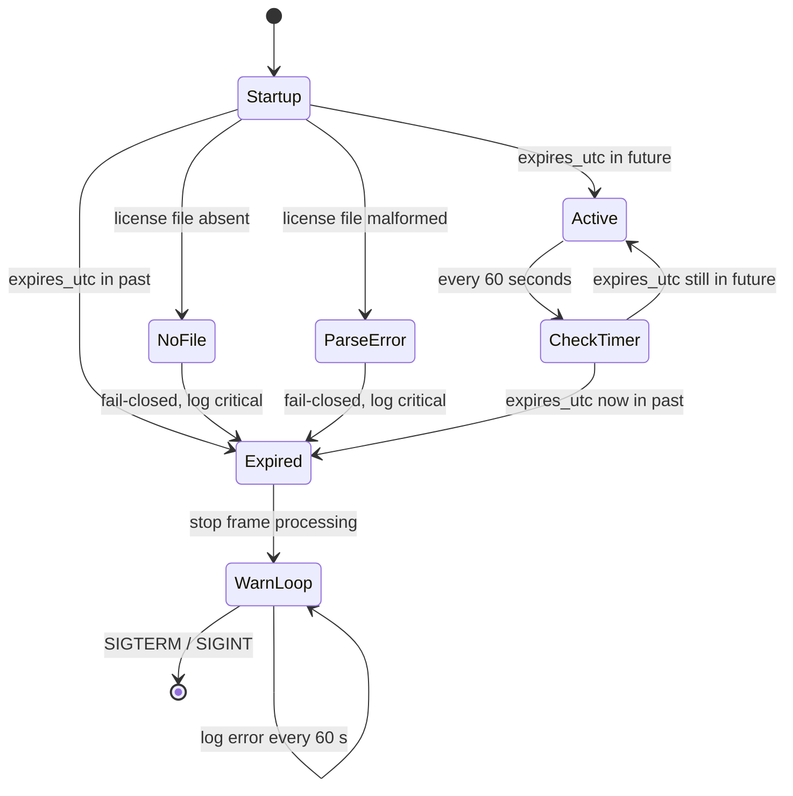

# Demo Mode Design: Expiration Date Enforcement

## Build Configuration

Demo mode is **disabled by default**. To build with expiration enforcement,
use `make build-demo` or pass `-DENABLE_DEMO_MODE=ON` to CMake. Standard
`make build` produces a production binary with no expiration code.

## Overview

This document describes the design for a demo mode feature that enforces a hard
expiration date on the Argus audience measurement extension. Every minute the
running process compares the current wall-clock time against an expiration
timestamp stored in `expires.json`. The file is searched in multiple locations,
allowing field overrides of the bundled expiration date. Once the current time
passes the timestamp, all video frame processing stops and the logs emit
persistent error messages instructing the operator to obtain a new version.

## Requirements

1. Every 60 seconds, read the license file from the first location where it exists
   (see Search Order below) and compare the expiration timestamp to the current
   UTC wall-clock time.
2. If the current time is past the expiration timestamp, stop all video frame
   processing immediately.
3. After expiration, log an error every 60 seconds stating that demo mode has
   expired and a new version is required.
4. If the expiration file is absent in a demo build, treat it as expired
   (fail-closed): log a critical error and stop video processing. A production
   build compiled with `ENABLE_DEMO_MODE=OFF` ignores the file entirely.
5. If the expiration file is present but malformed, log a critical error and
   treat the demo as expired (fail-closed).
6. Re-reading the file on every check allows the expiration date to be updated
   in the field without restarting the process.

## Expiration File

### Search Order

The license file is searched in the following locations (first found wins):

| Priority | Path | Purpose |
|----------|------|---------|
| 1 | `--license-file <path>` | Command-line override |
| 2 | `/storage/sd/expires.json` | SD card override (field update) |
| 3 | `/storage/flash/expires.json` | Flash storage override (persistent) |
| 4 | `/var/volatile/bsext/ext_npu_argus/expires.json` | Bundled default |

This allows extending the demo expiration in the field by placing an updated
`expires.json` on the SD card or flash storage, without modifying the installed
extension package.

### JSON Structure

```json
{
  "version": 1,
  "expires_utc": "2026-03-31T23:59:59Z",
  "issued_utc":  "2026-02-23T00:00:00Z",
  "note":        "Argus demo license — contact sales@example.com for production"
}
```

**Fields:**

| Field         | Type   | Required | Description                                                  |
|---------------|--------|----------|--------------------------------------------------------------|
| `version`     | int    | yes      | Schema version; currently must be `1`                        |
| `expires_utc` | string | yes      | ISO 8601 UTC datetime; processing stops after this moment    |
| `issued_utc`  | string | no       | Informational: when this license was created                 |
| `note`        | string | no       | Informational: human-readable contact / renewal instructions |

**`expires_utc` format:** `YYYY-MM-DDTHH:MM:SSZ` — full UTC datetime, always
with a `Z` suffix. The implementation must reject any value that does not parse
as a valid UTC datetime.

### Example: License Expiring End of Q1 2026

```json
{
  "version": 1,
  "expires_utc": "2026-03-31T23:59:59Z",
  "issued_utc":  "2026-01-15T00:00:00Z",
  "note":        "Argus demo — 75-day evaluation. Contact sales@brightsign.biz for production."
}
```

## Architecture

### Check Mechanism

A lightweight `DemoLicenseChecker` class encapsulates all expiration logic. It
is constructed in `main()` before the orchestrator starts, and its `check()`
method is called in the main loop every 60 seconds.

```
┌─────────────┐      check() every 60 s      ┌───────────────────────┐
│  main loop  │ ──────────────────────────── │  DemoLicenseChecker   │
└─────────────┘                              │  - reads expires.json │
        │                                    │  - parses expires_utc │
        │  is_expired() == true              │  - compares to now()  │
        ▼                                    └───────────────────────┘
  stop orchestrator
  enter warning-only loop
```

### State Diagram



## Implementation

### New Class: `DemoLicenseChecker`

**Files:** `include/demo/demo_license_checker.h` and
`src/demo/demo_license_checker.cpp`

```cpp
class DemoLicenseChecker {
public:
    explicit DemoLicenseChecker(const std::string& license_file_path);

    // Read and parse the file; compare expires_utc to now.
    // Returns true if the demo is expired (or the file is malformed).
    // Returns false if not expired or if the file is absent.
    bool check();

    // True after the first check() call that returned true.
    bool is_expired() const;

    // Expiration timestamp string for log messages (empty if no file).
    const std::string& expires_utc() const;

private:
    std::string file_path_;
    bool expired_{false};
    std::string expires_utc_;

    // Parse ISO 8601 UTC string "YYYY-MM-DDTHH:MM:SSZ" into time_t.
    // Returns false on parse failure.
    bool parse_iso8601_utc(const std::string& s, std::time_t& out);
};
```

**Key design decisions:**

- Re-read the file on every `check()` call so a provisioner can extend the
  expiration date in the field without a process restart.
- Use `std::time(nullptr)` (wall-clock seconds since epoch) to compare against
  the parsed expiration. Monotonic clock is deliberately not used here because
  expiration is defined by a calendar date, not elapsed runtime.
- Fail-closed on parse errors: a corrupted or tampered file triggers expiration.
- No in-memory state between calls other than caching `expired_` once it
  becomes true — once expired, it stays expired for the lifetime of the process.

### Integration in `main.cpp`

```cpp
#ifdef DEMO_MODE_ENABLED
#include "demo/demo_license_checker.h"
#endif

int main(int argc, char** argv) {

    // ... existing initialization, config load, orchestrator setup ...

#ifdef DEMO_MODE_ENABLED
    // Search order: --license-file > /storage/sd > /storage/flash > extension dir
    std::string license_path;
    if (cli.license_file && file_exists(cli.license_file)) {
        license_path = cli.license_file;
    } else if (file_exists("/storage/sd/expires.json")) {
        license_path = "/storage/sd/expires.json";
    } else if (file_exists("/storage/flash/expires.json")) {
        license_path = "/storage/flash/expires.json";
    } else {
        license_path = "/var/volatile/bsext/ext_npu_argus/expires.json";
    }
    LG_INFO("Demo mode: using license file %s", license_path.c_str());
    DemoLicenseChecker license_checker(license_path);

    // Initial check before starting the orchestrator.
    if (license_checker.check()) {
        LG_ERROR("============================================================");
        LG_ERROR("DEMO MODE EXPIRED: expiration was %s",
                 license_checker.expires_utc().c_str());
        LG_ERROR("This build is a DEMO VERSION. Obtain a new version to");
        LG_ERROR("continue operation. Contact your BrightSign representative.");
        LG_ERROR("============================================================");

        // Enter warning-only loop — do not start the orchestrator.
        auto last_warn = std::chrono::steady_clock::now();
        while (!g_stop.load()) {
            auto elapsed = std::chrono::duration_cast<std::chrono::seconds>(
                std::chrono::steady_clock::now() - last_warn).count();
            if (elapsed >= 60) {
                LG_ERROR("============================================================");
                LG_ERROR("DEMO MODE EXPIRED: video processing is disabled");
                LG_ERROR("Expiration: %s  |  Obtain a new version to continue.",
                         license_checker.expires_utc().c_str());
                LG_ERROR("============================================================");
                last_warn = std::chrono::steady_clock::now();
            }
            std::this_thread::sleep_for(std::chrono::milliseconds(200));
        }
        return 0;
    }

    if (!license_checker.expires_utc().empty()) {
        LG_INFO("Demo mode active — expires %s", license_checker.expires_utc().c_str());
    }

    auto last_license_check = std::chrono::steady_clock::now();
#endif

    // ... start orchestrator ...

    while (!g_stop.load() && !g_restart_requested.load()) {
        std::this_thread::sleep_for(std::chrono::milliseconds(200));

#ifdef DEMO_MODE_ENABLED
        {
            auto elapsed = std::chrono::duration_cast<std::chrono::seconds>(
                std::chrono::steady_clock::now() - last_license_check).count();
            if (elapsed >= 60) {
                last_license_check = std::chrono::steady_clock::now();
                if (license_checker.check()) {
                    LG_ERROR("============================================================");
                    LG_ERROR("DEMO MODE EXPIRED: stopping video processing");
                    LG_ERROR("Expiration: %s  |  Obtain a new version to continue.",
                             license_checker.expires_utc().c_str());
                    LG_ERROR("============================================================");
                    g_stop.store(true);
                    break;
                }
            }
        }
#endif

        // ... existing heartbeat logging ...
    }

    // If expired, re-enter warning loop after orchestrator stops.
#ifdef DEMO_MODE_ENABLED
    if (license_checker.is_expired()) {
        // Orchestrator shutdown happens in existing code below this point.
        // After shutdown completes, enter the warning loop so the service
        // manager sees a running process (prevents automatic restart loops).
        // The process exits only on SIGTERM / SIGINT.
        // This block is reached after the orchestrator join below.
    }
#endif

    // ... existing orchestrator stop / join ...

#ifdef DEMO_MODE_ENABLED
    if (license_checker.is_expired()) {
        auto last_warn = std::chrono::steady_clock::now();
        while (!g_stop.load()) {
            auto elapsed = std::chrono::duration_cast<std::chrono::seconds>(
                std::chrono::steady_clock::now() - last_warn).count();
            if (elapsed >= 60) {
                LG_ERROR("============================================================");
                LG_ERROR("DEMO MODE EXPIRED: video processing is disabled");
                LG_ERROR("Expiration: %s  |  Obtain a new version to continue.",
                         license_checker.expires_utc().c_str());
                LG_ERROR("============================================================");
                last_warn = std::chrono::steady_clock::now();
            }
            std::this_thread::sleep_for(std::chrono::milliseconds(200));
        }
    }
#endif

    return exit_code;
}
```

### Build-Time Guard

Demo mode enforcement is compiled in only when `DEMO_MODE_ENABLED` is defined:

```cmake
# CMakeLists.txt
option(ENABLE_DEMO_MODE "Compile in demo expiration enforcement" OFF)
if(ENABLE_DEMO_MODE)
    add_definitions(-DDEMO_MODE_ENABLED=1)
    target_sources(argus_extension PRIVATE src/demo/demo_license_checker.cpp)
endif()
```

The default build (`ENABLE_DEMO_MODE=OFF`) contains no demo-mode code paths
and ignores the presence or absence of `expires.json`. Demo mode is ON by
default; it must be explicitly disabled for production releases.

## Error Handling

| Scenario | Behavior |
|---|---|
| File absent | Treat as expired (fail-closed); log critical error |
| File present, `version` != 1 | Log critical; treat as expired (fail-closed) |
| File present, `expires_utc` missing or malformed | Log critical; treat as expired (fail-closed) |
| File present, `expires_utc` in future | Run normally; log INFO with expiration date on startup |
| File present, `expires_utc` in past | Stop processing; log ERROR every 60 seconds |
| File unreadable (permissions) | Log critical; treat as expired (fail-closed) |
| JSON parse error | Log critical; treat as expired (fail-closed) |
| System clock not set (epoch / year 1970) | Expiration check result depends on `expires_utc`; no special handling — operators must ensure NTP is configured |

## Logging

### Startup — not expired

```
INFO: Demo mode active — expires 2026-03-31T23:59:59Z
```

### Startup — already expired

```
ERROR: ============================================================
ERROR: DEMO MODE EXPIRED: expiration was 2026-03-31T23:59:59Z
ERROR: This build is a DEMO VERSION. Obtain a new version to
ERROR: continue operation. Contact your BrightSign representative.
ERROR: ============================================================
```

### Expiration detected during operation

```
ERROR: ============================================================
ERROR: DEMO MODE EXPIRED: stopping video processing
ERROR: Expiration: 2026-03-31T23:59:59Z  |  Obtain a new version to continue.
ERROR: ============================================================
```

### Persistent warning (every 60 seconds after expiration)

```
ERROR: ============================================================
ERROR: DEMO MODE EXPIRED: video processing is disabled
ERROR: Expiration: 2026-03-31T23:59:59Z  |  Obtain a new version to continue.
ERROR: ============================================================
```

### Malformed file

```
CRITICAL: Demo mode: failed to parse expires.json — treating as expired
CRITICAL: Demo mode: field 'expires_utc' missing or not a valid UTC datetime
```

## Provisioning

### Source of truth

`expires.json` lives in the **project root** and is committed to the repository.
Edit it there when a new expiry date is needed, then rebuild and repackage.

### Build and package flow

1. The `Makefile` `build-demo` target compiles with `ENABLE_DEMO_MODE=ON`.
   The default `build` target passes `DEMO_MODE=0` which sets
   `ENABLE_DEMO_MODE=OFF` to produce a binary with no expiration code.
2. The `package` script copies `expires.json` from the project root into the
   staging bundle root (`staging/expires.json`).
3. The resulting `argus-demo-*.zip` includes `expires.json` at the top level.

### Installation on the player

The `attention_demo` binary searches for `expires.json` in multiple locations
(see Search Order above). The bundled file in the extension directory serves
as the default.

### Updating the expiry date in the field

To extend the demo expiration without reinstalling the extension, place an
updated `expires.json` in one of the override locations:

**Option 1: SD card (easiest, removable)**
```bash
# Copy to SD card root
cp expires.json /storage/sd/expires.json
```

**Option 2: Flash storage (persistent across SD changes)**
```bash
# Copy to flash storage
cp expires.json /storage/flash/expires.json
```

The running process re-reads the file on every 60-second check and will pick
up the new date without a restart. The SD card location takes priority over
flash, which takes priority over the bundled default.

### Command-line override

The license file path can be explicitly specified via command-line argument,
which takes highest priority:

```bash
./attention_demo --license-file /path/to/custom/expires.json
```

## Security Considerations

- **Bypass vector:** A user with root access can place an `expires.json` with
  a far-future date on the SD card or flash storage, or advance/change the
  system clock. This is a soft enforcement intended for honest evaluation use;
  it is not a DRM system.
- **Fail-closed design:** Any file corruption or tampered `version` field
  triggers expiration rather than silently bypassing it.
- **No network dependency:** The check is entirely local; no phone-home is
  required, which suits air-gapped demo environments.
- **Wall-clock dependence:** The check depends on the system clock being
  accurate. Demo units should run NTP. A clock at epoch (year 1970) will
  never trigger expiration for any reasonably-dated `expires_utc` value.

## Testing

### Unit Tests

**File:** `tests/test_demo_license_checker.cpp`

| Test case | Expected result |
|---|---|
| File absent | `check()` returns true (fail-closed) |
| Valid file, expiry in future | `check()` returns false; `expires_utc()` populated |
| Valid file, expiry in past | `check()` returns true |
| File with `version` != 1 | `check()` returns true (fail-closed) |
| `expires_utc` field missing | `check()` returns true (fail-closed) |
| `expires_utc` not valid ISO 8601 | `check()` returns true (fail-closed) |
| File exists but not readable | `check()` returns true (fail-closed) |
| `expires_utc` exactly equal to now | `check()` returns true (expired at boundary) |
| Once `is_expired()` is true, stays true | Subsequent `check()` calls return true |

### Integration Test

Write an `expires.json` with `expires_utc` set 2 minutes in the future. Start
the binary. Observe INFO log with expiry date. Wait for expiry. Confirm ERROR
messages appear within 60 seconds of the expiry time and that the orchestrator
stops.

## References

- Main application: `src/main.cpp`
- Demo checker: `include/demo/demo_license_checker.h`, `src/demo/demo_license_checker.cpp`
- Configuration: `src/config/configuration.h`
- Orchestrator: `src/orchestration/orchestrator.h`
- BrightSign extension packaging: `docs/BrightSign-Extension-Packaging-Presentation.md`
