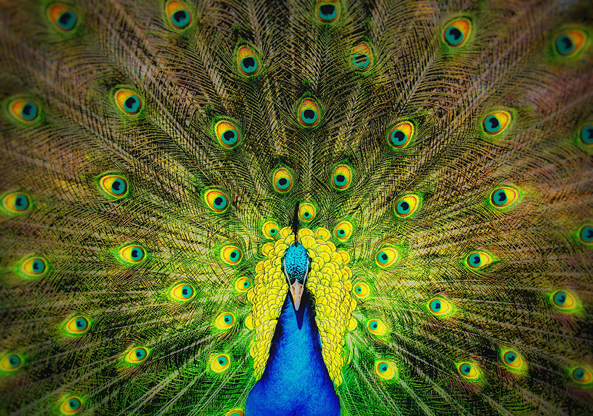
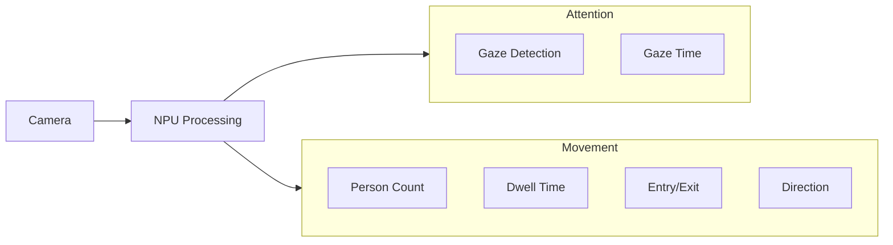
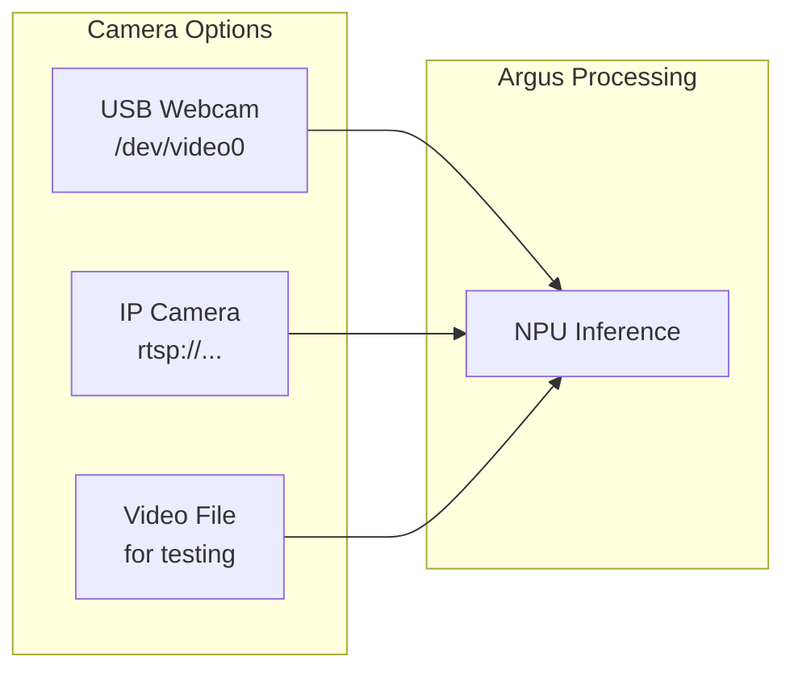
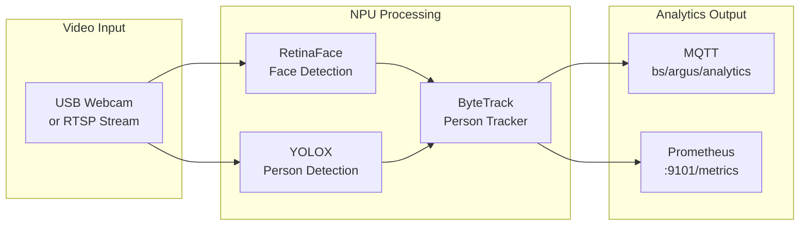

<p align="center">
  
</p>

# Argus Audience Measurement Extension

**Edge AI for real-time audience analytics on BrightSign players**

Argus is a **machine vision application** that analyzes live video from a camera to measure audience behavior. Connect a USB webcam or an IP camera via RTSP, and Argus uses neural network inference on the device's NPU to detect people, track their movement, and determine if they're looking at your display.

Transform your BrightSign digital signage player into an intelligent audience measurement system. Understand not just *who* is in front of your display, but *how* they're engaging with it.

## What Argus Measures

| Measurement | Description |
|-------------|-------------|
| **Person Count** | How many people are currently in view |
| **Gaze Detection** | Is each person looking at the screen? |
| **Gaze Time** | How long has each person been looking? |
| **Dwell Time** | How long has each person been in the area? |
| **Entry/Exit** | When people enter or leave the frame |
| **Direction** | Which way are people moving? (8-way compass) |
| **Speed** | How fast are people moving? |

## What are the Parts of the Solution?




## Camera Input

Argus works with any camera that provides a video feed:



| Input Type | Example | Use Case |
|------------|---------|----------|
| **USB Webcam** | `/dev/video0` | Simple setup, direct connection |
| **RTSP Stream** | `rtsp://192.168.0.100:8554/live` | IP cameras, PoE cameras, existing infrastructure |
| **Video File** | `/storage/sd/test.mp4` | Testing and development |

**Typical setup:** Mount a camera facing the audience area in front of your digital sign, connect via USB or network, and Argus continuously analyzes the video stream.

## Key Features

- **Flexible camera support** - USB webcams, RTSP/IP cameras, or video files
- **Real-time analytics** - Sub-second latency from camera to data
- **Per-person tracking** - Stable IDs track individuals across frames
- **Dual output** - MQTT for real-time streaming, Prometheus for dashboards
- **Privacy by design** - No images leave the device, no facial recognition
- **Edge processing** - All AI runs on-device using NPU acceleration
- **Low power** - ~3.5W enables fanless operation

## Architecture Overview



The system captures video frames, runs two neural networks in parallel on the NPU (face detection for gaze, person detection for tracking), fuses the results, and outputs analytics via MQTT and Prometheus.

## Getting Your Data

Argus provides two ways to access analytics data:

### Option 1: MQTT (Real-time)

Subscribe to the MQTT topic for real-time JSON messages:

```bash
mosquitto_sub -h <PLAYER_IP> -t 'bs/argus/analytics' -v
```

Example message (abbreviated; see **[MQTT Schema Reference](docs/mqtt-message-format.md)** for all fields):
```json
{
  "schema": "analytics/v7.0",
  "ts": 164.68,
  "device": "XS-156",
  "people": 3,
  "gaze": 1,
  "fps": 29,
  "tracks": [
    {
      "id": 63,
      "state": "Confirmed",
      "bbox": [52.9, 227.4, 286.6, 720.0],
      "score": 0.93,
      "dir": "UR",
      "dwell": 31.03,
      "gaze": { "detected": 1, "time": 8.0, "face_bbox": [231, 167, 240, 180] }
    }
  ]
}
```

**[Full MQTT Integration Guide →](docs/INTEGRATION-MQTT.md)**

### Option 2: Prometheus (Dashboards & Alerting)

Scrape metrics from the Prometheus exporter:

```bash
curl http://<PLAYER_IP>:9101/metrics
```

Key metrics:
| Metric | Description |
|--------|-------------|
| `argus_occupancy_current` | Current person count |
| `argus_gaze_current` | People currently looking |
| `argus_visitors_total` | Total visitors (counter) |
| `argus_dwell_seconds` | Dwell time histogram |

**[Full Prometheus & Grafana Setup Guide →](docs/prometheus-grafana-setup.md)**

## Build Packages

The build produces two zip packages, each containing the same binaries, models, and configs for all supported SOCs. They differ in how they are deployed to a BrightSign player.

### Development Package (`argus-dev-<timestamp>.zip`)

For testing and iterative development. Contents are extracted directly to the filesystem.

- **Deployment path:** `/usr/local/argus` (volatile storage)
- **Persistence:** Lost on reboot
- **Install method:** Unzip and run manually
- **Use case:** Rapid iteration, debugging, field testing

```bash
# On the player
mkdir -p /usr/local/argus && cd /usr/local/argus
unzip /storage/sd/argus-dev-*.zip
./bsext_init run
```

### Extension Package (`argus-ext-<timestamp>.zip`)

For permanent production deployment. Contains an LVM image created by `sh/make-extension-lvm` that installs into the BrightSign extension system.

- **Deployment path:** BrightSign extension partition (mounted at `/var/volatile/bsext/ext_npu_argus`)
- **Persistence:** Survives reboots and SD card removal
- **Install method:** Run the LVM install script, then reboot
- **Use case:** Production deployments, long-running installations

```bash
# On the player
cd /usr/local
unzip /storage/sd/argus-ext-*.zip
bash ./ext_npu_argus_install-lvm.sh
reboot
```

### Building Packages

Building requires an **x86_64 Linux** machine (Ubuntu 20.04+ recommended) with Docker or Podman. The build uses a containerized cross-compilation SDK to produce ARM binaries for the BrightSign players — it cannot run on ARM, macOS, or Windows hosts.

```bash
make build          # Production build
make build-demo     # Demo build (adds expiration date enforcement)
```

Both targets compile the application and run `./package`, which produces the two zip files in the project root. Demo builds include a `demo` prefix in the filenames (e.g., `argus-demo-dev-*.zip`).

See **[Build & Installation Guide](docs/BUILD-INSTRUCTIONS.md)** for full details on prerequisites, SDK setup, and incremental builds.

## Supported Hardware

| Platform | SoC | NPU | Parallel Models |
|----------|-----|-----|-----------------|
| **XT5** | RK3588 | 3-core, 6 TOPS | 2-3 models |
| **XS156** | RK3576 | 2-core, 4 TOPS | 2 models |
| **LS5/HS5** | RK3568 | 1-core, 1 TOPS | 1 model |

## Performance

| Metric | Value |
|--------|-------|
| Inference latency | <15ms per model |
| End-to-end latency | 35-55ms |
| Processing rate | 25-30 FPS |
| Power consumption | ~3.5W |

## How Person Tracking Works

Argus uses ByteTrack to maintain stable person IDs across frames. Each tracked person has individual gaze metrics, dwell time, and movement direction. No facial embeddings are stored — privacy-preserving by design.

**[Full Tracking Explanation →](docs/TRACKING-EXPLAINED.md)**

## Documentation

| Document | Description |
|----------|-------------|
| **[Build & Installation](docs/BUILD-INSTRUCTIONS.md)** | Building, deploying, and installing |
| **[Configuration Reference](docs/CONFIGURATION.md)** | All configuration options |
| **[MQTT Integration](docs/INTEGRATION-MQTT.md)** | Real-time data via MQTT |
| **[MQTT Schema Reference](docs/mqtt-message-format.md)** | Complete v7.0 message format |
| **[Prometheus & Grafana](docs/prometheus-grafana-setup.md)** | Metrics, dashboards, and alerting |
| **[Tracking Explained](docs/TRACKING-EXPLAINED.md)** | How person tracking works |
| **[Architecture Design](docs/DESIGN.md)** | System architecture deep-dive |
| **[C++ Architecture](docs/cpp-design.md)** | Code structure and modification guide |

## Troubleshooting

### Check Service Status
```bash
ssh brightsign@<PLAYER_IP>
cd /var/volatile/bsext/ext_npu_argus
./bsext_init status
```

### View Logs
```bash
tail -f /tmp/ext-npu-argus.log
```

### Test MQTT Connection
```bash
mosquitto_sub -h <PLAYER_IP> -t 'bs/argus/#' -v
```

### Common Issues

| Issue | Solution |
|-------|----------|
| No MQTT messages | Check broker: `ps aux \| grep mosquitto` |
| Camera not detected | Check device: `ls /dev/video*` |
| Low FPS | Reduce resolution or enable single model mode |

## License

*License information to be determined.*

## Support

- **Issues**: [GitHub Issues](https://github.com/BrightSign-Playground/argus-audience-measurement-extension/issues)
- **Documentation**: See `/docs` folder
