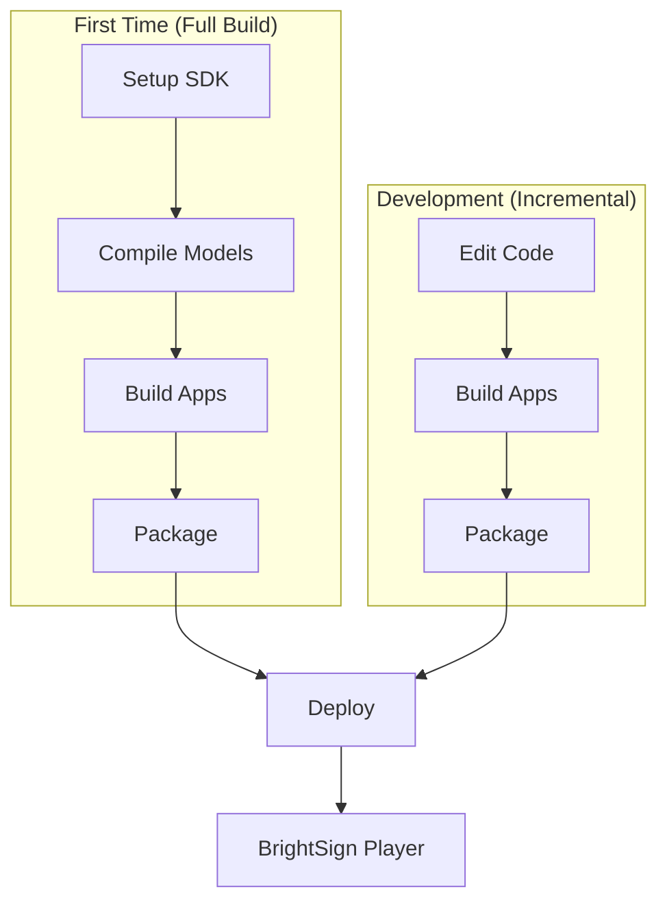

# Build & Installation Guide

This guide covers building Argus from source and deploying it to BrightSign players.

## Prerequisites

### Build Machine Requirements

| Requirement | Details |
|-------------|---------|
| **OS** | x86_64 Linux (Ubuntu 20.04+ recommended) |
| **Container Runtime** | Docker or Podman |
| **Disk Space** | ~10GB for SDK and build artifacts |
| **Memory** | 8GB+ recommended |

### Container Runtime

The build system automatically detects and uses Docker or Podman:

```bash
# Check which is available
docker --version || podman --version
```

Install one of:
- **Docker**: https://docs.docker.com/engine/install/
- **Podman**: https://podman.io/getting-started/installation

## Build Process Overview



## Full Build (First Time)

For a complete build including SDK setup and model compilation:

```bash
# Clone the repository
git clone https://github.com/BrightSign-Playground/argus-audience-measurement-extension.git
cd argus-audience-measurement-extension

# Full build - creates packages for all supported devices
./scripts/runall.sh --auto
```

This will:
1. Download and build the cross-compilation SDK
2. Compile RKNN models for all target platforms
3. Build the C++ application
4. Build Go utilities (argus-exporter, image-stream-server)
5. Create deployment packages

### Build Output

```
argus-ext-<timestamp>.zip   # Production package
argus-dev-<timestamp>.zip   # Development package (includes debug symbols)
```

## Incremental Build (Development)

Once the SDK and models exist, use `./build-apps` for fast iteration:

```bash
# Build for all platforms
./build-apps

# Build for single platform (faster)
./build-apps LS5       # RK3568 (LS5/HS5)
./build-apps XT5       # RK3588 (XT5)
./build-apps Firebird  # RK3576 (XS156)

# Clean build
./build-apps --clean XT5

# Verbose output
./build-apps -v
```

### Force Update Dependencies

To update Go dependencies from upstream:

```bash
make build-update
```

### Package After Building

```bash
./package
```

Output will be in the project root:
- `argus-ext-<timestamp>.zip` - Production package
- `argus-dev-<timestamp>.zip` - Development package

## Deployment

### Copy Package to Device

```bash
scp argus-ext-<timestamp>.zip brightsign@<DEVICE_IP>:/storage/sd/
```

### Install on Device

SSH into the device and install:

```bash
ssh brightsign@<DEVICE_IP>

# Extract package
cd /storage/sd
unzip argus-ext-<timestamp>.zip

# Run installer
bash ./ext_npu_argus_install-lvm.sh

# Start the service
cd /var/volatile/bsext/ext_npu_argus
./bsext_init start
```

### Verify Installation

```bash
# Check service status
./bsext_init status

# View logs
tail -f /tmp/ext-npu-argus.log

# Test MQTT output
mosquitto_sub -h localhost -t 'bs/argus/#' -v
```

## Build Configuration

### Platform Targets

| Target Name | SoC | BrightSign Model |
|-------------|-----|------------------|
| `XT5` | RK3588 | XT5 series |
| `LS5` | RK3568 | LS5, HS5 series |
| `Firebird` | RK3576 | XS156 series |

### Build Options

| Option | Description |
|--------|-------------|
| `--clean` | Remove build artifacts before building |
| `--quiet` | Reduced output verbosity |
| `--verbose` | Full build output |

## Dependencies

### Runtime Dependencies (on device)

These are included in the extension package:
- RKNN SDK and runtime
- OpenCV 4.x
- GStreamer 1.0
- Mosquitto MQTT
- Boost (filesystem, system)

### Build Dependencies (on build machine)

- CMake 3.x
- ARM cross-compilation toolchain (from SDK)
- Go 1.21+ (for argus-exporter)

## Troubleshooting Build Issues

### SDK Not Found

```
Error: SDK not found in ./sdk directory
```

**Solution:** Run the full build first:
```bash
./scripts/runall.sh --auto
```

### Model Compilation Failed

```
Error: RKNN model compilation failed
```

**Solution:** Ensure you have the RKNN toolkit container:
```bash
./scripts/setup_rknn_toolkit.sh
```

### Go Build Failed

```
Error: go: command not found
```

**Solution:** Install Go 1.21+:
```bash
# Ubuntu/Debian
sudo apt install golang-go

# Or download from https://go.dev/dl/
```

### Permission Denied

```
Error: Permission denied: ./build-apps
```

**Solution:** Make scripts executable:
```bash
chmod +x build-apps package scripts/*.sh
```

### Container Runtime Not Found

```
Error: Neither docker nor podman found
```

**Solution:** Install Docker or Podman (see Prerequisites).

## Uninstalling

### Stop the Extension

```bash
ssh brightsign@<DEVICE_IP>
/var/volatile/bsext/ext_npu_argus/bsext_init stop
```

### Verify Processes Stopped

```bash
ps | grep -E "attention_demo|argus-exporter|mosquitto"
```

### Run Uninstall Script

```bash
/var/volatile/bsext/ext_npu_argus/uninstall.sh
```

### Reboot

```bash
reboot
```

## Development Workflow

For active development, see:
- **[Orange Pi Development Guide](OrangePi_Development.md)** - Native ARM development
- **[C++ Architecture](cpp-design.md)** - Code structure and modification guide

### Recommended Workflow

1. Make code changes
2. Build for single platform: `./build-apps LS5`
3. Deploy and test on device
4. Once stable, build all platforms: `./build-apps`
5. Package for distribution: `./package`

## Related Documentation

- **[Configuration Reference](CONFIGURATION.md)** - Configure after installation
- **[Architecture Design](DESIGN.md)** - System architecture
- **[README](../README.md)** - Project overview
