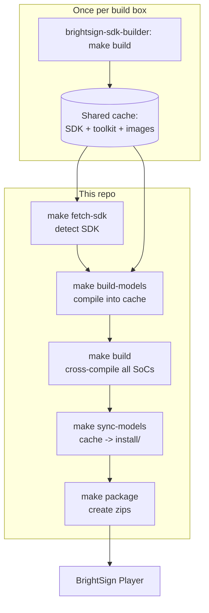

# Build & Installation Guide

This guide covers building Argus from source and deploying it to BrightSign players.

## Prerequisites

### Build Machine Requirements

| Requirement | Details |
|-------------|---------|
| **OS** | x86_64 Linux (Ubuntu 20.04+ recommended) |
| **Container Runtime** | Docker or Podman |
| **Disk Space** | ~25GB for the SDK + toolkit (in the shared cache), plus build artifacts |
| **Memory** | 8GB+ recommended |

The build cross-compiles ARM binaries for the players; it cannot run on ARM, macOS, or Windows hosts.

### Shared build cache (provisioned once per build box)

The heavy, box-level assets are **not** built in this repo:

| Asset | Produced by | Consumed here for |
|-------|-------------|-------------------|
| Custom aarch64 cross-compile SDK | `brightsign-sdk-builder` | cross-compiling the extension |
| RKNN toolkit + `rknn_tk2` image | `brightsign-sdk-builder` | compiling the models |
| Compiled RKNN models (per SoC) | `make build-models` (this repo) | packaging |

The SDK, toolkit, and container images are expensive (~hours, ~25GB) and identical across every consumer project, so they live in a **shared cache outside the repo** and are built **once per build box** by the sibling [`brightsign-sdk-builder`](https://github.com/brightsign/brightsign-sdk-builder) repo:

```bash
# One-time per build box, from a checkout parallel to this repo:
cd ../brightsign-sdk-builder && make build
```

The cache defaults to `../argus-build-cache` (parallel to the repo). Override the location with `ARGUS_CACHE_DIR` (use the same value for the builder and this repo if they are not siblings):

```bash
make cache-info                                        # resolved cache + what is present
make cache-info ARGUS_CACHE_DIR=/srv/argus-build-cache # against a custom location
```

### Container Runtime

```bash
docker --version || podman --version
```

Install one of:
- **Docker**: https://docs.docker.com/engine/install/
- **Podman**: https://podman.io/getting-started/installation

## Build Process Overview


```mermaid
flowchart TD
    subgraph Box["Once per build box"]
        B0[brightsign-sdk-builder: make build] --> Cache[(Shared cache:<br/>SDK + toolkit + images)]
    end

    subgraph Repo["This repo"]
        F[make fetch-sdk<br/>detect SDK] --> BM[make build-models<br/>compile into cache]
        BM --> BLD[make build<br/>cross-compile all SoCs]
        BLD --> SY[make sync-models<br/>cache -> install/]
        SY --> PKG[make package<br/>create zips]
    end

    Cache --> F
    Cache --> BM
    PKG --> Device[BrightSign Player]
```

`make package` runs the whole consumer chain (`build` → `build-models` → `sync-models` → `./package`).

## Full Build

```bash
# Clone the repository (ideally parallel to brightsign-sdk-builder)
git clone https://github.com/brightsign/argus-audience-measurement-extension.git
cd argus-audience-measurement-extension

# One-time: provision the shared cache (if not already done on this box)
( cd ../brightsign-sdk-builder && make build )

# Cross-compile all SoCs, sync models, and create packages
make package          # production
make package-demo     # with demo expiration-date enforcement
```

If this repo is not checked out alongside `brightsign-sdk-builder`, pass `ARGUS_CACHE_DIR=/path/to/argus-build-cache` to every `make` call (or export it).

### Build Output

```
argus-ext-<timestamp>.zip   # Production package
argus-dev-<timestamp>.zip   # Development package (includes debug symbols)
```

Demo builds carry a `demo` prefix (e.g. `argus-demo-ext-<timestamp>.zip`).

## Incremental Build (Development)

Once the cache is provisioned, iterate with the granular targets:

```bash
make build                 # cross-compile all SoCs
make build SOCS=rk3588     # single SoC, faster (rk3588 | rk3576 | rk3568)
make build-demo            # all SoCs, demo expiration enforcement

make package               # rebuild + sync models + repackage
```

| Target | Does |
|--------|------|
| `make fetch-sdk` | detect the SDK in the shared cache |
| `make build-models` | compile the RKNN models into the cache (idempotent) |
| `make build` | cross-compile the extension (all SoCs, or `SOCS=`) |
| `make sync-models` | copy cached models into `install/<SOC>/model` |
| `make build-gst-plugins` | (optional) build the MP4 GStreamer plugins from the cached OE tree |
| `make package` | full chain: build + models + sync + zips |
| `make run-tests` / `make test` | build and run the host-side C++ unit tests |
| `make clean` | remove this repo's build artifacts (keeps the cache) |
| `make cache-info` | show the resolved cache and what is present |

Run `make` with no target for the full list.

### Force Update Dependencies

To force the auxiliary build scripts to re-pull their sources:

```bash
make build-update
```

## Deployment

### Copy Package to Device

```bash
scp argus-ext-<timestamp>.zip brightsign@<DEVICE_IP>:/storage/sd/
```

### Install on Device

```bash
ssh brightsign@<DEVICE_IP>

# Extract package
cd /storage/sd
unzip argus-ext-<timestamp>.zip

# Run installer
bash ./ext_npu_argus_install-lvm.sh

# Start the service
cd /var/volatile/bsext/ext_npu_argus
./bsext_init start
```

### Verify Installation

```bash
# Check service status
./bsext_init status

# View logs
tail -f /tmp/ext-npu-argus.log

# Test MQTT output
mosquitto_sub -h localhost -t 'bs/argus/#' -v
```

## Build Configuration

### Platform Targets

| SoC | `SOCS=` value | Build dir | BrightSign Model |
|-----|---------------|-----------|------------------|
| RK3588 | `rk3588` | `build_xt5` | XT5 series |
| RK3568 | `rk3568` | `build_ls5` | LS5, HS5 series |
| RK3576 | `rk3576` | `build_rk3576` | XS156 series |

### Demo Mode

Demo builds compile in expiration-date enforcement. Select it via the demo targets or `DEMO_MODE=1`:

```bash
make package-demo
# equivalently:
make package DEMO_MODE=1
```

## Dependencies

### Runtime Dependencies (on device)

Included in the extension package:
- RKNN SDK and runtime
- OpenCV 4.x
- GStreamer 1.0
- Mosquitto MQTT
- Boost (filesystem, system)

### Build Dependencies (on build machine)

- CMake 3.x
- Docker or Podman
- The shared cache provisioned by `brightsign-sdk-builder` (SDK + RKNN toolkit + `rknn_tk2` image)

## Troubleshooting Build Issues

### SDK Not Found

```
No cross-compile SDK found in the shared cache ...
```

**Solution:** Provision the cache from the sibling repo, then rebuild:
```bash
cd ../brightsign-sdk-builder && make build
```
If this repo is not parallel to the builder, make sure both resolve the same cache (`make cache-info`, and pass `ARGUS_CACHE_DIR` consistently).

### Models Missing

```
WARNING: no compiled models for RKxxxx in <cache>/models/RKxxxx
```

**Solution:** Compile them into the cache (needs the cached toolkit + `rknn_tk2` image):
```bash
make build-models
```

### MP4 / GStreamer Plugins Not Built

The optional `make build-gst-plugins` needs the builder's OE build tree (`<cache>/bsoe`), which `brightsign-sdk-builder`'s `make clean` reclaims. Re-provision with `cd ../brightsign-sdk-builder && make build` if it was cleaned.

### Permission Denied

```
Error: Permission denied: scripts/build.sh
```

**Solution:** Make scripts executable:
```bash
chmod +x package scripts/*.sh scripts/lib/*.sh
```

### Container Runtime Not Found

```
Error: Neither docker nor podman found
```

**Solution:** Install Docker or Podman (see Prerequisites).

## Uninstalling

### Stop the Extension

```bash
ssh brightsign@<DEVICE_IP>
/var/volatile/bsext/ext_npu_argus/bsext_init stop
```

### Verify Processes Stopped

```bash
ps | grep -E "attention_demo|argus-exporter|mosquitto"
```

### Run Uninstall Script

```bash
/var/volatile/bsext/ext_npu_argus/uninstall.sh
```

### Reboot

```bash
reboot
```

## Development Workflow

For active development, see:
- **[Orange Pi Development Guide](OrangePi_Development.md)** - Native ARM development
- **[C++ Architecture](cpp-design.md)** - Code structure and modification guide

### Recommended Workflow

1. Make code changes
2. Build for a single platform: `make build SOCS=rk3568`
3. Deploy and test on device
4. Once stable, build all platforms and package: `make package`

## Related Documentation

- **[Configuration Reference](CONFIGURATION.md)** - Configure after installation
- **[Architecture Design](DESIGN.md)** - System architecture
- **[README](../README.md)** - Project overview
