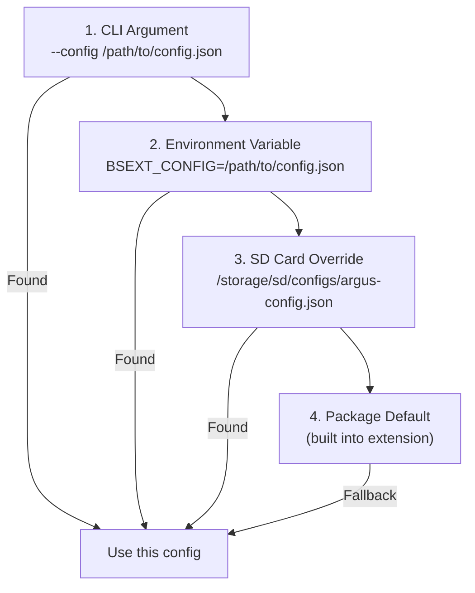

# Configuration Reference

Complete reference for configuring the Argus Audience Measurement Extension.

## Configuration File Location

Argus looks for configuration in the following order (first found wins):



**Recommended:** Use `/storage/sd/configs/argus-config.json` for easy customization.

## Quick Configuration

### Minimal Configuration

```json
{
  "input_source": "rtsp",
  "input": {
    "rtsp_url": "rtsp://192.168.0.100:8554/live"
  }
}
```

### Production Configuration

```json
{
  "input_source": "rtsp",
  "input": {
    "rtsp_url": "rtsp://192.168.0.100:8554/live"
  },
  "log_level": "warn",
  "publishers": [
    {
      "kind": "mqtt",
      "mqtt": {
        "host": "localhost",
        "port": 1883,
        "topic": "bs/argus/analytics",
        "period_ms": 1000
      }
    }
  ]
}
```

---

## Complete Configuration Schema

### Input Source Selection

| Key | Type | Default | Description |
|-----|------|---------|-------------|
| `input_source` | string | `"rtsp"` | Input type: `"rtsp"`, `"usb"`, or `"file"` |
| `device_id` | string | `""` | Device identifier for MQTT messages. Empty = auto-detect from MAC |

```json
{
  "input_source": "rtsp",
  "device_id": "lobby-display-01"
}
```

---

### Input Configuration

#### RTSP Camera

```json
{
  "input_source": "rtsp",
  "input": {
    "rtsp_url": "rtsp://192.168.0.100:8554/live",
    "rtsp": {
      "latency_ms": 100
    }
  }
}
```

| Key | Type | Default | Description |
|-----|------|---------|-------------|
| `input.rtsp_url` | string | Required | RTSP stream URL |
| `input.rtsp.latency_ms` | integer | `100` | Buffering latency in milliseconds |

#### USB Camera

```json
{
  "input_source": "usb",
  "input": {
    "usb_device": "/dev/video0",
    "usb": {
      "width": 640,
      "height": 480,
      "fps": 30
    }
  }
}
```

| Key | Type | Default | Description |
|-----|------|---------|-------------|
| `input.usb_device` | string | `"/dev/video0"` | USB camera device path |
| `input.usb.width` | integer | `640` | Capture width |
| `input.usb.height` | integer | `480` | Capture height |
| `input.usb.fps` | integer | `30` | Target frame rate |

#### Video File (Testing)

```json
{
  "input_source": "file",
  "input": {
    "file_path": "/storage/sd/test-video.mp4",
    "file": {
      "loop": true
    }
  }
}
```

| Key | Type | Default | Description |
|-----|------|---------|-------------|
| `input.file_path` | string | Required | Path to video file |
| `input.file.loop` | boolean | `false` | Loop video playback |

---

### Model Configuration

#### Primary Model (RetinaFace)

```json
{
  "primary_model": {
    "name": "retinaface",
    "model_path": "model/retinaface.rknn",
    "input_size": [320, 320],
    "npu_core": 0,
    "conf_threshold": 0.3,
    "nms_threshold": 0.45,
    "norm": {
      "mean": [123.675, 116.28, 103.53],
      "std": [58.395, 57.12, 57.375]
    }
  }
}
```

| Key | Type | Default | Description |
|-----|------|---------|-------------|
| `name` | string | `"retinaface"` | Model identifier |
| `model_path` | string | Required | Path to .rknn model file |
| `input_size` | [int, int] | `[320, 320]` | Model input dimensions |
| `npu_core` | integer | `0` | NPU core to use (0-2) |
| `conf_threshold` | float | `0.3` | Minimum confidence to detect |
| `nms_threshold` | float | `0.45` | Non-max suppression threshold |

#### Secondary Models (YOLOX)

```json
{
  "secondary_models": [
    {
      "name": "yolox",
      "model_path": "model/yolox_s.rknn",
      "input_size": [640, 640],
      "npu_core": 1,
      "conf_threshold": 0.5,
      "nms_threshold": 0.45,
      "norm": {
        "mean": [0, 0, 0],
        "std": [1, 1, 1]
      }
    }
  ]
}
```

---

### Publisher Configuration

#### MQTT Publisher

```json
{
  "publishers": [
    {
      "kind": "mqtt",
      "mqtt": {
        "host": "localhost",
        "port": 1883,
        "topic": "bs/argus/analytics",
        "qos": 0,
        "retain": false,
        "period_ms": 1000
      }
    }
  ]
}
```

| Key | Type | Default | Description |
|-----|------|---------|-------------|
| `mqtt.host` | string | `"localhost"` | MQTT broker hostname |
| `mqtt.port` | integer | `1883` | MQTT broker port |
| `mqtt.topic` | string | `"bs/argus/analytics"` | Topic to publish to |
| `mqtt.qos` | integer | `0` | MQTT QoS level (0, 1, or 2) |
| `mqtt.retain` | boolean | `false` | Retain messages on broker |
| `mqtt.period_ms` | integer | `1000` | Publish interval in milliseconds |

---

### Runtime Settings

```json
{
  "runtime": {
    "target_fps": 30,
    "heartbeat_ms": 1000
  }
}
```

| Key | Type | Default | Description |
|-----|------|---------|-------------|
| `target_fps` | integer | `30` | Target processing frame rate |
| `heartbeat_ms` | integer | `1000` | Health check interval |

---

### Processing Settings

```json
{
  "processing": {
    "th": {
      "score": 0.5,
      "iou": 0.45
    },
    "nms_max_dets": 100
  }
}
```

| Key | Type | Default | Description |
|-----|------|---------|-------------|
| `processing.th.score` | float | `0.5` | Detection score threshold |
| `processing.th.iou` | float | `0.45` | IoU threshold for NMS |
| `processing.nms_max_dets` | integer | `100` | Maximum detections after NMS |

---

### Logging

```json
{
  "log_level": "info",
  "log_dir": "/storage/sd/logs",
  "log_json": true
}
```

| Key | Type | Default | Description |
|-----|------|---------|-------------|
| `log_level` | string | `"info"` | Log verbosity (see below) |
| `log_dir` | string | `"/storage/sd/logs"` | Log file directory |
| `log_json` | boolean | `true` | Output logs in JSON format |

#### Log Levels

| Level | Description |
|-------|-------------|
| `debug` | All messages including debug output |
| `info` | Informational messages and above (recommended) |
| `warn` | Warnings and errors only (production) |
| `error` | Errors and critical only |

---

### Privacy Features

```json
{
  "blur_faces": true,
  "blur_method": "pixelate",
  "blur_intensity": 12
}
```

| Key | Type | Default | Description |
|-----|------|---------|-------------|
| `blur_faces` | boolean | `false` | Enable person blurring in output frames (blurs the full person bounding box, not just the face region) |
| `blur_method` | string | `"pixelate"` | Blur method: `"pixelate"` or `"gaussian"` |
| `blur_intensity` | integer | `12` | Blur strength (see below) |

#### Blur Intensity

| Method | Intensity | Description |
|--------|-----------|-------------|
| `pixelate` | 4-32 | Block size in pixels. Smaller = more detail visible |
| `gaussian` | 31-99 | Kernel size (must be odd). Larger = more blur |

**Note:** Blurring only affects output frames written to `output_dir`, not analytics data.

---

### Frame Output (Debug)

```json
{
  "enable_frame_output": true,
  "output_dir": "/tmp"
}
```

| Key | Type | Default | Description |
|-----|------|---------|-------------|
| `enable_frame_output` | boolean | `false` | Write annotated frames to disk |
| `output_dir` | string | `"/tmp"` | Directory for output frames |

---

### Test Modes

```json
{
  "test_face_only": false,
  "test_yolo_only": false
}
```

| Key | Type | Default | Description |
|-----|------|---------|-------------|
| `test_face_only` | boolean | `false` | Run only RetinaFace (disable YOLOX) |
| `test_yolo_only` | boolean | `false` | Run only YOLOX (disable RetinaFace) |

Use these for debugging or on single-core NPU devices.

---

## BrightSign Registry Configuration

Some settings can be overridden via BrightSign registry:

```bash
# Set video device via registry
registry write extension bsext-gaze-video-device rtsp://192.168.0.100:8554/live

# Disable auto-start
registry write extension bsext-gaze-disable-auto-start true
```

### Registry Keys

| Key | Type | Description |
|-----|------|-------------|
| `bsext-gaze-video-device` | string | Override input source |
| `bsext-gaze-disable-auto-start` | boolean | Disable automatic startup |

### Priority Order

Set `input_source_priority` to control which takes precedence:

```json
{
  "input_source_priority": "config"
}
```

| Value | Behavior |
|-------|----------|
| `"config"` | Use config.json settings (default) |
| `"registry"` | Use BrightSign registry values |

---

## Example Configurations

### High-Traffic Retail (RTSP, High FPS)

```json
{
  "input_source": "rtsp",
  "input": {
    "rtsp_url": "rtsp://192.168.0.100:8554/live",
    "rtsp": { "latency_ms": 50 }
  },
  "log_level": "warn",
  "runtime": { "target_fps": 30 },
  "publishers": [{
    "kind": "mqtt",
    "mqtt": {
      "host": "localhost",
      "port": 1883,
      "topic": "bs/argus/analytics",
      "period_ms": 500
    }
  }]
}
```

### Low-Power Kiosk (USB, Single Model)

```json
{
  "input_source": "usb",
  "input": {
    "usb_device": "/dev/video0",
    "usb": { "width": 640, "height": 480, "fps": 15 }
  },
  "log_level": "warn",
  "test_face_only": true,
  "runtime": { "target_fps": 15 }
}
```

### Development/Testing (File, Debug)

```json
{
  "input_source": "file",
  "input": {
    "file_path": "/storage/sd/test-video.mp4",
    "file": { "loop": true }
  },
  "log_level": "debug",
  "enable_frame_output": true,
  "output_dir": "/tmp"
}
```

### Privacy Mode (Face Blurring)

```json
{
  "input_source": "rtsp",
  "input": { "rtsp_url": "rtsp://192.168.0.100:8554/live" },
  "blur_faces": true,
  "blur_method": "pixelate",
  "blur_intensity": 16,
  "enable_frame_output": true,
  "output_dir": "/storage/sd/frames"
}
```

---

## Validation

### Check Configuration Syntax

```bash
# Validate JSON syntax
cat /storage/sd/configs/argus-config.json | python3 -m json.tool
```

### Test Configuration

```bash
# Start with specific config
cd /var/volatile/bsext/ext_npu_argus
./attention_demo --config /storage/sd/configs/argus-config.json
```

### View Active Configuration

Check the logs to see which configuration was loaded:

```bash
tail -100 /tmp/ext-npu-argus.log | grep "Config path"
```

---

## Related Documentation

- **[MQTT Integration](INTEGRATION-MQTT.md)** - Configure MQTT output
- **[Prometheus Integration](INTEGRATION-PROMETHEUS.md)** - Metrics configuration
- **[Build Instructions](BUILD-INSTRUCTIONS.md)** - Building from source
- **[README](../README.md)** - Project overview
