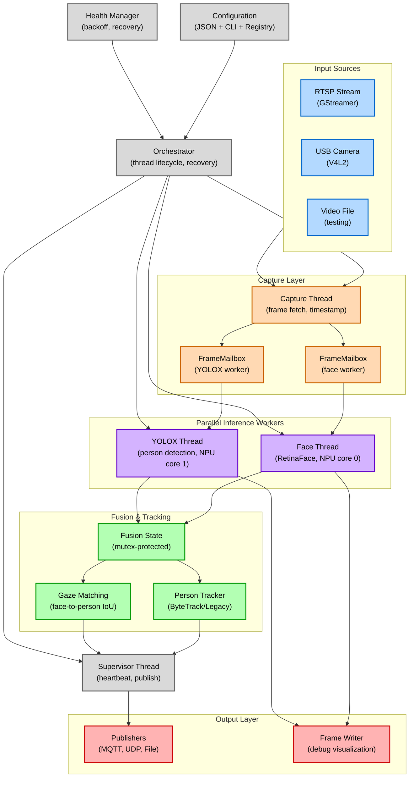
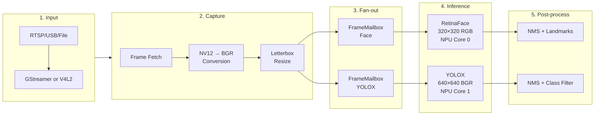
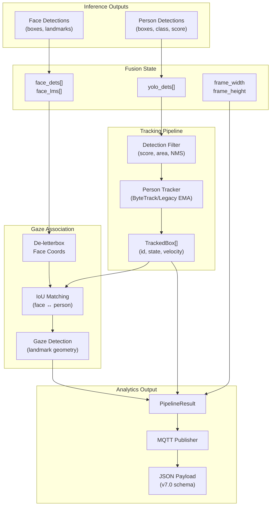
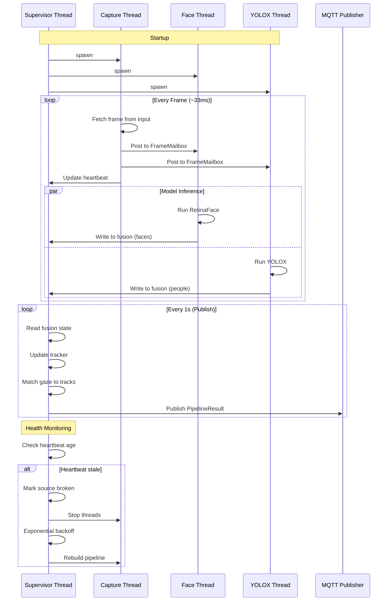

# Argus Audience Measurement Extension - Design Document

## Overview

The Argus Audience Measurement Extension is a multi-threaded C++ application that performs real-time person detection, face detection, and gaze estimation using Rockchip NPU platforms. The application captures video from RTSP streams, USB cameras, or video files, processes frames through multiple neural network models in parallel, tracks individuals across frames, determines if detected faces are looking at the camera, and publishes analytics results via MQTT.

**Platform Support:**
- **RK3588 (XT5)**: 3-core NPU (6 TOPS) - runs 2+ models in parallel
- **RK3576 (XS156)**: 2-core NPU (4 TOPS) - runs 2 models in parallel
- **RK3568 (LS5/HS5)**: 1-core NPU (1 TOPS) - runs 1 model

*This document focuses on the RK3588/XT5 implementation as the reference platform. Lower-tier platforms use the same software architecture but run fewer models concurrently.*

---

## Architecture Overview

The system follows a multi-producer, multi-consumer pattern with an Orchestrator coordinating several specialized threads:

1. **Supervisor Thread** - Monitors health, triggers recovery, publishes analytics
2. **Capture Thread** - Reads video frames and fans out to model workers
3. **Face Detection Thread** - Runs RetinaFace for face/gaze detection (NPU core 0)
4. **Object Detection Thread** - Runs YOLOX for person detection (NPU core 1)

All model threads write results to a shared fusion state, which is aggregated and published by the supervisor.

### High-Level Architecture Diagram



---

## Video Processing Pipeline

The video processing pipeline handles frames from capture through inference with low-latency, lock-free data flow.

### Pipeline Stages



### Stage Details

#### 1. Input Source
- **RTSP**: Network camera via GStreamer pipeline with appsink
- **USB**: V4L2 direct capture with configurable resolution/FPS
- **File**: Video file playback with optional loop for testing

#### 2. Capture & Preprocessing
- Reads frames in source format (typically NV12 for hardware decode)
- Converts NV12 → BGR using optimized BT.601 conversion
- Letterbox resizes to model input dimensions (320×320 or 640×640)
- Preserves original dimensions for coordinate de-letterboxing

#### 3. Frame Fan-out (Lock-Free)
- `FrameMailbox`: Single-slot lock-free buffer with atomic swap
- Capture thread posts frames; worker threads consume latest
- Drop-old policy ensures workers always get freshest frame
- Zero-copy via `SharedFrame` with reference counting

#### 4. Parallel Inference
- **RetinaFace** (NPU Core 0): Face detection + 5-point landmarks
  - Input: 320×320 RGB
  - Output: Face boxes, landmarks, confidence scores

- **YOLOX** (NPU Core 1): Person/object detection
  - Input: 640×640 BGR
  - Output: Bounding boxes, class IDs, confidence scores

#### 5. Post-processing
- Non-Maximum Suppression (NMS) per model
- Confidence thresholding (configurable per model)
- Coordinate de-letterboxing to original frame space
- Results stored in shared fusion state

---

## Data Pipeline

The data pipeline transforms raw inference outputs into structured analytics for publishing.

### Data Flow Diagram



### Pipeline Components

#### Fusion State
Thread-safe storage for multi-model outputs:
```cpp
struct FusionState {
    std::mutex m;
    std::vector<Detection> face_dets;    // RetinaFace results
    std::vector<Landmarks> face_lms;     // 5-point landmarks
    std::vector<Detection> yolo_dets;    // YOLOX results
    std::vector<TrackedBox> tracks;      // Tracker output
    int frame_width, frame_height;       // For normalization
};
```

#### Person Tracker
Multi-object tracker with stable ID assignment:
- **ByteTrack Mode**: Kalman filter + Hungarian matching for robust tracking
- **Legacy Mode**: EMA-smoothed IoU matching
- Outputs: `TrackedBox` with id, state, velocity, direction, dwell time

#### Gaze Association
Links face detections to person tracks:
1. De-letterbox face coordinates from model space to camera space
2. Expand person bbox upward (30%) to include head region
3. IoU matching between faces and expanded person boxes
4. Gaze detection using facial landmark geometry

#### Gaze Detection Algorithm
Determines if a face is looking at the camera using geometric analysis:
```cpp
bool face_is_looking_at_us(retinaface_object_t face) {
    // Calculate interocular distance
    float interocular_dist = distance(left_eye, right_eye);

    // Calculate face dimensions
    float face_width = face.box.right - face.box.left;
    float face_height = face.box.bottom - face.box.top;

    // Frontal face indicators
    float aspect_ratio = face_height / face_width;
    float interocular_ratio = interocular_dist / face_width;

    // Thresholds based on facial geometry research
    return aspect_ratio > 1.2 && aspect_ratio < 2.0 &&
           interocular_ratio > 0.3 && interocular_ratio < 0.7;
}
```

---

## Threading Model

### Thread Roles



### Thread Synchronization

| Resource | Protection | Access Pattern |
|----------|------------|----------------|
| `FusionState` | `std::mutex` | Writers: Face/YOLO threads; Reader: Supervisor |
| `FrameMailbox` | Lock-free atomic | Writer: Capture; Reader: Worker |
| `stop_*` flags | `std::atomic<bool>` | Writer: Supervisor; Readers: All workers |
| `last_heartbeat_ns` | `std::atomic<int64_t>` | Writer: Capture; Reader: Supervisor |

---

## Health Monitoring & Recovery

### State Machine

```mermaid
stateDiagram-v2
    [*] --> Stopped
    Stopped --> Starting: start()
    Starting --> Running: build_pipeline() success
    Starting --> Error: build_pipeline() failed

    Running --> Degraded: heartbeat stale
    Running --> Running: heartbeat OK

    Degraded --> Recovering: source marked broken

    Recovering --> Running: recover_pipeline() success
    Recovering --> Recovering: backoff & retry
    Recovering --> Error: max retries exceeded

    Error --> Stopped: request_stop()
    Running --> Stopped: request_stop()
```



### Recovery Strategy

1. **Detection**: Supervisor monitors capture thread heartbeat
2. **Backoff**: Exponential backoff (250ms → 8s) between recovery attempts
3. **Source Scan**: USB mode rescans `/dev/video*` for working device
4. **Rebuild**: Stops threads, recreates input source, reloads models
5. **Resume**: Spawns new worker threads, resets tracker

---

## Key Data Structures

### Pipeline Types

```cpp
// Raw frame from capture (non-owning view)
struct RawFrame {
    PixFmt fmt;                 // NV12, RGB24, BGR24
    int width, height;          // Preprocessed dimensions
    int orig_width, orig_height;// Original source dimensions
    uint8_t* plane0, *plane1;   // Pixel data
    int64_t pts_ns;             // Presentation timestamp
    uint64_t seq;               // Frame sequence number
};

// Tracked person with motion and gaze
struct TrackedBox {
    int id;                     // Stable GUID
    TrackState state;           // Tentative/Confirmed/Deleted
    float x0, y0, x1, y1;       // Smoothed bbox
    float vx, vy, speed;        // Velocity (px/sec)
    float dir_deg;              // Direction (degrees)
    const char* dir_label;      // "R,UR,U,UL,L,DL,D,DR,?"
    double dwell_s;             // Time in ROI
    bool has_gaze, is_gazing;   // Gaze state
    double gaze_time;           // Accumulated gaze time
    bool just_entered, just_exited; // Entry/exit events
};

// Final analytics result
struct PipelineResult {
    std::vector<TrackedBox> person_tracks;
    int people_count;           // YOLOX person count
    int gaze_count;             // Faces matched to tracks
    int fps;                    // Processing frame rate
    int frame_width, frame_height;
    uint64_t ts_ns;             // Timestamp (nanoseconds)
};
```

### Configuration Structure

```cpp
struct PipelineConfig {
    InputConfig input;          // RTSP URL, USB device, file path
    ModelSpec primary_model;    // RetinaFace config
    ModelSpec secondary_model;  // YOLOX config
    std::string device_id;      // For MQTT identification
    bool enable_face_model;     // Toggle RetinaFace
    bool enable_yolo_model;     // Toggle YOLOX
    bool enable_frame_output;   // Debug frame writing
    std::vector<PublisherConfig> publishers;
};
```

---

## Output Publishing

### MQTT Message Format (v7.0)

Published to `bs/argus/analytics` with schema version `analytics/v7.0`:

```json
{
  "schema": "analytics/v7.0",
  "ts": 164.68,
  "device": "XS-156",
  "stream": "rtsp://192.168.0.203:8554/live",
  "frame_w": 1280,
  "frame_h": 720,
  "model": "yolox_s",
  "fw_version": "7.0.0",
  "npu_load": 87.0,
  "people": 3,
  "people_confident": 2,
  "gaze": 1,
  "fps": 29,
  "roi": {
    "type": "border",
    "border_frac": 0.30,
    "rect": [384, 216, 896, 504]
  },
  "health": {
    "detector_fps": 29.0,
    "tracker_fps": 29.0,
    "queue_latency_ms": 0,
    "dropped_frames": 0
  },
  "tracks": [
    {
      "id": 63,
      "state": "Confirmed",
      "bbox": [52.9, 227.4, 286.6, 720.0],
      "score": 0.93,
      "zones": ["roi"],
      "dir": "?",
      "deg": 0.0,
      "dir_conf": 0.00,
      "speed": 0.0,
      "speed_norm": 0.000,
      "dwell": 31.03,
      "enter": false,
      "exit": false,
      "gaze": {
        "detected": 1,
        "time": 8.00,
        "face_bbox": [231.0, 167.0, 240.0, 180.0]
      }
    }
  ]
}
```

### Publisher Types

| Publisher | Protocol | Use Case |
|-----------|----------|----------|
| `MqttPublisher` | MQTT | Primary analytics output |
| `UdpJsonPublisher` | UDP/JSON | Low-latency local apps |
| `BrightSignV3Publisher` | UDP | BrightScript integration |
| `FileSink` | File | Debug logging |

---

## Performance Characteristics

### Benchmarks (RK3588/XT5)

| Metric | Value | Notes |
|--------|-------|-------|
| Inference latency | <15ms | Per model at full resolution |
| End-to-end latency | ~35-55ms | Capture to MQTT publish |
| NPU power per core | +0.80W | C++ implementation |
| Total power (2-model) | ~3.5W | Enables fanless operation |
| Memory footprint | ~120MB | Including model weights |
| FPS (2-model parallel) | 25-30 | Stable processing rate |

### Optimization Techniques

1. **Zero-copy frame sharing**: `SharedFrame` with reference counting
2. **Lock-free fan-out**: `FrameMailbox` with atomic swap
3. **Hardware acceleration**: RGA for format conversion, NPU for inference
4. **Batch-free processing**: Single-frame latency optimization
5. **Emission caching**: Hold last tracks for 500ms to bridge detection gaps

---

## Configuration

### Priority Order

1. **CLI arguments**: `--config /path/to/config.json`
2. **Environment variable**: `BSEXT_CONFIG=/path/to/config.json`
3. **SD card override**: `/storage/sd/configs/config.json`
4. **Package default**: `/var/volatile/bsext/ext_npu_argus/RK3568/configs/config.json`

### Key Configuration Options

```json
{
  "log_level": "info",
  "input_source": "rtsp",
  "input": {
    "rtsp_url": "rtsp://192.168.0.203:8554/live",
    "usb_device": "/dev/video0"
  },
  "primary_model": {
    "name": "retinaface",
    "model_path": "model/retinaface.rknn",
    "npu_core": 0,
    "conf_threshold": 0.5
  },
  "secondary_model": {
    "name": "yolox",
    "model_path": "model/yolox_s.rknn",
    "npu_core": 1,
    "conf_threshold": 0.5
  },
  "test_face_only": false,
  "test_yolo_only": false,
  "publishers": [
    {
      "kind": "mqtt",
      "mqtt": {
        "host": "localhost",
        "port": 1883,
        "topic": "bs/argus/analytics",
        "period_ms": 1000
      }
    }
  ]
}
```

---

## File Structure

### Source Organization

```
src/
├── main.cpp                    # Entry point, CLI parsing
├── orchestration/
│   ├── orchestrator.cpp        # Thread lifecycle, recovery
│   └── inference_worker.cpp    # Generic model worker loop
├── pipeline/
│   ├── capture_worker.cpp      # Frame capture
│   ├── preprocess_stage.cpp    # NV12→RGB, resize
│   └── processing_pipeline.cpp # Legacy pipeline (unused)
├── models/
│   ├── model_factory.cpp       # Model instantiation
│   ├── model_runner_retinaface.cpp
│   └── model_runner_yolox.cpp
├── input/
│   ├── input_factory.cpp       # Source factory
│   ├── input_rtsp.cpp          # GStreamer RTSP
│   ├── input_usb.cpp           # V4L2 USB
│   └── input_file.cpp          # Video file
├── tracking/
│   ├── tracker.cpp             # Multi-object tracker
│   └── byte_tracker_lite.cpp   # ByteTrack implementation
├── output/
│   ├── mqtt_publisher.cpp      # MQTT analytics
│   ├── async_publisher.cpp     # Async wrapper
│   └── publisher_factory.cpp   # Publisher instantiation
├── health/
│   └── health_manager.cpp      # Backoff and recovery
└── attention.cpp               # Gaze detection logic
```

### Include Organization

```
include/
├── config/                     # Configuration structs
├── pipeline/                   # Pipeline types and stages
├── models/                     # Model interfaces
├── input/                      # Input source interfaces
├── output/                     # Publisher interfaces
├── tracking/                   # Tracker types
├── health/                     # Health monitoring
├── metrics/                    # Telemetry types
└── orchestration/              # Orchestrator interface
```

---

## Extension Points

### Adding New Input Sources

1. Implement `IInputSource` interface
2. Add case to `make_input()` factory
3. Configure via `InputConfig` fields

### Adding New Models

1. Implement `IModelRunner` interface
2. Add to `make_model_runner()` factory
3. Create new worker thread in Orchestrator
4. Add results to `FusionState`

### Adding New Publishers

1. Implement `IPublisher` interface
2. Add to `make_publisher()` factory
3. Configure via `PublisherConfig`

---

## Related Documentation

- **[MQTT Message Format](mqtt-message-format.md)** - Complete v7.0 schema reference
- **[Multi-Model Architecture](multiple-models.md)** - Parallel NPU execution design
- **[RGB-D Camera Support](rgbd.md)** - Depth camera integration guide

---

## Version History

| Version | Changes |
|---------|---------|
| v7.0 | ByteTrack integration, per-track gaze, MQTT schema v7.0 |
| v6.2 | Direction confidence, improved stationary detection |
| v6.0 | Initial multi-model architecture |
