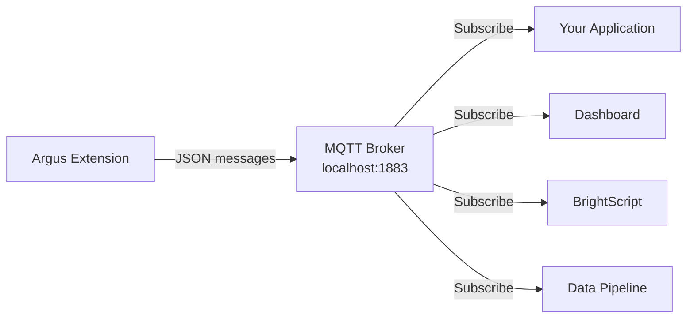

# MQTT Integration Guide

This guide explains how to receive and process real-time analytics data from Argus via MQTT.

## Overview



| Property | Value |
|----------|-------|
| **Protocol** | MQTT 3.1.1 |
| **Default Broker** | localhost:1883 |
| **Default Topic** | `bs/argus/analytics` |
| **Message Format** | JSON |
| **Schema Version** | `analytics/v7.0` |
| **Default Rate** | 1 message/second |

## Quick Start

### 1. Subscribe to the Topic

```bash
# Using mosquitto_sub
mosquitto_sub -h <PLAYER_IP> -t 'bs/argus/analytics' -v
```

### 2. Receive Messages

You'll see JSON messages like:

```json
{
  "schema": "analytics/v7.0",
  "ts": 164.68,
  "device": "XT5-ABC123",
  "people": 2,
  "gaze": 1,
  "fps": 29,
  "tracks": [...]
}
```

### 3. Extract What You Need

See the code examples below for your platform.

---

## Message Structure

### Top-Level Fields

| Field | Type | Description |
|-------|------|-------------|
| `schema` | string | Schema version (`"analytics/v7.0"`) |
| `ts` | float | Timestamp (seconds since start) |
| `device` | string | Device identifier |
| `stream` | string | Input source URL/path |
| `frame_w` | int | Frame width in pixels |
| `frame_h` | int | Frame height in pixels |
| `people` | int | Current person count |
| `gaze` | int | People currently looking at screen |
| `fps` | int | Processing frame rate |
| `npu_load` | float | NPU utilization percentage |
| `tracks` | array | Per-person tracking data |

### Track Object Fields

Each item in the `tracks` array:

| Field | Type | Description |
|-------|------|-------------|
| `id` | int | Stable person ID |
| `state` | string | `"Tentative"`, `"Confirmed"`, or `"Lost"` |
| `bbox` | [x1,y1,x2,y2] | Bounding box coordinates |
| `score` | float | Detection confidence (0-1) |
| `dir` | string | Direction: `"R"`,`"UR"`,`"U"`,`"UL"`,`"L"`,`"DL"`,`"D"`,`"DR"`,`"?"` |
| `deg` | float | Direction in degrees (0-360) |
| `speed` | float | Movement speed (pixels/second) |
| `dwell` | float | Time in view (seconds) |
| `enter` | bool | Just entered the frame |
| `exit` | bool | Just exited the frame |
| `gaze` | object | Gaze data (see below) |

### Gaze Object Fields

| Field | Type | Description |
|-------|------|-------------|
| `detected` | int | 1 if face detected, 0 otherwise |
| `time` | float | Accumulated gaze time (seconds) |
| `face_bbox` | [x1,y1,x2,y2] | Face bounding box |

---

## Code Examples

### Python

```python
#!/usr/bin/env python3
"""Argus MQTT Subscriber Example"""

import json
import paho.mqtt.client as mqtt

BROKER = "192.168.0.100"  # Your BrightSign player IP
TOPIC = "bs/argus/analytics"

def on_message(client, userdata, msg):
    data = json.loads(msg.payload)

    # Basic counts
    people = data.get("people", 0)
    gazing = data.get("gaze", 0)

    print(f"People: {people}, Looking: {gazing}")

    # Process each tracked person
    for track in data.get("tracks", []):
        track_id = track["id"]
        dwell = track.get("dwell", 0)
        gaze_time = track.get("gaze", {}).get("time", 0)
        direction = track.get("dir", "?")

        print(f"  Person {track_id}: dwell={dwell:.1f}s, gaze={gaze_time:.1f}s, dir={direction}")

        # Detect entry/exit events
        if track.get("enter"):
            print(f"  → Person {track_id} ENTERED")
        if track.get("exit"):
            print(f"  ← Person {track_id} EXITED")

def main():
    client = mqtt.Client()
    client.on_message = on_message
    client.connect(BROKER, 1883, 60)
    client.subscribe(TOPIC)

    print(f"Subscribed to {TOPIC} on {BROKER}")
    client.loop_forever()

if __name__ == "__main__":
    main()
```

**Install dependencies:**
```bash
pip install paho-mqtt
```

### Node.js

```javascript
// argus-subscriber.js
const mqtt = require('mqtt');

const BROKER = 'mqtt://192.168.0.100';
const TOPIC = 'bs/argus/analytics';

const client = mqtt.connect(BROKER);

client.on('connect', () => {
  console.log(`Connected to ${BROKER}`);
  client.subscribe(TOPIC);
});

client.on('message', (topic, message) => {
  const data = JSON.parse(message.toString());

  // Basic counts
  const { people, gaze, fps } = data;
  console.log(`People: ${people}, Looking: ${gaze}, FPS: ${fps}`);

  // Process tracks
  for (const track of data.tracks || []) {
    const { id, dwell, dir } = track;
    const gazeTime = track.gaze?.time || 0;

    console.log(`  Person ${id}: dwell=${dwell.toFixed(1)}s, gaze=${gazeTime.toFixed(1)}s, dir=${dir}`);

    // Entry/exit events
    if (track.enter) console.log(`  → Person ${id} ENTERED`);
    if (track.exit) console.log(`  ← Person ${id} EXITED`);
  }
});
```

**Install dependencies:**
```bash
npm install mqtt
```

### BrightScript

```brightscript
' Argus MQTT Subscriber for BrightSign
Sub Main()
    mqtt = CreateObject("roMqttClient")
    mqtt.SetServer("localhost", 1883)
    mqtt.Connect()
    mqtt.Subscribe("bs/argus/analytics", 0)

    msgPort = CreateObject("roMessagePort")
    mqtt.SetPort(msgPort)

    While True
        msg = Wait(0, msgPort)
        If Type(msg) = "roMqttClientEvent" Then
            If msg.GetEventType() = mqtt.CYCLED_PUBLISH Then
                payload = msg.GetPayload()
                data = ParseJson(payload)

                ' Basic counts
                people = data.people
                gazing = data.gaze
                Print "People: "; people; ", Looking: "; gazing

                ' Process tracks
                For Each track In data.tracks
                    trackId = track.id
                    dwell = track.dwell
                    Print "  Person "; trackId; ": dwell="; dwell; "s"

                    If track.enter = True Then
                        Print "  → Person "; trackId; " ENTERED"
                    End If
                    If track.exit = True Then
                        Print "  ← Person "; trackId; " EXITED"
                    End If
                Next
            End If
        End If
    End While
End Sub
```

### curl (Testing)

```bash
# Subscribe and pretty-print messages
mosquitto_sub -h <PLAYER_IP> -t 'bs/argus/analytics' | while read line; do
  echo "$line" | python3 -m json.tool
done
```

---

## Common Use Cases

### Counting People

```python
def on_message(client, userdata, msg):
    data = json.loads(msg.payload)
    current_count = data.get("people", 0)
    print(f"Current occupancy: {current_count}")
```

### Measuring Attention Rate

```python
def on_message(client, userdata, msg):
    data = json.loads(msg.payload)
    people = data.get("people", 0)
    gazing = data.get("gaze", 0)

    if people > 0:
        attention_rate = (gazing / people) * 100
        print(f"Attention rate: {attention_rate:.1f}%")
```

### Tracking Entry/Exit Events

```python
def on_message(client, userdata, msg):
    data = json.loads(msg.payload)

    for track in data.get("tracks", []):
        if track.get("enter"):
            log_entry(track["id"], data["ts"])
        if track.get("exit"):
            log_exit(track["id"], data["ts"], track.get("dwell", 0))
```

### Calculating Average Dwell Time

```python
def on_message(client, userdata, msg):
    data = json.loads(msg.payload)

    tracks = data.get("tracks", [])
    if tracks:
        avg_dwell = sum(t.get("dwell", 0) for t in tracks) / len(tracks)
        print(f"Average dwell time: {avg_dwell:.1f}s")
```

### Direction Flow Analysis

```python
from collections import Counter

direction_counts = Counter()

def on_message(client, userdata, msg):
    data = json.loads(msg.payload)

    for track in data.get("tracks", []):
        if track.get("state") == "Confirmed":
            direction = track.get("dir", "?")
            direction_counts[direction] += 1

    # Print direction distribution
    print(f"Direction flow: {dict(direction_counts)}")
```

---

## Configuration

### Changing the MQTT Topic

Edit `/storage/sd/configs/argus-config.json`:

```json
{
  "publishers": [{
    "kind": "mqtt",
    "mqtt": {
      "topic": "my/custom/topic"
    }
  }]
}
```

### Adjusting Publish Rate

```json
{
  "publishers": [{
    "kind": "mqtt",
    "mqtt": {
      "period_ms": 500
    }
  }]
}
```

| `period_ms` | Rate | Use Case |
|-------------|------|----------|
| `100` | 10 Hz | Real-time displays |
| `500` | 2 Hz | Interactive applications |
| `1000` | 1 Hz | General analytics (default) |
| `5000` | 0.2 Hz | Low-bandwidth environments |

### Using External MQTT Broker

```json
{
  "publishers": [{
    "kind": "mqtt",
    "mqtt": {
      "host": "mqtt.example.com",
      "port": 1883
    }
  }]
}
```

---

## Troubleshooting

### No Messages Received

1. **Check broker is running:**
   ```bash
   ssh brightsign@<PLAYER_IP>
   ps aux | grep mosquitto
   ```

2. **Check Argus is running:**
   ```bash
   ps aux | grep attention_demo
   ```

3. **Verify topic name:**
   ```bash
   mosquitto_sub -h <PLAYER_IP> -t '#' -v  # Subscribe to all topics
   ```

### Connection Refused

1. **Check firewall:**
   ```bash
   # Port 1883 must be accessible
   nc -zv <PLAYER_IP> 1883
   ```

2. **Check broker binding:**
   The embedded Mosquitto broker binds to all interfaces by default.

### Messages Not Parsing

1. **Verify JSON syntax:**
   ```bash
   mosquitto_sub -h <PLAYER_IP> -t 'bs/argus/analytics' | head -1 | python3 -m json.tool
   ```

2. **Check schema version:**
   Ensure your parser handles `analytics/v7.0` schema.

### High Latency

1. **Reduce publish rate:**
   Set `period_ms` to a lower value for faster updates.

2. **Use QoS 0:**
   QoS 0 (fire-and-forget) has lowest latency.

---

## Related Documentation

- **[MQTT Schema Reference](mqtt-message-format.md)** - Complete v7.0 schema specification
- **[Configuration Reference](CONFIGURATION.md)** - All configuration options
- **[Prometheus Integration](INTEGRATION-PROMETHEUS.md)** - Alternative metrics access
- **[Tracking Explained](TRACKING-EXPLAINED.md)** - Understanding track lifecycle
