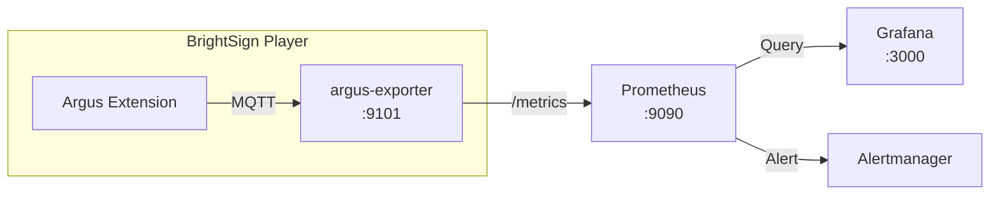

# Prometheus Integration Guide

This guide explains how to collect and visualize Argus metrics using Prometheus and Grafana.

## Overview



| Component | Port | Description |
|-----------|------|-------------|
| **argus-exporter** | 9101 | Exports Prometheus metrics |
| **Prometheus** | 9090 | Metrics storage and queries |
| **Grafana** | 3000 | Visualization dashboards |

## Quick Start

### 1. Verify Exporter is Running

```bash
curl http://<PLAYER_IP>:9101/metrics
```

You should see metrics like:
```
# HELP argus_occupancy_current Current number of people in view
# TYPE argus_occupancy_current gauge
argus_occupancy_current 3
```

### 2. Configure Prometheus Scrape

Add to your `prometheus.yml`:

```yaml
scrape_configs:
  - job_name: 'argus'
    static_configs:
      - targets: ['<PLAYER_IP>:9101']
    scrape_interval: 5s
```

### 3. Query Metrics

Open Prometheus UI and query:

```promql
argus_occupancy_current
```

---

## Available Metrics

### Visitor Metrics

| Metric | Type | Description |
|--------|------|-------------|
| `argus_occupancy_current` | Gauge | Current number of people in view |
| `argus_visitors_total` | Counter | Total visitors that entered |
| `argus_exits_total` | Counter | Total people that exited |

### Engagement Metrics

| Metric | Type | Description |
|--------|------|-------------|
| `argus_gaze_current` | Gauge | People currently looking at screen |
| `argus_gaze_total` | Counter | Total gaze events detected |
| `argus_gaze_seconds_total` | Counter | Total accumulated gaze time |
| `argus_dwell_seconds` | Histogram | Dwell time distribution |

### Movement Metrics

| Metric | Type | Labels | Description |
|--------|------|--------|-------------|
| `argus_direction_total` | Counter | `direction` | Movement direction counts |

Direction labels: `R`, `UR`, `U`, `UL`, `L`, `DL`, `D`, `DR`

### System Metrics

| Metric | Type | Description |
|--------|------|-------------|
| `argus_fps_current` | Gauge | Current processing FPS |
| `argus_npu_load_percent` | Gauge | NPU utilization (0-100) |
| `argus_frame_latency_ms` | Histogram | Frame processing latency |
| `argus_exporter_up` | Gauge | Exporter health (1=up, 0=down) |

### Track Metrics

| Metric | Type | Labels | Description |
|--------|------|--------|-------------|
| `argus_track_state` | Gauge | `state` | Tracks by state |

State labels: `Tentative`, `Confirmed`, `Lost`

---

## Example PromQL Queries

### Current Occupancy

```promql
argus_occupancy_current
```

### Average Occupancy (5 minutes)

```promql
avg_over_time(argus_occupancy_current[5m])
```

### Attention Rate (% looking)

```promql
(argus_gaze_current / argus_occupancy_current) * 100
```

### Visitor Flow Rate (per minute)

```promql
rate(argus_visitors_total[1m]) * 60
```

### Exit Rate (per minute)

```promql
rate(argus_exits_total[1m]) * 60
```

### Direction Distribution

```promql
sum by (direction) (rate(argus_direction_total[5m]))
```

### 95th Percentile Dwell Time

```promql
histogram_quantile(0.95, rate(argus_dwell_seconds_bucket[5m]))
```

### Average FPS

```promql
avg_over_time(argus_fps_current[5m])
```

### NPU Utilization

```promql
avg_over_time(argus_npu_load_percent[5m])
```

---

## Grafana Dashboard Setup

### Quick Import

1. Open Grafana → Dashboards → Import
2. Upload the dashboard JSON from `configs/grafana-dashboard.json`
3. Select your Prometheus data source
4. Click Import

### Manual Dashboard Creation

#### Panel 1: Current Occupancy (Stat)

```promql
argus_occupancy_current
```

- Visualization: Stat
- Thresholds: 0 (green), 5 (yellow), 10 (red)

#### Panel 2: Attention Rate (Gauge)

```promql
(argus_gaze_current / clamp_min(argus_occupancy_current, 1)) * 100
```

- Visualization: Gauge
- Unit: Percent (0-100)

#### Panel 3: Occupancy Over Time (Time Series)

```promql
argus_occupancy_current
```

- Visualization: Time series
- Fill opacity: 20

#### Panel 4: Visitor Flow (Time Series)

```promql
rate(argus_visitors_total[1m]) * 60
rate(argus_exits_total[1m]) * 60
```

- Legend: Entries, Exits

#### Panel 5: Direction Heatmap (Pie Chart)

```promql
sum by (direction) (increase(argus_direction_total[1h]))
```

- Visualization: Pie chart

#### Panel 6: Dwell Time Distribution (Histogram)

```promql
histogram_quantile(0.50, rate(argus_dwell_seconds_bucket[5m]))
histogram_quantile(0.95, rate(argus_dwell_seconds_bucket[5m]))
```

- Legend: Median, 95th percentile

---

## Alerting Rules

Add to your Prometheus alert rules:

```yaml
groups:
  - name: argus
    rules:
      # No data from exporter
      - alert: ArgusExporterDown
        expr: up{job="argus"} == 0
        for: 1m
        labels:
          severity: critical
        annotations:
          summary: "Argus exporter is down"
          description: "No metrics from {{ $labels.instance }}"

      # Low FPS indicates performance issues
      - alert: ArgusLowFPS
        expr: argus_fps_current < 10
        for: 5m
        labels:
          severity: warning
        annotations:
          summary: "Argus FPS is low"
          description: "FPS is {{ $value }} on {{ $labels.instance }}"

      # High NPU load
      - alert: ArgusHighNPULoad
        expr: argus_npu_load_percent > 90
        for: 5m
        labels:
          severity: warning
        annotations:
          summary: "NPU load is high"
          description: "NPU at {{ $value }}% on {{ $labels.instance }}"

      # No people detected for extended period (camera issue?)
      - alert: ArgusNoDetections
        expr: argus_occupancy_current == 0 and argus_fps_current > 0
        for: 30m
        labels:
          severity: info
        annotations:
          summary: "No people detected"
          description: "No detections for 30 minutes on {{ $labels.instance }}"

      # High occupancy alert
      - alert: ArgusHighOccupancy
        expr: argus_occupancy_current > 20
        for: 1m
        labels:
          severity: info
        annotations:
          summary: "High occupancy detected"
          description: "{{ $value }} people on {{ $labels.instance }}"
```

---

## Recording Rules

Pre-compute expensive queries for dashboard performance:

```yaml
groups:
  - name: argus_recording
    rules:
      # Average occupancy over 5 minutes
      - record: argus:occupancy_avg_5m
        expr: avg_over_time(argus_occupancy_current[5m])

      # Attention rate
      - record: argus:attention_rate
        expr: (argus_gaze_current / clamp_min(argus_occupancy_current, 1)) * 100

      # Visitor flow rate (per minute)
      - record: argus:visitor_rate_1m
        expr: rate(argus_visitors_total[1m]) * 60

      # 95th percentile dwell time
      - record: argus:dwell_p95_5m
        expr: histogram_quantile(0.95, rate(argus_dwell_seconds_bucket[5m]))
```

---

## Multi-Device Setup

### Service Discovery

For multiple BrightSign players, use file-based discovery:

```yaml
# prometheus.yml
scrape_configs:
  - job_name: 'argus'
    file_sd_configs:
      - files:
          - '/etc/prometheus/argus-targets.json'
```

```json
// argus-targets.json
[
  {
    "targets": ["192.168.0.101:9101", "192.168.0.102:9101"],
    "labels": {
      "location": "lobby"
    }
  },
  {
    "targets": ["192.168.0.103:9101"],
    "labels": {
      "location": "entrance"
    }
  }
]
```

### Aggregating Across Devices

```promql
# Total occupancy across all devices
sum(argus_occupancy_current)

# Average attention rate across locations
avg by (location) (argus:attention_rate)

# Total visitor flow
sum(rate(argus_visitors_total[5m])) * 60
```

---

## Configuration

### Exporter Configuration

The argus-exporter runs automatically as part of the extension. Configuration is minimal:

| Setting | Default | Description |
|---------|---------|-------------|
| Port | 9101 | Metrics endpoint port |
| Path | /metrics | Metrics endpoint path |

### Scrape Interval Recommendations

| Use Case | Interval | Notes |
|----------|----------|-------|
| Real-time dashboard | 5s | Higher Prometheus load |
| General monitoring | 15s | Good balance (recommended) |
| Long-term trends | 30s | Lower storage requirements |

---

## Troubleshooting

### No Metrics from Exporter

1. **Check exporter is running:**
   ```bash
   ssh brightsign@<PLAYER_IP>
   ps aux | grep argus-exporter
   ```

2. **Check port is accessible:**
   ```bash
   curl -v http://<PLAYER_IP>:9101/metrics
   ```

3. **Check logs:**
   ```bash
   tail -f /tmp/ext-npu-argus.log | grep exporter
   ```

### Metrics Show Zero

1. **Verify Argus is processing:**
   ```bash
   curl http://<PLAYER_IP>:9101/metrics | grep argus_fps
   ```

2. **Check camera input:**
   ```bash
   # FPS should be > 0
   argus_fps_current 0  # This indicates camera issue
   ```

### Grafana Shows "No Data"

1. **Verify Prometheus scrape:**
   - Open Prometheus UI → Status → Targets
   - Check argus target is "UP"

2. **Test query in Prometheus first:**
   - Open Prometheus UI → Graph
   - Try: `argus_occupancy_current`

3. **Check time range:**
   - Grafana time picker may be set to period with no data

### High Cardinality Warning

If you see cardinality warnings, avoid using high-cardinality labels like track IDs in queries.

---

## Related Documentation

- **[Prometheus & Grafana Setup](prometheus-grafana-setup.md)** - Full setup guide
- **[MQTT Integration](INTEGRATION-MQTT.md)** - Alternative real-time data access
- **[Configuration Reference](CONFIGURATION.md)** - All configuration options
- **[README](../README.md)** - Project overview
