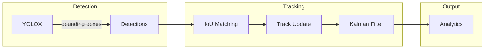
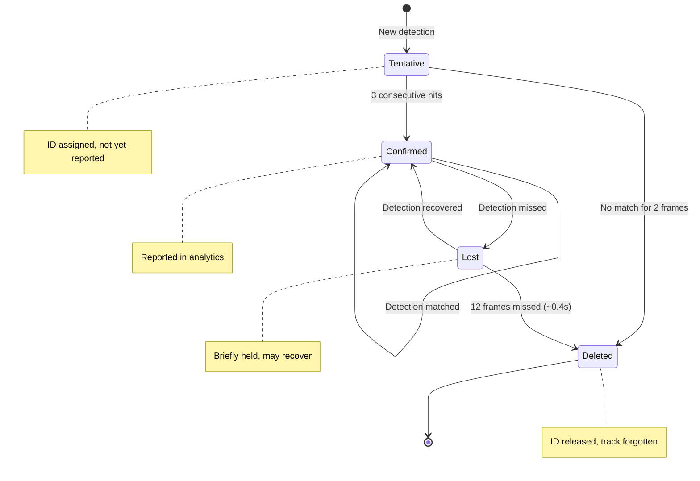
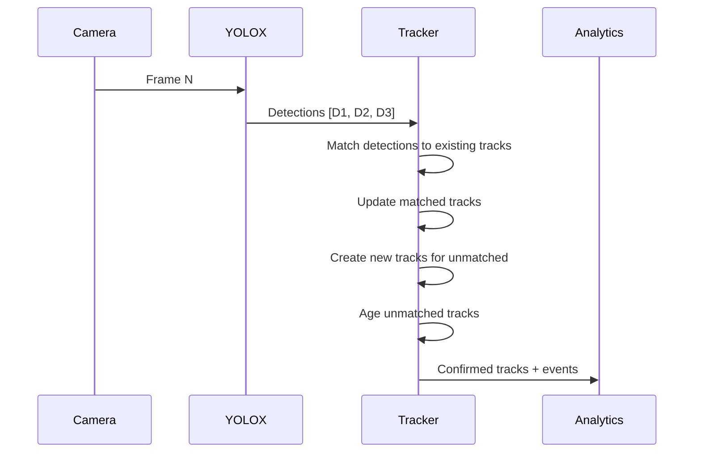
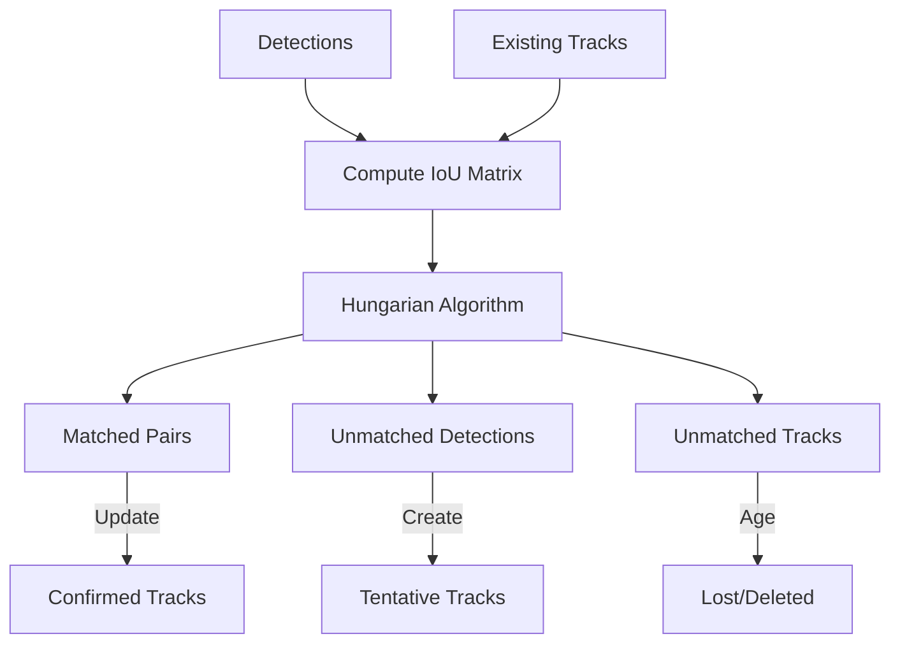
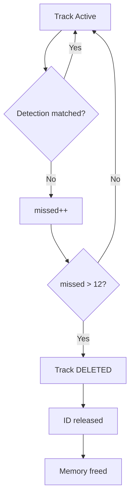
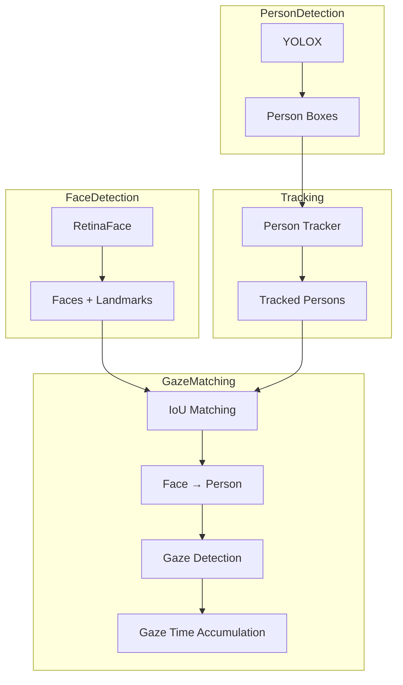
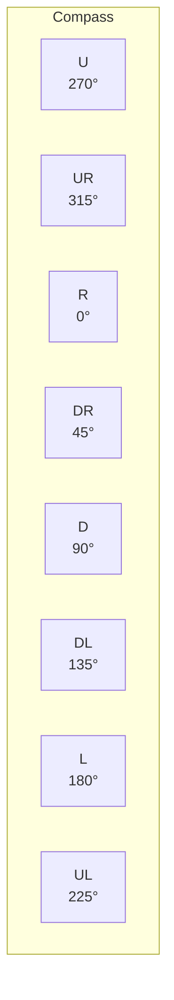
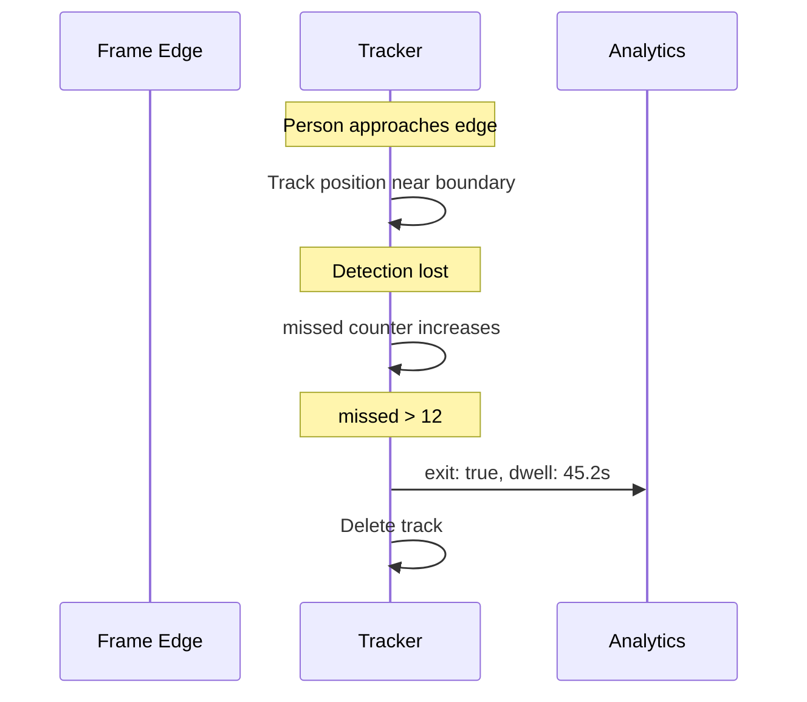
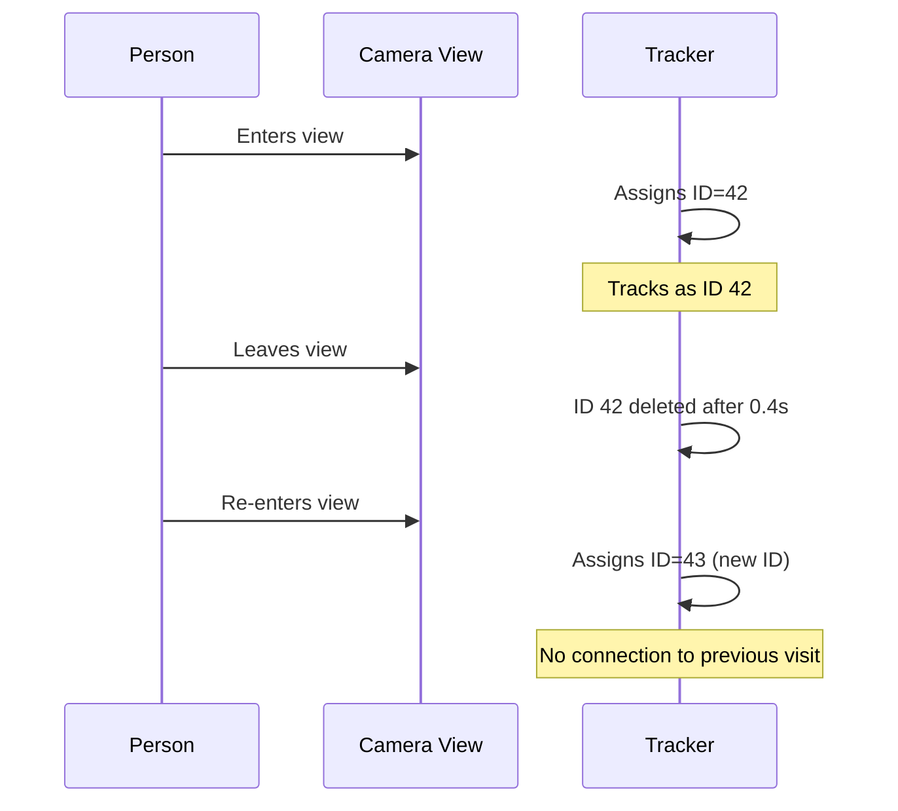

# How Person Tracking Works

This document explains how Argus tracks people across video frames, assigns stable IDs, and when tracks are "forgotten."

## Overview

Argus uses **ByteTrack** to maintain stable person identities across frames. Each detected person receives a unique ID that persists as long as they remain visible.



## Track Lifecycle

Every tracked person goes through a defined lifecycle:



### State Descriptions

| State | Description | Reported? |
|-------|-------------|-----------|
| **Tentative** | New detection, being verified | No |
| **Confirmed** | Stable track, actively monitored | Yes |
| **Lost** | Temporarily missing, may recover | Yes (briefly) |
| **Deleted** | Track removed, ID released | No |

---

## Detection to Tracking Pipeline



### Step 1: Detection

YOLOX processes each frame and outputs person bounding boxes:

```
Frame N detections:
  D1: [100, 200, 300, 500] confidence=0.92
  D2: [400, 150, 550, 480] confidence=0.87
  D3: [600, 300, 750, 600] confidence=0.78
```

### Step 2: IoU Matching

Detections are matched to existing tracks using **Intersection over Union (IoU)**:



**IoU Calculation:**

```
IoU = (Area of Intersection) / (Area of Union)

Example:
  Detection: [100, 200, 300, 500]
  Track:     [110, 190, 290, 510]
  IoU = 0.72 (high overlap = same person)
```

### Step 3: Track Update

- **Matched detection**: Update track position, reset miss counter
- **Unmatched detection**: Create new tentative track
- **Unmatched track**: Increment miss counter

### Step 4: State Transitions

Based on hit/miss counts:

| Condition | Action |
|-----------|--------|
| Tentative + 3 hits | → Confirmed |
| Tentative + 2 misses | → Deleted |
| Confirmed + miss | → Lost |
| Lost + hit | → Confirmed |
| Lost + 12 misses | → Deleted |

---

## Key Parameters

These parameters control tracking behavior:

| Parameter | Default | Description |
|-----------|---------|-------------|
| `confirm_hits` | 3 | Consecutive detections needed to confirm |
| `max_missed` | 12 | Frames before confirmed track is deleted |
| `iou_match_thresh` | 0.35 | Minimum IoU for detection-track matching |
| `min_det_score` | 0.50 | Minimum detection confidence |
| `min_area_px` | 1600 | Minimum bounding box area (~40x40 pixels) |

### Timing at 30 FPS

| Event | Frames | Time |
|-------|--------|------|
| Track confirmation | 3 | ~100ms |
| Track deletion | 12 | ~400ms |
| Maximum lost recovery | 12 | ~400ms |

---

## When Tracks Are "Forgotten"

A track is deleted (forgotten) when:

1. **Tentative track fails verification** (no match for 2 frames)
2. **Confirmed track loses detection** for 12 consecutive frames (~0.4s at 30 FPS)
3. **Track moves outside frame** (exit event triggered, then deleted)



### What Happens on Deletion

1. **Track data cleared**: Position history, velocity, gaze time
2. **ID released**: May be reused for future tracks
3. **Exit event emitted**: If track was at frame edge
4. **Memory freed**: No persistent storage

---

## Gaze Association

Gaze detection is associated with person tracks:



### Face-to-Person Matching

1. For each tracked person, expand head region (top 30% of bbox)
2. Compute IoU between face detections and head regions
3. Best matching face is associated with that person
4. Gaze is determined from facial landmarks geometry

### Gaze Time Accumulation

- Each track maintains `gaze_time` (seconds looking at screen)
- Increments when face is detected AND gaze is toward camera
- Reported in analytics: `track.gaze.time`

---

## Motion and Direction

### Velocity Estimation

Position is smoothed using Kalman filter, then velocity computed:

```
velocity_x = (position_x[now] - position_x[prev]) / delta_time
velocity_y = (position_y[now] - position_y[prev]) / delta_time
speed = sqrt(velocity_x² + velocity_y²)
```

### Direction Quantization

Velocity vector is quantized to 8-way compass:



| Direction | Degrees | Description |
|-----------|---------|-------------|
| `R` | 337.5° - 22.5° | Right |
| `UR` | 22.5° - 67.5° | Up-Right |
| `U` | 67.5° - 112.5° | Up |
| `UL` | 112.5° - 157.5° | Up-Left |
| `L` | 157.5° - 202.5° | Left |
| `DL` | 202.5° - 247.5° | Down-Left |
| `D` | 247.5° - 292.5° | Down |
| `DR` | 292.5° - 337.5° | Down-Right |
| `?` | - | Stationary or unknown |

---

## Entry and Exit Events

### Entry Detection

A track triggers `enter: true` when:
- State transitions to **Confirmed**
- This is the first time this track is reported

### Exit Detection

A track triggers `exit: true` when:
- Track is being deleted
- Track was near frame edge (within 10% of boundary)
- Provides final dwell time



---

## Privacy by Design

### No Re-Identification

If a person leaves and returns, they receive a **new ID**:



### No Embeddings Stored

- Argus does **not** store facial embeddings or biometric data
- Tracking uses only bounding box geometry (IoU matching)
- When a track is deleted, all associated data is freed
- No persistent identity across sessions

### Edge-Only Processing

- All AI inference runs on the BrightSign player's NPU
- No images or video leave the device
- Only anonymous analytics (counts, dwell times, directions) are exported

---

## Tracking Quality Factors

### Good Tracking Conditions

- Stable camera position
- Adequate lighting
- People moving at walking speed
- Clear view (no heavy occlusion)

### Challenging Conditions

| Condition | Impact | Mitigation |
|-----------|--------|------------|
| Crowded scenes | ID switches | Lower `iou_match_thresh` |
| Fast movement | Missed detections | Higher FPS camera |
| Partial occlusion | Lost tracks | ByteTrack handles moderate occlusion |
| Low light | Fewer detections | Better lighting or IR camera |

---

## Debugging Tracking Issues

### Enable Frame Output

```json
{
  "enable_frame_output": true,
  "output_dir": "/tmp/frames"
}
```

View annotated frames:
```bash
ls /tmp/frames/*.jpg
```

### Check Track States

Monitor MQTT for track state transitions:

```python
for track in data["tracks"]:
    print(f"ID {track['id']}: state={track['state']}, dwell={track['dwell']}")
```

### Log Analysis

```bash
grep -E "track|confirm|delete" /tmp/ext-npu-argus.log
```

---

## Related Documentation

- **[MQTT Integration](INTEGRATION-MQTT.md)** - Track data in MQTT messages
- **[MQTT Schema Reference](mqtt-message-format.md)** - Complete field documentation
- **[Architecture Design](DESIGN.md)** - System architecture
- **[C++ Design](cpp-design.md)** - Implementation details
