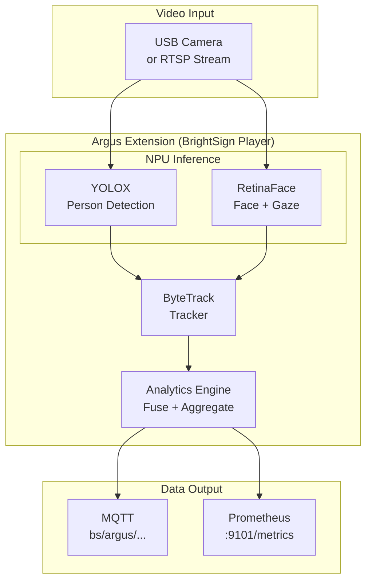
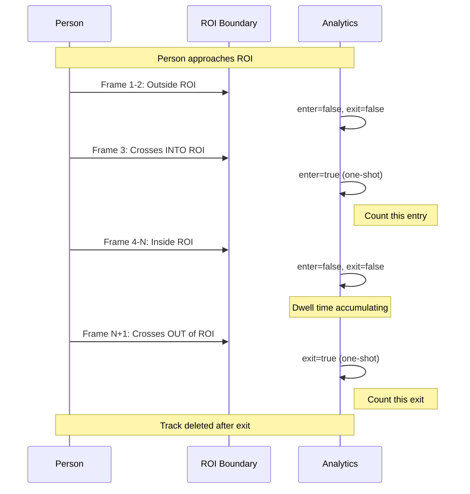
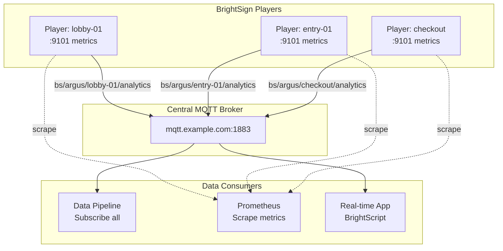

# Argus API Integration Guide

**Version 0.4.0** | February 4, 2026

---

This guide provides a deep technical reference for integrating with the Argus Audience Measurement Extension. It covers the full capabilities of the system, all configuration options, and detailed specifications for the MQTT and Prometheus output interfaces.

---

## Table of Contents

1. [System Capabilities](#system-capabilities)
2. [Architecture Overview](#architecture-overview)
3. [Configuration Integration Points](#configuration-integration-points)
4. [MQTT Output Specification](#mqtt-output-specification)
5. [Prometheus Metrics Output](#prometheus-metrics-output)
6. [Multi-Player Deployments](#multi-player-deployments)

---

## System Capabilities

Argus is an edge AI audience measurement system that runs entirely on BrightSign digital signage players. It processes video from USB cameras or from RTSP/IP camera streams using NPU-accelerated neural networks to produce real-time audience analytics.

### Core Measurements

| Capability | Description | Update Rate |
|------------|-------------|-------------|
| **Person Detection** | Detects and counts people in the camera's field of view | Per frame (25-30 FPS) |
| **Person Tracking** | Assigns stable IDs to individuals across frames using ByteTrack | Per frame |
| **Gaze Detection** | Determines if each person is looking at the screen/camera | Per frame |
| **Gaze Time** | Accumulated seconds each person has spent looking at the screen | Continuous |
| **Dwell Time** | Time each person has spent within the Region of Interest (ROI) | Continuous |
| **Entry/Exit Events** | One-shot events when people enter or leave the ROI | Event-driven |
| **Movement Direction** | 8-way compass direction of travel (R, UR, U, UL, L, DL, D, DR) | Per frame |
| **Movement Speed** | Velocity in pixels per second and normalized to frame diagonal | Per frame |

### Detection Models

| Model | Purpose | NPU Core | Input Size |
|-------|---------|----------|------------|
| **YOLOX** | Person detection (full body bounding boxes) | Core 1 | 640x640 |
| **RetinaFace** | Face detection and gaze classification | Core 0 | 320x320 |

### Privacy Architecture

Argus is designed with privacy as a core principle:

- **No facial recognition**: No biometric embeddings are computed or stored
- **No re-identification**: If a person leaves and returns, they receive a new ID
- **Edge processing only**: All AI inference runs on-device; no images leave the player
- **Anonymous output**: Only aggregate counts, times, and geometric data are exported
- **No persistent storage**: Track data is cleared when a person leaves view

---

## Architecture Overview



### Processing Pipeline

1. **Frame Capture**: Video frames acquired from USB camera, RTSP stream, or file
2. **Parallel Inference**: YOLOX and RetinaFace run simultaneously on separate NPU cores
3. **Tracking**: ByteTrack associates detections across frames with stable IDs
4. **Gaze Matching**: Face detections matched to person tracks via IoU
5. **Analytics Computation**: Speed, direction, dwell, entry/exit calculated per track
6. **Publishing**: Results output via MQTT (real-time JSON) and Prometheus (metrics)

---

## Configuration Integration Points

### Configuration File Location

Argus loads configuration from the first available source:

| Priority | Source | Path |
|----------|--------|------|
| 1 | CLI argument | `--config /path/to/config.json` |
| 2 | Environment variable | `BSEXT_CONFIG=/path/to/config.json` |
| 3 | SD card override | `/storage/sd/configs/argus-config.json` |
| 4 | Package default | Built into extension |

**Recommended approach**: Place your configuration at `/storage/sd/configs/argus-config.json` for easy modification without rebuilding the extension.

### Complete Configuration Schema

#### Input Configuration

```json
{
  "input_source": "rtsp",
  "device_id": "lobby-display-01",
  "input": {
    "rtsp_url": "rtsp://192.168.0.100:8554/live",
    "rtsp": {
      "latency_ms": 100
    }
  }
}
```

| Field | Type | Default | Description |
|-------|------|---------|-------------|
| `input_source` | string | `"rtsp"` | Input type: `"rtsp"`, `"usb"`, or `"file"` |
| `device_id` | string | Auto (MAC) | Device identifier included in all output messages |
| `input.rtsp_url` | string | Required for RTSP | Full RTSP URL including port |
| `input.rtsp.latency_ms` | integer | `100` | Buffer latency for RTSP streams |
| `input.usb_device` | string | `"/dev/video0"` | Device path for USB cameras |
| `input.usb.width` | integer | `640` | Capture width in pixels |
| `input.usb.height` | integer | `480` | Capture height in pixels |
| `input.usb.fps` | integer | `30` | Target capture frame rate |
| `input.file_path` | string | Required for file | Path to video file |
| `input.file.loop` | boolean | `false` | Loop video playback |

#### Publisher Configuration

Publishers define where analytics data is sent. Multiple publishers can be active simultaneously.

```json
{
  "publishers": [
    {
      "kind": "mqtt",
      "mqtt": {
        "host": "localhost",
        "port": 1883,
        "topic": "bs/argus/analytics",
        "qos": 0,
        "retain": false,
        "period_ms": 1000
      }
    }
  ]
}
```

##### MQTT Publisher Fields

| Field | Type | Default | Description |
|-------|------|---------|-------------|
| `mqtt.host` | string | `"localhost"` | MQTT broker hostname or IP address |
| `mqtt.port` | integer | `1883` | MQTT broker port |
| `mqtt.topic` | string | `"bs/argus/analytics"` | Topic to publish analytics messages |
| `mqtt.qos` | integer | `0` | MQTT QoS level (0, 1, or 2) |
| `mqtt.retain` | boolean | `false` | Whether to set retain flag on messages |
| `mqtt.period_ms` | integer | `1000` | Publish interval in milliseconds |

#### Processing Configuration

```json
{
  "runtime": {
    "target_fps": 30,
    "heartbeat_ms": 1000
  },
  "processing": {
    "th": {
      "score": 0.5,
      "iou": 0.45
    },
    "nms_max_dets": 100
  }
}
```

| Field | Type | Default | Description |
|-------|------|---------|-------------|
| `runtime.target_fps` | integer | `30` | Target processing frame rate |
| `runtime.heartbeat_ms` | integer | `1000` | Health check interval |
| `processing.th.score` | float | `0.5` | Detection score threshold |
| `processing.th.iou` | float | `0.45` | IoU threshold for NMS |

#### Logging Configuration

```json
{
  "log_level": "info",
  "log_dir": "/storage/sd/logs",
  "log_json": true
}
```

| Level | Description |
|-------|-------------|
| `debug` | All messages including verbose debug output |
| `info` | Informational messages (recommended for development) |
| `warn` | Warnings and errors only (recommended for production) |
| `error` | Critical errors only |

---

## MQTT Output Specification

This section provides the complete specification for the MQTT analytics output, including topic structure, message format, and all fields.

### Connection Details

| Property | Default Value | Description |
|----------|---------------|-------------|
| **Protocol** | MQTT 3.1.1 | Standard MQTT protocol |
| **Default Broker** | `localhost:1883` | Embedded Mosquitto broker on player |
| **Default Port** | `1883` (non-TLS) | Standard MQTT port |
| **TLS Port** | `8883` | Secure MQTT (if configured) |
| **Authentication** | None (local) | Configurable for remote brokers |

### Topic Structure and Wildcards

#### Default Topic Format

```
bs/argus/analytics
```

The default topic is device-agnostic. For multi-player deployments, you should configure device-specific topics.

#### Device-Specific Topic Pattern

For deployments with multiple players, configure topics that include the device identifier:

```
bs/argus/{device_id}/analytics
```

Example configurations for a fleet:

| Player | device_id | Topic |
|--------|-----------|-------|
| Lobby Display | `lobby-01` | `bs/argus/lobby-01/analytics` |
| Entrance | `entrance-main` | `bs/argus/entrance-main/analytics` |
| Checkout 1 | `checkout-01` | `bs/argus/checkout-01/analytics` |

#### Wildcard Subscription Patterns

MQTT wildcards enable subscribing to multiple players with a single subscription:

| Pattern | Matches | Use Case |
|---------|---------|----------|
| `bs/argus/+/analytics` | Any single device | All players in deployment |
| `bs/argus/lobby-+/analytics` | `lobby-01`, `lobby-02`, etc. | All lobby displays |
| `bs/argus/#` | All Argus topics | Complete data capture |
| `bs/argus/+/+` | Device + any sub-topic | Future-proof for topic versioning |

**Example: Subscribe to all players**
```bash
mosquitto_sub -h central-broker.example.com -t 'bs/argus/+/analytics' -v
```

**Example: Subscribe to specific location group**
```bash
mosquitto_sub -h central-broker.example.com -t 'bs/argus/checkout-+/analytics' -v
```

### Configuring Device-Specific Topics

To enable per-player topics, configure both `device_id` and a topic pattern:

```json
{
  "device_id": "lobby-01",
  "publishers": [
    {
      "kind": "mqtt",
      "mqtt": {
        "host": "central-broker.example.com",
        "port": 1883,
        "topic": "bs/argus/lobby-01/analytics"
      }
    }
  ]
}
```

### Message Format Specification

#### Schema Version

All messages include a schema version for compatibility:

```json
{
  "schema": "analytics/v7.0"
}
```

- **Format**: `analytics/v{major}.{minor}`
- **Current Version**: `analytics/v7.0`
- **Major Changes**: Breaking schema changes (new required fields, removed fields, changed types)
- **Minor Changes**: Additive changes only (new optional fields)

**Client Version Handling:**

```javascript
const [_, major, minor] = data.schema.match(/v(\d+)\.(\d+)/);
if (parseInt(major) > 7) {
  console.error(`Unsupported schema version: ${data.schema}`);
  return; // Reject unknown major versions
}
// Process message (ignore unknown fields for forward compatibility)
```

#### Complete Message Example

```json
{
  "schema": "analytics/v7.0",
  "ts": 164.68,
  "device": "lobby-01",
  "stream": "rtsp://192.168.0.100:8554/live",
  "frame_w": 1280,
  "frame_h": 720,
  "model": "yolox_s",
  "fw_version": "7.0.0",
  "npu_load": 45.2,
  "people": 3,
  "people_confident": 2,
  "gaze": 1,
  "gaze_conf": 0.87,
  "fps": 29,
  "roi": {
    "type": "border",
    "border_frac": 0.10,
    "rect": [128, 72, 1152, 648]
  },
  "health": {
    "detector_fps": 29.5,
    "tracker_fps": 29.2,
    "queue_latency_ms": 12,
    "dropped_frames": 0,
    "last_model_reload_ts": 0.0
  },
  "tracks": [
    {
      "id": 42,
      "state": "Confirmed",
      "bbox": [180.5, 120.3, 440.2, 475.8],
      "score": 0.93,
      "zones": ["main", "roi"],
      "dir": "L",
      "deg": 175.5,
      "dir_conf": 0.87,
      "speed": 65.3,
      "speed_norm": 0.082,
      "dwell": 45.2,
      "enter": false,
      "exit": false,
      "gaze": {
        "detected": 1,
        "time": 12.5,
        "face_bbox": [220, 130, 260, 180]
      }
    },
    {
      "id": 51,
      "state": "Confirmed",
      "bbox": [600.0, 200.0, 750.0, 550.0],
      "score": 0.88,
      "zones": ["roi"],
      "dir": "?",
      "deg": 0.0,
      "dir_conf": 0.00,
      "speed": 0.0,
      "speed_norm": 0.000,
      "dwell": 8.7,
      "enter": false,
      "exit": false
    }
  ]
}
```

#### Top-Level Fields Reference

| Field | Type | Required | Description |
|-------|------|----------|-------------|
| `schema` | string | Yes | Schema version identifier (`"analytics/v7.0"`) |
| `ts` | float | Yes | Timestamp in seconds (monotonic, since system start) |
| `device` | string | Yes | Device identifier (configured or auto-detected from MAC) |
| `stream` | string | Yes | Video input source URL or path |
| `frame_w` | integer | Yes | Frame width in pixels |
| `frame_h` | integer | Yes | Frame height in pixels |
| `model` | string | No | Detection model name (e.g., `"yolox_s"`) |
| `fw_version` | string | No | Firmware/software version |
| `npu_load` | float | No | NPU utilization percentage (0-100) |
| `people` | integer | Yes | Current person count (equals `tracks.length`) |
| `people_confident` | integer | No | Count of tracks with score >= 0.70 |
| `gaze` | integer | Yes | Number of people currently gazing at screen |
| `gaze_conf` | float | No | Average gaze detection confidence (0-1) |
| `fps` | integer | Yes | Current processing frame rate |
| `roi` | object | No | Region of Interest configuration |
| `health` | object | No | System health metrics |
| `tracks` | array | Yes | Array of track objects (one per person) |

#### Track Object Fields Reference

Each element in the `tracks` array represents one tracked person:

| Field | Type | Required | Description |
|-------|------|----------|-------------|
| `id` | integer | Yes | Unique track identifier (persists across frames) |
| `state` | string | Yes | Track state: `"Confirmed"` (only confirmed tracks are published) |
| `bbox` | [float, float, float, float] | Yes | Bounding box `[x0, y0, x1, y1]` in pixels |
| `score` | float | Yes | Detection confidence (0.0 - 1.0) |
| `zones` | string[] | No | Zone names this track is within (e.g., `["roi", "main"]`) |
| `dir` | string | Yes | Direction: `"R"`, `"UR"`, `"U"`, `"UL"`, `"L"`, `"DL"`, `"D"`, `"DR"`, or `"?"` |
| `deg` | float | Yes | Direction in degrees (0-360, 0=right, 90=up) |
| `dir_conf` | float | Yes | Direction confidence (0.0 - 1.0) |
| `speed` | float | Yes | Speed in pixels per second |
| `speed_norm` | float | Yes | Speed normalized to frame diagonal (0.0 - 1.0) |
| `dwell` | float | Yes | Time in ROI in seconds |
| `enter` | boolean | Yes | True for exactly one message when entering ROI |
| `exit` | boolean | Yes | True for exactly one message when exiting ROI |
| `gaze` | object | No | Per-person gaze data (present only when face detected) |

#### Gaze Object Fields Reference

The `gaze` object is **conditionally present** on track objects. It appears only when:
- A face is detected by RetinaFace
- The face successfully matches to this person track via IoU

| Field | Type | Description |
|-------|------|-------------|
| `detected` | integer | Current gaze state: `1` = looking at screen, `0` = looking away |
| `time` | float | Cumulative gaze time in seconds (increases while `detected=1`) |
| `face_bbox` | [int, int, int, int] | Face bounding box `[x0, y0, x1, y1]` in pixels |

**Important**: Not all tracks will have gaze data. In typical scenarios, 10-30% of tracked people have face detections at any moment. Your integration code must handle tracks without gaze data:

```javascript
for (const track of data.tracks) {
  if (track.gaze) {
    // Face detected for this person
    const isLooking = track.gaze.detected === 1;
    const totalGazeTime = track.gaze.time;
  } else {
    // No face detected (person turned away, too far, occluded)
  }
}
```

#### Health Object Fields Reference

| Field | Type | Description |
|-------|------|-------------|
| `detector_fps` | float | Detection model inference rate (EMA over ~1s) |
| `tracker_fps` | float | Tracker update rate (EMA over ~1s) |
| `queue_latency_ms` | float | Processing queue latency in milliseconds |
| `dropped_frames` | integer | Frames dropped since last publish |
| `last_model_reload_ts` | float | Timestamp of last model reload |

**Health Monitoring Thresholds:**

| Metric | Warning | Critical | Description |
|--------|---------|----------|-------------|
| `detector_fps` | < 20 | < 10 | Model inference slowing down |
| `queue_latency_ms` | > 50 | > 100 | Processing bottleneck |
| `dropped_frames` | > 0 | > 5 | System under stress |
| `npu_load` | > 80% | > 95% | NPU saturation |

#### ROI Object Fields Reference

| Field | Type | Description |
|-------|------|-------------|
| `type` | string | ROI type: `"border"` (inset from frame edges) or `"polygon"` |
| `border_frac` | float | Border fraction (e.g., 0.10 = 10% inset from each edge) |
| `rect` | [int, int, int, int] | Computed ROI rectangle `[x0, y0, x1, y1]` in pixels |

#### Direction and Speed Reference

**8-Way Compass Directions:**

| Direction | Degree Range | Description |
|-----------|--------------|-------------|
| `"R"` | 337.5° - 22.5° | Moving right |
| `"UR"` | 22.5° - 67.5° | Moving up-right |
| `"U"` | 67.5° - 112.5° | Moving up (away from camera) |
| `"UL"` | 112.5° - 157.5° | Moving up-left |
| `"L"` | 157.5° - 202.5° | Moving left |
| `"DL"` | 202.5° - 247.5° | Moving down-left |
| `"D"` | 247.5° - 292.5° | Moving down (toward camera) |
| `"DR"` | 292.5° - 337.5° | Moving down-right |
| `"?"` | N/A | Stationary or below speed threshold |

**Speed Interpretation (at 640x480 resolution):**

| Speed (px/s) | Interpretation |
|--------------|----------------|
| 0 | Stationary (below 36 px/s threshold) |
| 36-60 | Slow walking |
| 60-90 | Normal walking |
| 90-120 | Fast walking/jogging |
| > 120 | Clamped (prevents edge track spikes) |

**Note**: Speed scales with resolution. For 1280x720, multiply these values by ~1.5.

#### Entry/Exit Event Behavior

The `enter` and `exit` fields are **one-shot flags**:

- `enter: true` appears for **exactly one message** when a person enters the ROI
- `exit: true` appears for **exactly one message** when a person leaves the ROI
- Both are `false` at all other times
- They are **mutually exclusive** within a single track in a single message



### JSON Schema Definition

For automated validation, here is the formal JSON Schema:

```json
{
  "$schema": "http://json-schema.org/draft-07/schema#",
  "type": "object",
  "required": ["schema", "ts", "device", "stream", "frame_w", "frame_h", "people", "fps", "tracks"],
  "properties": {
    "schema": {
      "type": "string",
      "pattern": "^analytics/v\\d+\\.\\d+$"
    },
    "ts": { "type": "number", "minimum": 0 },
    "device": { "type": "string" },
    "stream": { "type": "string" },
    "frame_w": { "type": "integer", "minimum": 1 },
    "frame_h": { "type": "integer", "minimum": 1 },
    "model": { "type": "string" },
    "fw_version": { "type": "string" },
    "npu_load": { "type": "number", "minimum": 0, "maximum": 100 },
    "people": { "type": "integer", "minimum": 0 },
    "people_confident": { "type": "integer", "minimum": 0 },
    "gaze": { "type": "integer", "minimum": 0 },
    "gaze_conf": { "type": "number", "minimum": 0, "maximum": 1 },
    "fps": { "type": "integer", "minimum": 0 },
    "roi": {
      "type": "object",
      "properties": {
        "type": { "type": "string", "enum": ["border", "polygon"] },
        "border_frac": { "type": "number", "minimum": 0, "maximum": 0.5 },
        "rect": { "type": "array", "items": { "type": "number" }, "minItems": 4, "maxItems": 4 }
      }
    },
    "health": {
      "type": "object",
      "properties": {
        "detector_fps": { "type": "number" },
        "tracker_fps": { "type": "number" },
        "queue_latency_ms": { "type": "number" },
        "dropped_frames": { "type": "integer" },
        "last_model_reload_ts": { "type": "number" }
      }
    },
    "tracks": {
      "type": "array",
      "items": {
        "type": "object",
        "required": ["id", "state", "bbox", "score", "dir", "deg", "dir_conf", "speed", "speed_norm", "dwell", "enter", "exit"],
        "properties": {
          "id": { "type": "integer", "minimum": 1 },
          "state": { "type": "string", "enum": ["Tentative", "Confirmed", "Lost"] },
          "bbox": { "type": "array", "items": { "type": "number" }, "minItems": 4, "maxItems": 4 },
          "score": { "type": "number", "minimum": 0, "maximum": 1 },
          "zones": { "type": "array", "items": { "type": "string" } },
          "dir": { "type": "string", "enum": ["R", "UR", "U", "UL", "L", "DL", "D", "DR", "?"] },
          "deg": { "type": "number", "minimum": 0, "maximum": 360 },
          "dir_conf": { "type": "number", "minimum": 0, "maximum": 1 },
          "speed": { "type": "number", "minimum": 0 },
          "speed_norm": { "type": "number", "minimum": 0, "maximum": 1 },
          "dwell": { "type": "number", "minimum": 0 },
          "enter": { "type": "boolean" },
          "exit": { "type": "boolean" },
          "gaze": {
            "type": "object",
            "required": ["detected", "time", "face_bbox"],
            "properties": {
              "detected": { "type": "integer", "enum": [0, 1] },
              "time": { "type": "number", "minimum": 0 },
              "face_bbox": { "type": "array", "items": { "type": "number" }, "minItems": 4, "maxItems": 4 }
            }
          }
        }
      }
    }
  }
}
```

### Message Frequency and Bandwidth

| Setting | Message Rate | Typical Size | Bandwidth |
|---------|--------------|--------------|-----------|
| `period_ms: 5000` | 0.2 Hz | 300-800 bytes | ~0.2 KB/s |
| `period_ms: 1000` | 1 Hz | 300-800 bytes | ~0.5 KB/s |
| `period_ms: 500` | 2 Hz | 300-800 bytes | ~1.2 KB/s |
| `period_ms: 100` | 10 Hz | 300-800 bytes | ~6 KB/s |

Message size varies with track count (~150 bytes base + ~200 bytes per track).

---

## Configuring an Off-Player MQTT Broker

By default, Argus publishes to a Mosquitto broker running locally on the BrightSign player. For centralized data collection, you can configure Argus to publish to an external broker.

### Local Broker (Default)

The default configuration assumes the broker runs on the same player:

```json
{
  "publishers": [
    {
      "kind": "mqtt",
      "mqtt": {
        "host": "localhost",
        "port": 1883,
        "topic": "bs/argus/analytics"
      }
    }
  ]
}
```

### Remote Broker Configuration

To publish to a centralized broker on your network:

```json
{
  "device_id": "store-42-entrance",
  "publishers": [
    {
      "kind": "mqtt",
      "mqtt": {
        "host": "mqtt-broker.example.com",
        "port": 1883,
        "topic": "bs/argus/store-42-entrance/analytics",
        "qos": 1
      }
    }
  ]
}
```

#### Configuration Fields for Remote Broker

| Field | Value | Notes |
|-------|-------|-------|
| `mqtt.host` | Broker hostname or IP | Must be reachable from player network |
| `mqtt.port` | `1883` (non-TLS) or `8883` (TLS) | Ensure firewall allows connection |
| `mqtt.topic` | Include device ID | Enables per-player topic filtering |
| `mqtt.qos` | `1` recommended for remote | Ensures delivery over unreliable networks |

#### Network Requirements

For remote broker connectivity:

1. **Network access**: Player must have route to broker
2. **Firewall rules**: Port 1883 (or 8883) must be open
3. **DNS resolution**: If using hostname, ensure DNS is configured
4. **Broker authentication**: Configure credentials if broker requires auth

#### Testing Remote Connectivity

From the BrightSign player (via SSH):

```bash
# Test TCP connectivity
nc -zv mqtt-broker.example.com 1883

# Test MQTT publish
mosquitto_pub -h mqtt-broker.example.com -t 'test/connection' -m 'hello'

# Monitor from broker side
mosquitto_sub -h mqtt-broker.example.com -t 'bs/argus/#' -v
```

### Dual Publishing (Local + Remote)

You can publish to multiple brokers simultaneously:

```json
{
  "device_id": "lobby-01",
  "publishers": [
    {
      "kind": "mqtt",
      "mqtt": {
        "host": "localhost",
        "port": 1883,
        "topic": "bs/argus/analytics",
        "period_ms": 100
      }
    },
    {
      "kind": "mqtt",
      "mqtt": {
        "host": "cloud-broker.example.com",
        "port": 8883,
        "topic": "bs/argus/lobby-01/analytics",
        "qos": 1,
        "period_ms": 1000
      }
    }
  ]
}
```

This configuration:
- Publishes at 10 Hz locally for real-time display triggers
- Publishes at 1 Hz to cloud for analytics aggregation

---

## Prometheus Metrics Output

In addition to MQTT, Argus exposes Prometheus metrics for dashboarding and alerting.

### Endpoint Details

| Property | Value |
|----------|-------|
| **URL** | `http://<PLAYER_IP>:9101/metrics` |
| **Format** | Prometheus text exposition format |
| **Recommended Scrape Interval** | 5-15 seconds |

### Available Metrics

#### Visitor Metrics

| Metric | Type | Description |
|--------|------|-------------|
| `argus_occupancy_current` | Gauge | Current number of people in view |
| `argus_visitors_total` | Counter | Total visitors that entered (cumulative) |
| `argus_exits_total` | Counter | Total people that exited (cumulative) |

#### Engagement Metrics

| Metric | Type | Description |
|--------|------|-------------|
| `argus_gaze_current` | Gauge | People currently looking at screen |
| `argus_gaze_total` | Counter | Total gaze events detected |
| `argus_gaze_seconds_total` | Counter | Total accumulated gaze time |
| `argus_dwell_seconds` | Histogram | Dwell time distribution |

#### Movement Metrics

| Metric | Type | Labels | Description |
|--------|------|--------|-------------|
| `argus_direction_total` | Counter | `direction` | Movement counts by direction |

#### System Metrics

| Metric | Type | Description |
|--------|------|-------------|
| `argus_fps_current` | Gauge | Current processing FPS |
| `argus_npu_load_percent` | Gauge | NPU utilization (0-100) |
| `argus_frame_latency_ms` | Histogram | Frame processing latency |
| `argus_exporter_up` | Gauge | Exporter health (1=up) |

### Prometheus Configuration

Add to your `prometheus.yml`:

```yaml
scrape_configs:
  - job_name: 'argus'
    static_configs:
      - targets: ['192.168.0.100:9101']
    scrape_interval: 15s
```

For multiple players:

```yaml
scrape_configs:
  - job_name: 'argus'
    static_configs:
      - targets:
          - '192.168.0.101:9101'
          - '192.168.0.102:9101'
          - '192.168.0.103:9101'
        labels:
          location: 'retail-store-1'
```

### Example PromQL Queries

```promql
# Current total occupancy across all players
sum(argus_occupancy_current)

# Attention rate (% of people looking)
(sum(argus_gaze_current) / sum(argus_occupancy_current)) * 100

# Visitor entry rate (per minute)
rate(argus_visitors_total[5m]) * 60

# 95th percentile dwell time
histogram_quantile(0.95, rate(argus_dwell_seconds_bucket[5m]))

# Direction flow distribution
sum by (direction) (rate(argus_direction_total[5m]))
```

---

## Multi-Player Deployments

### Architecture for Fleet Management



### Configuration Strategy

1. **Assign unique device IDs** to each player
2. **Use device ID in topic** for message routing
3. **Configure central broker** for aggregation
4. **Use wildcard subscriptions** for fleet-wide consumers

### Example Fleet Configuration

**Player: lobby-01** (`/storage/sd/configs/argus-config.json`):
```json
{
  "device_id": "lobby-01",
  "input_source": "rtsp",
  "input": { "rtsp_url": "rtsp://192.168.1.10:8554/live" },
  "publishers": [{
    "kind": "mqtt",
    "mqtt": {
      "host": "mqtt.example.com",
      "port": 1883,
      "topic": "bs/argus/lobby-01/analytics"
    }
  }]
}
```

**Player: entrance-main** (`/storage/sd/configs/argus-config.json`):
```json
{
  "device_id": "entrance-main",
  "input_source": "usb",
  "input": { "usb_device": "/dev/video0" },
  "publishers": [{
    "kind": "mqtt",
    "mqtt": {
      "host": "mqtt.example.com",
      "port": 1883,
      "topic": "bs/argus/entrance-main/analytics"
    }
  }]
}
```

### Subscribing to All Players

```bash
# Subscribe to all Argus analytics from any player
mosquitto_sub -h mqtt.example.com -t 'bs/argus/+/analytics' -v
```

Output:
```
bs/argus/lobby-01/analytics {"schema":"analytics/v7.0","device":"lobby-01","people":3,...}
bs/argus/entrance-main/analytics {"schema":"analytics/v7.0","device":"entrance-main","people":1,...}
bs/argus/checkout/analytics {"schema":"analytics/v7.0","device":"checkout","people":0,...}
```

### Filtering by Device in Consumer Code

```python
import json
import paho.mqtt.client as mqtt

def on_message(client, userdata, msg):
    # Extract device from topic: bs/argus/{device}/analytics
    parts = msg.topic.split('/')
    device_from_topic = parts[2] if len(parts) >= 4 else 'unknown'

    data = json.loads(msg.payload)
    device_from_payload = data.get('device', 'unknown')

    # Both should match
    print(f"Device: {device_from_topic}, People: {data['people']}, Gaze: {data['gaze']}")

client = mqtt.Client()
client.on_message = on_message
client.connect("mqtt.example.com", 1883)

# Subscribe to all players with wildcard
client.subscribe("bs/argus/+/analytics")
client.loop_forever()
```

---

## Appendix: Quick Reference

### Minimum Viable Configuration

```json
{
  "input_source": "rtsp",
  "input": {
    "rtsp_url": "rtsp://192.168.0.100:8554/live"
  }
}
```

### Production Configuration Template

```json
{
  "device_id": "YOUR-DEVICE-ID",
  "input_source": "rtsp",
  "input": {
    "rtsp_url": "rtsp://YOUR-CAMERA-IP:8554/live",
    "rtsp": { "latency_ms": 100 }
  },
  "log_level": "warn",
  "runtime": {
    "target_fps": 30
  },
  "publishers": [
    {
      "kind": "mqtt",
      "mqtt": {
        "host": "YOUR-MQTT-BROKER",
        "port": 1883,
        "topic": "bs/argus/YOUR-DEVICE-ID/analytics",
        "qos": 1,
        "period_ms": 1000
      }
    }
  ]
}
```

### Key Topic Patterns

| Pattern | Use Case |
|---------|----------|
| `bs/argus/analytics` | Single player, local broker |
| `bs/argus/{device_id}/analytics` | Multi-player, per-device routing |
| `bs/argus/+/analytics` | Subscribe to all players |
| `bs/argus/{location}-+/analytics` | Subscribe to location group |

### Essential Fields for Integration

| Field | Purpose |
|-------|---------|
| `device` | Identify source player |
| `people` | Current occupancy |
| `gaze` | Attention count |
| `tracks[].dwell` | Engagement duration |
| `tracks[].enter` | Entry event (count visitors) |
| `tracks[].exit` | Exit event (count departures) |
| `tracks[].gaze.time` | Per-person attention time |

---

## Related Documentation

- **[MQTT Schema Reference](mqtt-message-format.md)** - Complete field definitions
- **[Configuration Reference](CONFIGURATION.md)** - All configuration options
- **[Tracking Explained](TRACKING-EXPLAINED.md)** - How person tracking works
- **[Prometheus Integration](INTEGRATION-PROMETHEUS.md)** - Metrics and Grafana setup
