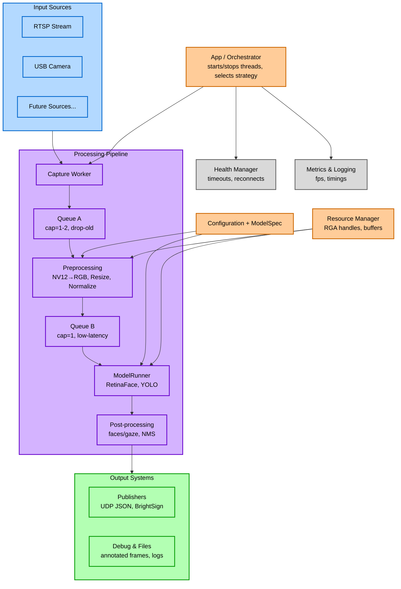
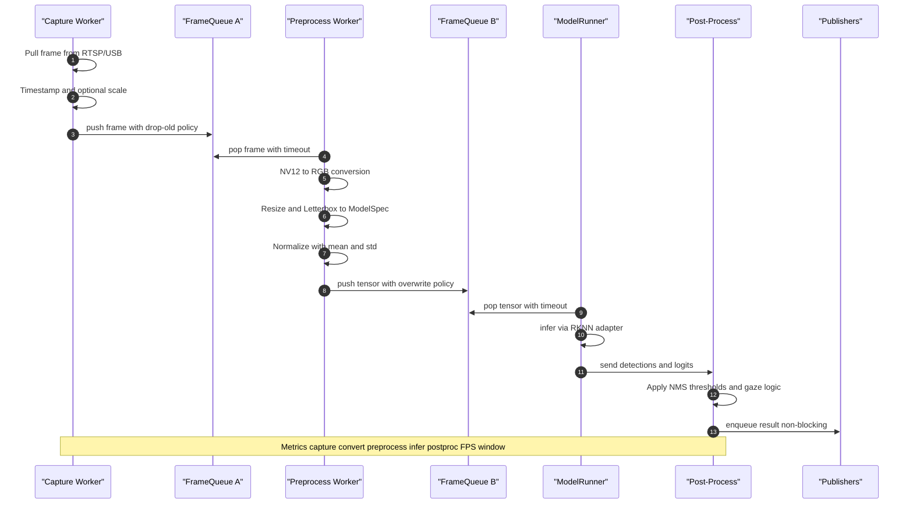
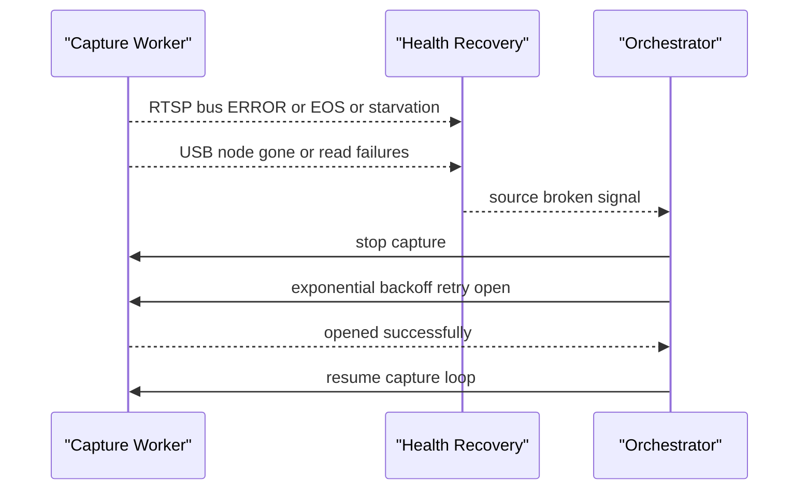

# BrightSign NPU Gaze Extension Architecture

This document describes the architecture of the BrightSign NPU Gaze Extension system, which provides real-time gaze tracking capabilities using neural processing units.

## System Overview

The system is designed as a modular pipeline that processes video input through various stages to detect and track gaze patterns, with support for multiple input sources and output formats.

## Architecture Diagram



---

**System Flow:**
1. **Input** → Capture video from RTSP/USB sources
2. **Queue A** → Buffer frames with drop-old policy  
3. **Preprocess** → Convert, resize, normalize frames
4. **Queue B** → Low-latency buffer for inference
5. **Model** → Run face/gaze detection models
6. **Postprocess** → Apply NMS, thresholds, extract gaze data
7. **Output** → Publish results via UDP/BrightSign or save debug files

**Control Systems:**
- **Orchestrator** manages threading and strategy selection
- **Config** provides parameters to processing stages  
- **Resource Manager** handles GPU/memory allocation
- **Health Manager** monitors and recovers from failures
- **Metrics** tracks performance and timing data

---

## Component Descriptions

### Core Components

#### App / Orchestrator
- **Central coordination hub** that manages the entire pipeline
- **Starts/stops workers**: Capture Worker, Preprocess Worker, Inference Worker, and Publishers
- **Strategy selection**: Selects InputSource strategy (RTSP/USB/…) and Model from ModelSpec
- **Recovery coordination**: Reacts to Recovery/Health events to reacquire sources
- **System-level decision making** and thread lifecycle management

#### Capture Worker (Explicit Component)
- **Owns RTSP/USB handles** and pulls raw frames from input sources
- **Minimal source-side processing**: timestamping, optional in-pipeline scaling if available
- **Frame pushing**: Pushes frames into FrameQueue A with drop-old policy
- **Timeout handling**: Manages connection timeouts and source-specific error conditions
- **Backoff/reacquisition**: Handles bus EOS/ERROR for RTSP, /dev node loss for USB

#### Input Sources
- **RTSP Source**: Network-based video streaming input with GStreamer bus monitoring
- **USB Camera Source**: Direct camera hardware integration with device node monitoring
- **Future Sources**: Extensible for additional input types via strategy pattern

#### Processing Pipeline
The main data flow consists of several specialized stages:

1. **FrameQueue A (Capture)**
   - **Capacity**: 1-2 frames
   - **Policy**: Drop-old on push when full (keeps freshest frame; prevents tail latency)
   - **Purpose**: Buffers incoming video frames from Capture Worker

2. **Preprocessing Pipeline**
   - **Model-aware, not model-specific**: Reads input shape + color layout from ModelSpec
   - **Format conversion**: NV12→RGB/BGR (RGA first; OpenCV fallback)
   - **Scaling**: Scale/letterbox as declared by model (e.g., 320×320 RGB, 640×640 BGR)
   - **Normalization**: Applies mean/std from ModelSpec
   - **Hardware-first approach**: Uses RGA contexts with software fallback

3. **FrameQueue B (Inference)**
   - **Capacity**: 1 frame (low latency design)
   - **Policy**: Overwrite or drop-old (model always gets latest preprocessed frame)
   - **Purpose**: Real-time buffer ensuring fresh data for inference

4. **ModelRunner**
   - **Interface design**: IModel interface with concrete implementations
   - **Runtime adapter**: RKNN2Interface handles device/session/tensors
   - **Concrete models**: RetinaFaceRKNN, YOLOv5RKNN implementing IModel
   - **Future-proof**: Strategy/Factory pattern for extensibility
   - **Device management**: Handles NPU resource allocation and scheduling

5. **Post-processing**
   - **Face processing**: Face boxes/landmarks extraction
   - **Gaze logic**: Gaze direction calculation and tracking
   - **Filtering**: Non-Maximum Suppression (NMS) and threshold application
   - **Configuration-driven**: Uses thresholds and parameters from config

### Support Systems

#### Configuration + ModelSpec
- **Source configuration**: RTSP URL, USB device paths
- **Model specifications**: Input dimensions (W×H), channels, mean/std normalization
- **Processing parameters**: Thresholds, NMS settings
- **Publisher targets**: Output destination configuration
- **Runtime behavior settings**: Performance and quality trade-offs

#### Resource Manager (RGA/handles)
- **RGA contexts**: Hardware acceleration resource management
- **Memory pools**: Scratch buffers (NV12 320×320), pinned memory pools
- **Tensor management**: Reusable RKNN I/O tensors and preallocated Mats
- **Utility operations**: nv12_to_rgb(), resize(), letterbox() with hw-first, sw-fallback behavior
- **Resource lifecycle**: Efficient allocation and cleanup of GPU/NPU resources

#### Recovery / Health Manager
- **RTSP monitoring**: GStreamer bus (ERROR/EOS), appsink starvation counters, RTP jitter/clock drift
- **USB monitoring**: Device node disappearance, repeated read failures
- **Backoff strategy**: Signals orchestrator to reacquire via exponential backoff
- **Failure detection**: Proactive monitoring of all pipeline stages
- **Automatic recovery**: Graceful degradation and service restoration

#### Metrics & Logging
- **Stage timers**: capture+convert, preprocess, inference, postprocess timing
- **Performance metrics**: FPS over sliding window, per-stage histograms for tuning
- **Error counters**: Track failures and recovery events
- **Debug capabilities**: Optional per-stage performance analysis
- **System telemetry**: Health indicators and operational statistics

### Output Systems

#### Publishers
- **Interface-based**: IPublisher interface for extensibility
- **UDP JSON**: Real-time data streaming with configurable endpoints
- **BrightSign V3**: Integration with BrightSign ecosystem
- **Future sinks**: Extensible output formats via plugin architecture
- **Performance optimization**: Asynchronous publishing to prevent pipeline blocking

#### Debug & Files
- **Annotated frames**: Visual debugging with bounding boxes and gaze vectors
- **Performance logs**: Detailed timing and performance analysis data
- **Optional diagnostics**: PCAP/RTSP stats, frame dumps for development
- **Development tools**: Comprehensive debugging and troubleshooting capabilities

## Data Flow

### Steady State Processing



### Recovery / Reacquire Path



## Key Design Principles

### Performance Optimization
- **Lock-free queues** for minimal latency
- **Low-capacity buffers** to reduce memory usage and latency
- **Hardware acceleration** through NPU and GPU utilization
- **Drop-old policies** to maintain real-time performance
- **Asynchronous publishing** to prevent pipeline blocking

### Modularity
- **Strategy pattern** for algorithm selection
- **Plugin architecture** for extensible input/output sources
- **Configurable pipeline** stages
- **Interface-based design** (IModel, IPublisher) for extensibility

### Reliability
- **Health monitoring** and automatic recovery
- **Resource management** to prevent memory leaks
- **Graceful degradation** under high load
- **Exponential backoff** for connection recovery
- **Proactive failure detection** across all stages

## Technical Considerations

### Latency Requirements
- Frame queues sized for minimal buffering (cap=1-2)
- Direct hardware access where possible (RGA, RKNN)
- Optimized preprocessing pipeline with hardware fallbacks
- Real-time buffer policies (drop-old, overwrite)

### Memory Management
- Efficient buffer allocation through Resource Manager
- GPU/NPU memory optimization with pooling
- Preallocated tensors and scratch buffers
- Hardware-first operations with software fallbacks

### Scalability
- Modular design allows for easy component replacement
- Configuration-driven behavior via ModelSpec
- Future-proof architecture for new models and sources
- Worker-based threading for independent scaling

## Usage Examples

### Basic Configuration
```yaml
input:
  type: "usb_camera"
  device: "/dev/video0"
  
processing:
  model: "retinaface_rknn"
  preprocessing:
    target_size: [320, 320]
    color_format: "RGB"
    normalize:
      mean: [104, 117, 123]
      std: [1, 1, 1]
    
output:
  publishers:
    - type: "udp_json"
      port: 8080
      host: "localhost"
    - type: "brightsign_v3"
      endpoint: "/api/gaze"

recovery:
  rtsp_timeout_ms: 5000
  usb_retry_count: 3
  backoff_max_ms: 30000
```

### Advanced Pipeline Setup
```yaml
pipeline:
  frame_queue_a:
    capacity: 2
    policy: "drop_old"
    timeout_ms: 100
  frame_queue_b:
    capacity: 1
    policy: "overwrite"
    timeout_ms: 50
    
preprocessing:
  rga_preferred: true
  letterbox_color: [114, 114, 114]
  
inference:
  model_spec:
    input_shape: [1, 3, 640, 640]
    input_layout: "NCHW"
    color_format: "BGR"
    
post_processing:
  nms_threshold: 0.5
  confidence_threshold: 0.7
  max_faces: 5

metrics:
  fps_window_size: 30
  stage_timers: true
  histograms: false
```