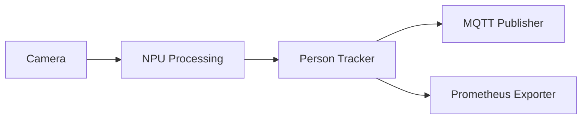
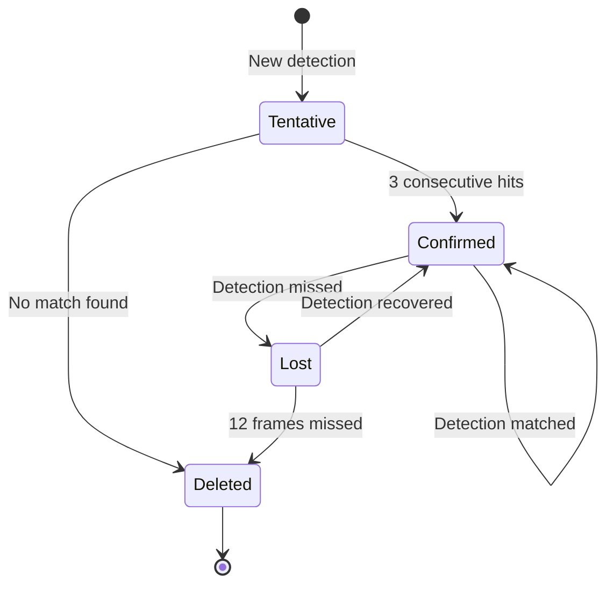
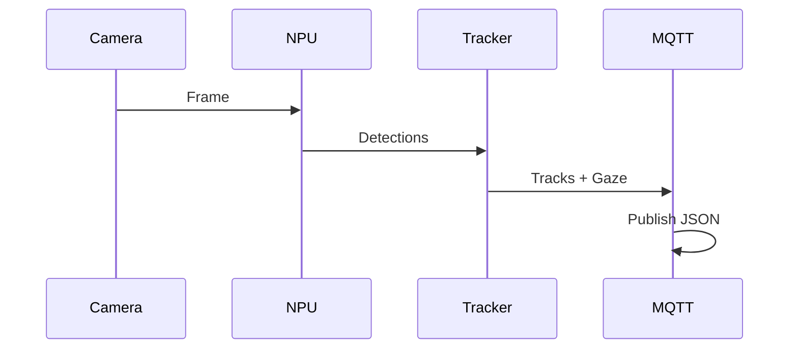
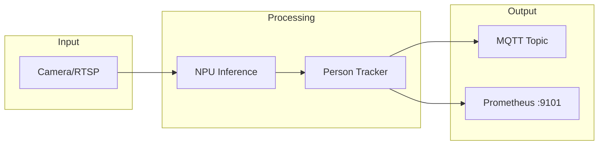
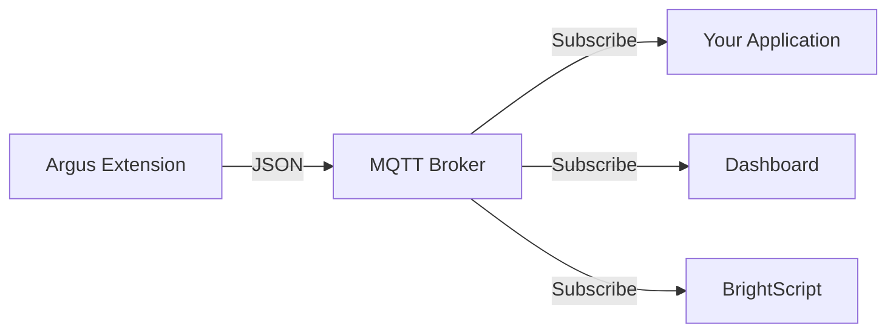
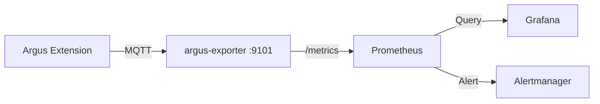
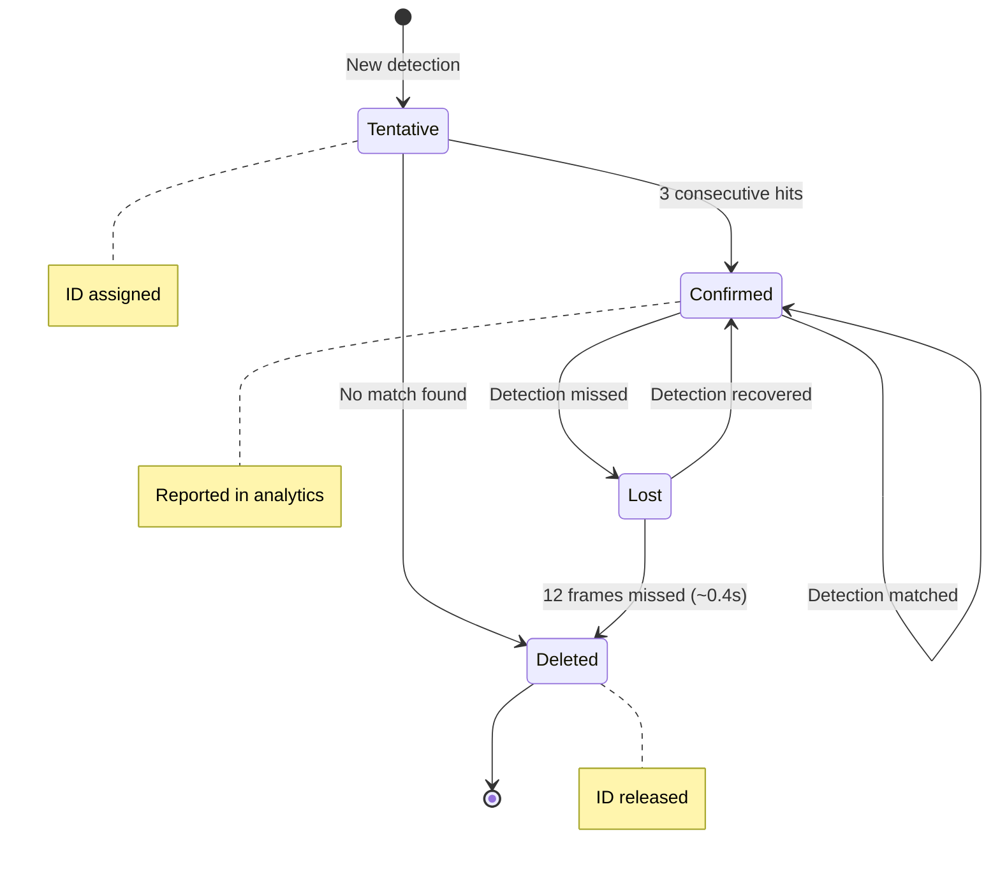
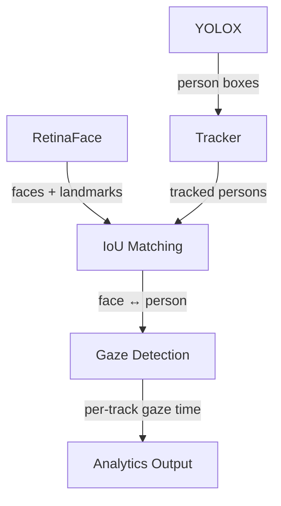

# Documentation Update Plan

**Created:** 2026-01-22
**Status:** Planning
**Goal:** Transform documentation from developer-focused build instructions to user-focused value proposition and integration guides.

---

## Executive Summary

The current documentation is technically comprehensive but focuses heavily on building and architecture. We need to shift focus to:

1. **Value proposition** - What problems does Argus solve?
2. **Integration guides** - How do I consume the data?
3. **Configuration reference** - How do I configure it?
4. **Build instructions** - Moved to a separate document

---

## Documentation Standards

### Diagrams: Use Mermaid Only

**All diagrams MUST use Mermaid syntax.** This ensures:
- Diagrams render directly in GitHub/GitLab
- Diagrams are version-controlled as text
- No external image files to maintain
- Consistent styling across all docs

**Mermaid Diagram Types to Use:**

| Diagram Type | Mermaid Syntax | Use For |
|--------------|----------------|---------|
| Flowcharts | `flowchart TD` | Data flow, pipelines |
| State diagrams | `stateDiagram-v2` | Track lifecycle, state machines |
| Sequence diagrams | `sequenceDiagram` | Thread interactions, message flow |
| Block diagrams | `block-beta` | Architecture overview |

**Example - Architecture Flowchart:**


**Example - Track State Diagram:**


**Example - Data Flow Sequence:**


---

## Current State Analysis

### What We Have (10 docs)

| Document | Lines | Focus | Keep/Move/Revise |
|----------|-------|-------|------------------|
| `README.md` | 488 | Build-heavy, some features | **Major revision** |
| `DESIGN.md` | 676 | Architecture deep-dive | Keep as-is |
| `mqtt-message-format.md` | 2009 | Excellent MQTT reference | Keep, minor updates |
| `prometheus-grafana-setup.md` | 289 | Setup guide | Expand metrics list |
| `cpp-design.md` | 1463 | C++ architecture | Keep as-is |
| `multiple-models.md` | 1080 | Multi-model design | Keep as-is |
| `OrangePi_Development.md` | 550 | Dev environment | Keep as-is |
| `blurring-technique.md` | 298 | Privacy feature | Keep as-is |
| `rgbd.md` | 233 | Future feature (planned) | Keep as-is |
| `NAMING.md` | 292 | Extension naming | Keep as-is |

### Key Gaps Identified

1. **No clear value proposition** in README
2. **Build instructions dominate** the README
3. **No integration quick-start** for MQTT or Prometheus
4. **No configuration reference** document
5. **No explanation of person tracking lifecycle**
6. **Prometheus metrics not fully documented**
7. **No clear "Getting Started with Data" section**

---

## Proposed Document Structure

### New/Revised Documents

```
README.md                          # Value prop, features, quick integration
docs/
├── BUILD-INSTRUCTIONS.md          # NEW: Moved from README
├── CONFIGURATION.md               # NEW: Complete config reference
├── INTEGRATION-MQTT.md            # NEW: MQTT integration guide
├── INTEGRATION-PROMETHEUS.md      # NEW: Prometheus integration guide
├── TRACKING-EXPLAINED.md          # NEW: How person tracking works
├── mqtt-message-format.md         # Existing: Schema reference
├── prometheus-grafana-setup.md    # Existing: Setup guide (expand)
├── DESIGN.md                      # Existing: Architecture
├── cpp-design.md                  # Existing: C++ details
├── multiple-models.md             # Existing: Multi-model design
├── OrangePi_Development.md        # Existing: Dev environment
├── blurring-technique.md          # Existing: Privacy feature
├── rgbd.md                        # Existing: Future feature
└── NAMING.md                      # Existing: Naming conventions
```

---

## Implementation Plan

### Phase 1: Create New README.md

**Goal:** Make README about value, not builds.

**New Structure:**

```markdown
# Argus Audience Measurement Extension

## What is Argus?
- Edge AI for audience analytics on BrightSign players
- Measures both ATTENTION (gaze) and MOVEMENT (tracking)
- Runs entirely on-device using NPU acceleration

## Key Capabilities
- Real-time person detection and tracking
- Gaze detection (are they looking at the screen?)
- Dwell time measurement
- Entry/exit counting with direction
- Privacy-preserving (no images leave the device)

## Data Output
- **MQTT**: Real-time analytics stream (see Integration Guide)
- **Prometheus**: Metrics for dashboards and alerting

## Quick Start
1. Install the extension (link to BUILD-INSTRUCTIONS.md)
2. Configure your camera (link to CONFIGURATION.md)
3. Start consuming data:
   - MQTT: `mosquitto_sub -t 'bs/argus/analytics'`
   - Prometheus: `curl http://<device>:9101/metrics`

## How It Works (Brief)
- Mermaid diagram showing: Camera → NPU → Tracks → MQTT/Prometheus
- Link to TRACKING-EXPLAINED.md for details

## Architecture (Mermaid)


## Supported Hardware
- Table of devices (keep from current README)

## Documentation
- Links to all other docs

## Performance
- Brief metrics (keep from current README)
```

**Tasks:**
- [ ] Draft new README structure
- [ ] Write "What is Argus?" section emphasizing value
- [ ] Write "Key Capabilities" with audience measurement focus
- [ ] Write "Data Output" summary section
- [ ] Write "Quick Start" focusing on data consumption
- [ ] Create simple architecture diagram
- [ ] Add links to detailed docs
- [ ] Review and refine

---

### Phase 2: Create BUILD-INSTRUCTIONS.md

**Goal:** Move all build content from README to dedicated doc.

**Content to move:**
- Full Build (First Time) section
- Incremental Build section
- Deploy to Device section
- Build Requirements section
- Container Runtime section
- Dependencies section

**Tasks:**
- [ ] Create `docs/BUILD-INSTRUCTIONS.md`
- [ ] Move build sections from README
- [ ] Add prerequisites checklist
- [ ] Add troubleshooting for build issues
- [ ] Verify all commands still work
- [ ] Add cross-references to README

---

### Phase 3: Create CONFIGURATION.md

**Goal:** Complete configuration reference.

**Structure:**

```markdown
# Configuration Reference

## Configuration File Location
- Priority order (CLI > env > SD card > default)
- File path: /storage/sd/configs/argus-config.json

## Complete Configuration Schema

### Input Sources
- rtsp: RTSP camera streams
- usb: USB webcam
- file: Video file (testing)

### Model Configuration
- primary_model (RetinaFace)
- secondary_models (YOLOX)
- Thresholds and NPU core assignment

### Publisher Configuration
- MQTT settings
- Topic, QoS, period

### Runtime Settings
- target_fps
- heartbeat_ms

### Logging
- log_level options
- log_dir

### Privacy Features
- blur_faces
- blur_method
- blur_intensity

### Test Modes
- test_face_only
- test_yolo_only

## Example Configurations
- Production (RTSP, minimal logging)
- Development (USB, debug logging)
- Testing (file input, looping)

## Registry-Based Configuration
- BrightSign registry keys
- Runtime overrides
```

**Tasks:**
- [ ] Create `docs/CONFIGURATION.md`
- [ ] Document all config keys with types and defaults
- [ ] Add validation rules
- [ ] Create example configurations
- [ ] Document registry keys
- [ ] Add troubleshooting section

---

### Phase 4: Create INTEGRATION-MQTT.md

**Goal:** Quick-start guide for MQTT integration.

**Structure:**

```markdown
# MQTT Integration Guide

## Overview
- What data is published
- Topic structure: bs/argus/analytics
- Message frequency (configurable, default 1Hz)

## Data Flow (Mermaid)


## Quick Start
1. Subscribe to topic
2. Parse JSON messages
3. Extract what you need

## Message Structure (Summary)
- Top-level fields (device, timestamp, people, gaze, fps)
- Track array with per-person data
- Link to full schema in mqtt-message-format.md

## Common Use Cases
- Counting people in view
- Measuring attention/gaze
- Tracking movement direction
- Detecting entry/exit events
- Measuring dwell time

## Code Examples
- Python subscriber
- Node.js subscriber
- BrightScript integration

## Configuration
- MQTT broker settings
- Topic customization
- Publish rate adjustment

## Troubleshooting
- No messages received
- Connection issues
- Message parsing errors
```

**Tasks:**
- [ ] Create `docs/INTEGRATION-MQTT.md`
- [ ] Write quick-start section
- [ ] Create code examples (Python, Node.js, BrightScript)
- [ ] Document common use cases with field mappings
- [ ] Add troubleshooting section
- [ ] Cross-reference to mqtt-message-format.md

---

### Phase 5: Create INTEGRATION-PROMETHEUS.md

**Goal:** Quick-start guide for Prometheus integration.

**Structure:**

```markdown
# Prometheus Integration Guide

## Overview
- argus-exporter exposes metrics on port 9101
- Designed for dashboards and alerting

## Metrics Flow (Mermaid)


## Quick Start
1. Verify exporter is running
2. Configure Prometheus scrape
3. Query metrics

## Available Metrics

### Visitor Metrics
| Metric | Type | Description |
|--------|------|-------------|
| argus_visitors_total | Counter | Total visitors entered |
| argus_occupancy_current | Gauge | Current person count |
| argus_exits_total | Counter | Total exits |

### Engagement Metrics
| Metric | Type | Description |
|--------|------|-------------|
| argus_gaze_current | Gauge | People currently gazing |
| argus_gaze_seconds_total | Counter | Total gaze time |
| argus_dwell_seconds | Histogram | Dwell time distribution |

### System Metrics
| Metric | Type | Description |
|--------|------|-------------|
| argus_fps_current | Gauge | Analytics FPS |
| argus_npu_load_percent | Gauge | NPU utilization |

## Example PromQL Queries
- Average occupancy over time
- Gaze rate (% of people gazing)
- Visitor flow rate
- Dwell time percentiles

## Grafana Dashboard
- Import pre-built dashboard
- Link to prometheus-grafana-setup.md

## Alerting Examples
- Low FPS alert
- NPU overload alert
- No data alert

## Configuration
- Exporter port
- Scrape interval recommendations
```

**Tasks:**
- [ ] Create `docs/INTEGRATION-PROMETHEUS.md`
- [ ] Document all exported metrics (verify against code)
- [ ] Write PromQL query examples
- [ ] Add Grafana quick-start
- [ ] Add alerting examples
- [ ] Cross-reference to prometheus-grafana-setup.md

---

### Phase 6: Create TRACKING-EXPLAINED.md

**Goal:** Explain person tracking lifecycle clearly.

**Structure:**

```markdown
# How Person Tracking Works

## Overview
- ByteTrack algorithm for robust tracking
- Stable IDs across frames
- Track lifecycle (new → confirmed → lost)

## Track Lifecycle

### 1. Detection
- YOLOX detects person bounding boxes
- Each detection has confidence score

### 2. Track Creation (Tentative)
- New detection creates tentative track
- Assigned unique ID
- State: Tentative

### 3. Track Confirmation
- After 3 consecutive detections (confirm_hits)
- State changes: Tentative → Confirmed
- Track is now reported in analytics

### 4. Track Maintenance
- IoU matching associates detections to existing tracks
- Position smoothed with Kalman filter
- Velocity and direction computed

### 5. Track Loss
- When detection not matched for consecutive frames
- "missed" counter increments
- After 12 frames (~0.4s at 30fps), track deleted

### 6. Track Deletion
- State: Deleted
- Track removed from active set
- ID may be reused after cooldown

## Key Parameters
| Parameter | Default | Description |
|-----------|---------|-------------|
| confirm_hits | 3 | Frames to confirm track |
| max_missed | 12 | Frames before deletion |
| iou_match_thresh | 0.35 | IoU threshold for matching |

## Gaze Association
- RetinaFace detects faces with landmarks
- Faces matched to person tracks by IoU
- Gaze determined by facial geometry
- Per-track gaze time accumulated

## Important Notes
- **No re-identification**: Same person re-entering gets new ID
- **No embeddings stored**: Privacy-preserving design
- **Edge-only**: All processing on device

## Track State Diagram (Mermaid)


## Gaze Association Flow (Mermaid)

```

**Tasks:**
- [ ] Create `docs/TRACKING-EXPLAINED.md`
- [ ] Explain track lifecycle clearly
- [ ] Document key parameters
- [ ] Explain gaze association
- [ ] Create Mermaid state diagram for track lifecycle
- [ ] Create Mermaid flowchart for gaze association
- [ ] Note privacy implications (no re-ID)

---

### Phase 7: Update Existing Documents

**prometheus-grafana-setup.md:**
- [ ] Add complete metrics list
- [ ] Add PromQL examples
- [ ] Cross-reference to new INTEGRATION-PROMETHEUS.md

**mqtt-message-format.md:**
- [ ] Add quick-start section at top
- [ ] Cross-reference to new INTEGRATION-MQTT.md

---

## Task Checklist Summary

### Phase 1: New README.md
- [ ] 1.1 Draft new README structure
- [ ] 1.2 Write "What is Argus?" value proposition
- [ ] 1.3 Write "Key Capabilities" section
- [ ] 1.4 Write "Data Output" summary
- [ ] 1.5 Write "Quick Start" for data consumption
- [ ] 1.6 Create Mermaid architecture diagram (Camera → NPU → Tracker → MQTT/Prometheus)
- [ ] 1.7 Add documentation links
- [ ] 1.8 Final review and polish

### Phase 2: BUILD-INSTRUCTIONS.md
- [ ] 2.1 Create document
- [ ] 2.2 Move build sections from README
- [ ] 2.3 Add prerequisites checklist
- [ ] 2.4 Add build troubleshooting
- [ ] 2.5 Verify commands
- [ ] 2.6 Add cross-references

### Phase 3: CONFIGURATION.md
- [ ] 3.1 Create document
- [ ] 3.2 Document all config keys
- [ ] 3.3 Add validation rules
- [ ] 3.4 Create example configs
- [ ] 3.5 Document registry keys
- [ ] 3.6 Add troubleshooting

### Phase 4: INTEGRATION-MQTT.md
- [ ] 4.1 Create document
- [ ] 4.2 Create Mermaid data flow diagram
- [ ] 4.3 Write quick-start section
- [ ] 4.4 Create Python example
- [ ] 4.5 Create Node.js example
- [ ] 4.6 Create BrightScript example
- [ ] 4.7 Document use cases with field mappings
- [ ] 4.8 Add troubleshooting

### Phase 5: INTEGRATION-PROMETHEUS.md
- [ ] 5.1 Create document
- [ ] 5.2 Create Mermaid metrics flow diagram
- [ ] 5.3 Document all exported metrics (verify against argus-exporter code)
- [ ] 5.4 Write PromQL query examples
- [ ] 5.5 Add Grafana quick-start
- [ ] 5.6 Add alerting examples
- [ ] 5.7 Add configuration section

### Phase 6: TRACKING-EXPLAINED.md
- [ ] 6.1 Create document
- [ ] 6.2 Explain track lifecycle
- [ ] 6.3 Document parameters
- [ ] 6.4 Explain gaze association
- [ ] 6.5 Create Mermaid state diagram (Tentative → Confirmed → Lost → Deleted)
- [ ] 6.6 Create Mermaid flowchart for gaze association
- [ ] 6.7 Note privacy design (no re-ID, no embeddings)

### Phase 7: Update Existing Docs
- [ ] 7.1 Update prometheus-grafana-setup.md
- [ ] 7.2 Update mqtt-message-format.md

---

## Key Messages to Emphasize

### Value Proposition
> Argus transforms your BrightSign player into an intelligent audience measurement system. Understand not just WHO is in front of your display, but HOW they're engaging with it.

### Two Types of Measurement
1. **Attention** - Are people looking at the screen? For how long?
2. **Movement** - Where are people going? How long do they stay?

### Privacy by Design
- No images or video leave the device
- No facial recognition or re-identification
- Only anonymous analytics are exported

### Integration Flexibility
- **Real-time**: MQTT for immediate analytics
- **Historical**: Prometheus for dashboards and trends

---

## Success Criteria

1. New user can understand what Argus does in 30 seconds
2. Developer can start receiving MQTT data in 5 minutes
3. Ops team can set up Prometheus dashboard in 15 minutes
4. All configuration options are documented with examples
5. Person tracking behavior is clearly explained

---

## Notes

- Keep technical depth in existing architecture docs
- New docs should be practical and example-driven
- Focus on "how do I use this?" not "how does it work internally?"
- Use consistent terminology: "person tracking" not "object tracking"
- Emphasize "audience measurement" over "gaze detection"
- **ALL diagrams must use Mermaid** - no external images or ASCII art
- Prefer `flowchart` for data flow, `stateDiagram-v2` for state machines, `sequenceDiagram` for interactions
