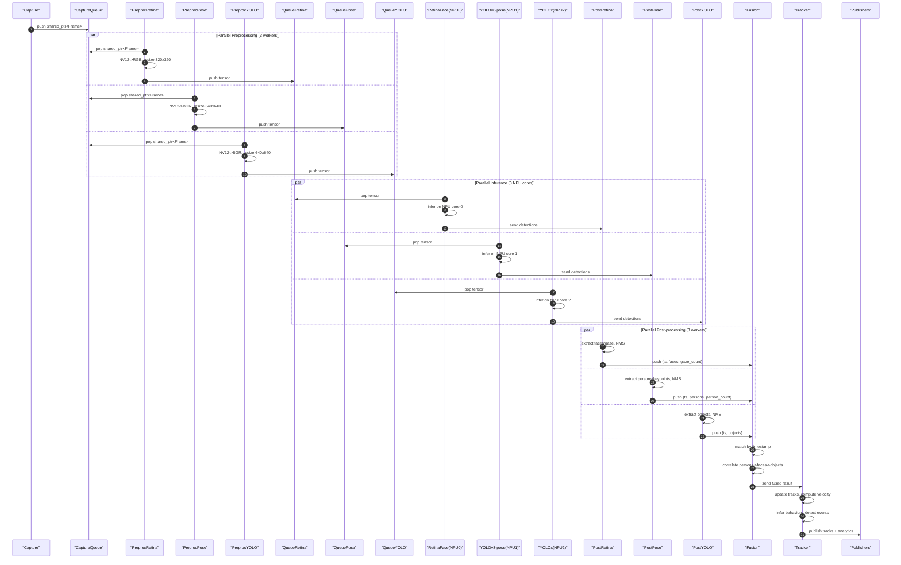

# Multiple Model Architecture

This document describes the multi-model architecture for running multiple neural networks concurrently on Rockchip NPU platforms.

## Current Implementation Status

**Currently Implemented (v7.0):**
- **RetinaFace** (NPU Core 0): Face detection + 5-point landmarks for gaze estimation
- **YOLOX** (NPU Core 1): Person/object detection for tracking

**Planned Extensions:**
- YOLOv8-pose for 17-keypoint skeleton tracking
- Third model on NPU Core 2 (RK3588 only)

The architecture described below covers both the current 2-model system and the full 3-model vision.

---

## Executive Summary

The RK3588 NPU has 3 cores that can run models independently. To run RetinaFace (face/gaze detection), YOLOv8-pose (person pose estimation), and YOLOx (object detection) concurrently on all 3 cores, we need to:

1. **Split preprocessing into model-specific branches** after initial capture
2. **Create parallel inference pipelines** with dedicated queues and workers per model
3. **Implement NPU core affinity** to bind models to specific NPU cores
4. **Merge results in a fusion post-processor** that correlates detections
5. **Extend configuration** to support multiple ModelSpecs

The key insight: **share capture, fork preprocessing, parallelize inference, merge results**.

## Retail Analytics Goals

The system provides comprehensive shopper analytics by combining outputs from three specialized models:

**Detection Outputs:**
- **Person count**: Number of people in frame (from YOLOv8-pose)
- **Face count**: Number of faces detected (from RetinaFace)
- **Gaze count**: Number of faces looking at screen (from RetinaFace gaze estimation)
- **Pose data**: 17 COCO keypoints per person (shoulders, elbows, wrists, hips, knees, ankles, etc.)
- **Object context**: Detected objects like carts, baskets, products (from YOLOx)

**Frame-to-Frame Tracking:**
- **Movement direction**: Track person position changes across frames
- **Gaze state changes**: Detect when person looks toward/away from screen
- **Pose transitions**: Identify pose changes indicating specific behaviors

**Behavioral Inference (via transfer learning on YOLOv8-pose):**
- **Pushing cart**: Arm/hand positions extended forward, body leaning slightly
- **Carrying basket**: Elbow bent, hand raised to waist/chest height
- **Shelf interaction**: Arm extension toward shelf, hand position near product level
- **Standing/browsing**: Stationary with minimal pose variation
- **Walking**: Regular leg movement pattern

## Architecture Changes

### Current 2-Model Architecture (Implemented in v7.0)

```
                          ┌─ FrameMailbox ─→ RetinaFace(NPU0) ─→ face_dets ─┐
                          │     (face)                                       │
Capture ─→ CaptureThread ─┤                                                  ├─→ FusionState ─→ Tracker ─→ Publishers
                          │                                                  │
                          └─ FrameMailbox ─→ YOLOX(NPU1) ─────→ yolo_dets ──┘
                               (yolo)
```

**Key features of current implementation:**
- **FrameMailbox**: Lock-free single-slot buffer with atomic swap (drop-old policy)
- **FusionState**: Mutex-protected shared state for multi-model results
- **Supervisor thread**: Reads fusion state, runs tracker, publishes analytics

### Planned 3-Model Architecture (Full NPU Utilization)

```
                    -> PreprocRetina -> QueueRetina -> RetinaFace(NPU0)   -\
                    |                                                       |
Capture -> QueueA ->|-> PreprocPose  -> QueuePose   -> YOLOv8-pose(NPU1) -|-> Fusion -> Tracker -> Publishers
                    |                                                       |
                    \-> PreprocYOLO  -> QueueYOLO   -> YOLOx(NPU2)        -/
```

**Key principles:**
- **Single capture source**: One camera feed for all 3 models (minimizes bandwidth)
- **Forked preprocessing**: Each model gets its own preprocessing worker with model-specific transforms
- **Parallel inference**: All 3 models run concurrently, one per NPU core
- **Result fusion**: Combined post-processor merges detections with timestamp correlation
- **Temporal tracking**: Frame-to-frame tracker maintains person state, movement, and behavior history

## Detailed Component Changes

### 1. Capture Worker (Minimal Changes)

**Current behavior:**
- Pulls frames from RTSP/USB
- Pushes to single FrameQueue A

**New behavior:**
- Pulls frames from RTSP/USB
- **Pushes to shared FrameQueue A** (no change)
- Frame is consumed by multiple preprocessing workers via **broadcast or shared pointer**

**Implementation options:**

**Option A: Broadcast Queue**
```cpp
class BroadcastQueue {
    void push(Frame frame);
    Frame pop(int consumer_id, timeout);  // Each consumer gets a copy
};
```

**Option B: Shared Pointer Queue** (Recommended)
```cpp
// Capture pushes shared_ptr<Frame>
captureQueue.push(std::make_shared<Frame>(raw_frame));

// Multiple preproc workers pop the same shared_ptr
auto frame = captureQueue.pop();  // Reference counted, no copy
```

**Recommendation:** Use **Option B** (shared pointers) to minimize memory copies. The frame buffer is immutable after capture, so multiple readers are safe.

### 2. Preprocessing Pipeline (Fork into Model-Specific Workers)

**Current behavior:**
- Single preprocessing worker
- Reads ModelSpec to determine transforms
- Converts NV12->RGB, resizes, normalizes

**New behavior:**
- **Multiple preprocessing workers**, one per model
- Each worker reads its own ModelSpec configuration
- Workers run in parallel threads

**Example: Three preprocessing workers**

```cpp
// RetinaFace preprocessing worker
class RetinaPreprocessWorker {
    ModelSpec retinaSpec;  // 320x320 RGB, mean=[104,117,123]

    void run() {
        while (running) {
            auto frame = captureQueue.pop();  // shared_ptr<Frame>
            auto tensor = preprocess(frame, retinaSpec);
            retinaQueue.push(tensor);
        }
    }
};

// YOLOv8-pose preprocessing worker
class PosePreprocessWorker {
    ModelSpec poseSpec;  // 640x640 BGR, mean=[0,0,0], std=[255,255,255]

    void run() {
        while (running) {
            auto frame = captureQueue.pop();  // same shared_ptr<Frame>
            auto tensor = preprocess(frame, poseSpec);
            poseQueue.push(tensor);
        }
    }
};

// YOLOx preprocessing worker
class YOLOPreprocessWorker {
    ModelSpec yoloSpec;  // 640x640 BGR, mean=[0,0,0], std=[255,255,255]

    void run() {
        while (running) {
            auto frame = captureQueue.pop();  // same shared_ptr<Frame>
            auto tensor = preprocess(frame, yoloSpec);
            yoloQueue.push(tensor);
        }
    }
};
```

**Key considerations:**
- Each worker maintains its own RGA context for parallel hardware acceleration
- Workers are independent threads; no synchronization needed (they consume the same input)
- Original frame from CaptureQueue is **immutable** (only read, never modified)

### 3. Inference Queues (One per Model)

**Current behavior:**
- Single FrameQueue B (capacity=1, overwrite policy)

**New behavior:**
- **Multiple inference queues**, one per model
- Each queue has capacity=1 with overwrite/drop-old policy

```cpp
FrameQueue retinaInferenceQueue(capacity=1, policy=OVERWRITE);
FrameQueue poseInferenceQueue(capacity=1, policy=OVERWRITE);
FrameQueue yoloInferenceQueue(capacity=1, policy=OVERWRITE);
```

**Why separate queues?**
- Models have different inference times (RetinaFace ~15ms, YOLOv8-pose ~25ms, YOLOx ~30ms)
- Independent queues prevent head-of-line blocking
- Each model gets freshest preprocessed frame at its own pace

### 4. ModelRunner (Parallel Instances with NPU Core Affinity)

**Current behavior:**
- Single ModelRunner with IModel interface
- RKNN2Interface manages NPU device/session

**New behavior:**
- **Multiple ModelRunner instances**, one per model
- Each runner explicitly binds to a specific NPU core

**NPU Core Affinity Implementation:**

```cpp
class ModelRunner {
    IModel* model;
    int npu_core_id;  // 0, 1, or 2 for RK3588

    void initialize() {
        // RKNN allows specifying target core during init
        rknn_init_opt opt;
        opt.target_core = npu_core_id;  // Bind to specific NPU core

        rknn_init(&context, model_data, model_size, 0, &opt);
    }

    void run() {
        while (running) {
            auto tensor = inferenceQueue.pop();
            auto result = model->infer(tensor);
            postprocessQueue.push(result);
        }
    }
};

// Usage
ModelRunner retinaRunner(retinaModel, npu_core_id=0);
ModelRunner poseRunner(poseModel, npu_core_id=1);
ModelRunner yoloRunner(yoloModel, npu_core_id=2);
```

**RK3588 NPU Core Allocation Strategy:**

| NPU Core | Assignment    | Rationale |
|----------|---------------|-----------|
| Core 0   | RetinaFace    | Face/gaze detection (fastest, ~15ms) |
| Core 1   | YOLOv8-pose   | Pose estimation with 17 keypoints (~25ms) |
| Core 2   | YOLOx         | Object detection for carts/baskets/products (~30ms) |

**Important:** RKNN API allows core affinity via `rknn_init` flags. Verify with RKNN toolkit that models are actually scheduled on target cores (check `rknn_query(RKNN_QUERY_PERF_DETAIL)`).

### 5. Post-Processing (Fusion of Multi-Model Results)

**Current behavior:**
- Single post-processor for one model's output
- Extracts faces/gaze, applies NMS

**New behavior:**
- **Parallel post-processors** per model (initial processing)
- **Fusion post-processor** that merges results

**Architecture:**

```
RetinaFace  -> RetinaPostproc -> FusionQueue -\
                                               |
YOLOv8-pose -> PosePostproc   -> FusionQueue -|-> FusionPostproc -> Tracker -> Publishers
                                               |
YOLOx       -> YOLOPostproc   -> FusionQueue -/
```

**Implementation:**

```cpp
// Per-model post-processors (existing logic)
class RetinaPostprocessor {
    void process(RetinaOutput output) {
        auto faces = extractFaces(output);  // NMS, thresholds
        auto gazes = computeGaze(faces);

        DetectionResult result;
        result.timestamp = output.timestamp;
        result.faces = faces;
        result.gazes = gazes;
        result.gaze_count = countLookingAtScreen(gazes);

        fusionQueue.push(result);
    }
};

class PosePostprocessor {
    void process(PoseOutput output) {
        auto persons = extractPersons(output);  // NMS, confidence threshold

        // Extract 17 COCO keypoints per person
        // [nose, left_eye, right_eye, left_ear, right_ear,
        //  left_shoulder, right_shoulder, left_elbow, right_elbow,
        //  left_wrist, right_wrist, left_hip, right_hip,
        //  left_knee, right_knee, left_ankle, right_ankle]

        DetectionResult result;
        result.timestamp = output.timestamp;
        result.persons = persons;
        result.person_count = persons.size();

        fusionQueue.push(result);
    }
};

class YOLOPostprocessor {
    void process(YOLOOutput output) {
        auto objects = extractObjects(output);  // NMS, class filtering

        DetectionResult result;
        result.timestamp = output.timestamp;
        result.objects = objects;  // carts, baskets, products

        fusionQueue.push(result);
    }
};

// Fusion post-processor (new component)
class FusionPostprocessor {
    struct TimestampedResult {
        uint64_t timestamp;
        optional<FaceDetections> faces;
        optional<PoseDetections> persons;
        optional<ObjectDetections> objects;

        int person_count = 0;
        int face_count = 0;
        int gaze_count = 0;
    };

    // Buffer to hold results waiting for pairing
    std::map<uint64_t, TimestampedResult> buffer;

    void process() {
        while (running) {
            auto result = fusionQueue.pop();

            // Find or create entry for this timestamp
            auto& entry = buffer[result.timestamp];

            // Merge into entry
            if (result.has_faces()) {
                entry.faces = result.faces;
                entry.face_count = result.faces.size();
                entry.gaze_count = result.gaze_count;
            }
            if (result.has_persons()) {
                entry.persons = result.persons;
                entry.person_count = result.person_count;
            }
            if (result.has_objects()) {
                entry.objects = result.objects;
            }

            // Check if we have all expected results for this timestamp
            if (entry.is_complete() || entry.is_too_old()) {
                // Correlate detections
                correlatePersonsWithFaces(entry);
                correlatePersonsWithObjects(entry);

                // Send to tracker
                trackerQueue.push(entry);
                buffer.erase(result.timestamp);
            }
        }
    }

    void correlatePersonsWithFaces(TimestampedResult& entry) {
        // Match face bboxes with person bboxes based on IoU
        // Link gaze direction to specific person
    }

    void correlatePersonsWithObjects(TimestampedResult& entry) {
        // Associate nearby carts/baskets with persons
        // Detect if person's hand keypoints overlap with shelf products
    }
};
```

**Fusion strategies:**

1. **Timestamp matching** (primary): Wait for results from all 3 models with matching timestamps
2. **Timeout-based**: If one model is slow, publish partial results after timeout (e.g., 100ms)
3. **Best-effort**: Publish latest available results from each model, even if timestamps don't align

**Correlation logic:**
- **Associate faces with persons**: Match face bbox with person bbox using IoU, link gaze to specific person
- **Associate persons with objects**: Link nearby carts/baskets to persons based on proximity
- **Detect shelf interactions**: Check if wrist keypoints are near product bounding boxes
- **Scene understanding**: Combine all detections for rich behavioral context

### 6. Temporal Tracking (New Component)

The tracker maintains frame-to-frame continuity and detects behavioral patterns over time.

**Implementation:**

```cpp
class TemporalTracker {
    struct TrackedPerson {
        int track_id;
        cv::Rect2f bbox;
        std::vector<cv::Point2f> keypoints;  // 17 COCO keypoints

        // Face/gaze association
        optional<int> face_id;
        bool looking_at_screen;

        // Object associations
        optional<int> cart_id;
        optional<int> basket_id;

        // Movement tracking
        cv::Point2f velocity;  // pixels/frame
        float direction_angle;  // radians

        // Behavior state
        PoseBehavior behavior;  // PUSHING_CART, CARRYING_BASKET, SHELF_INTERACTION, etc.
        int behavior_frame_count;  // frames in current behavior

        // History for temporal analysis
        std::deque<cv::Point2f> position_history;  // last N positions
        std::deque<PoseKeypoints> pose_history;     // last N poses
        int frames_since_gaze_change;
    };

    std::map<int, TrackedPerson> active_tracks;
    int next_track_id = 0;

    void update(const TimestampedResult& fused_result) {
        // 1. Data association: match current detections to existing tracks
        auto associations = matchDetectionsToTracks(fused_result.persons);

        // 2. Update existing tracks
        for (auto& [det_idx, track_id] : associations) {
            updateTrack(track_id, fused_result, det_idx);
        }

        // 3. Create new tracks for unmatched detections
        for (auto& unmatched_det : getUnmatchedDetections(associations)) {
            createNewTrack(unmatched_det, fused_result);
        }

        // 4. Remove stale tracks (not detected for N frames)
        removeStale Tracks();

        // 5. Analyze behavior changes
        for (auto& [track_id, person] : active_tracks) {
            analyzeBehaviorChange(person);
            detectMovementPattern(person);
            trackGazeChanges(person);
        }

        // 6. Publish tracking results
        publishTrackingResults();
    }

    void updateTrack(int track_id, const TimestampedResult& result, int det_idx) {
        auto& track = active_tracks[track_id];
        auto& detection = result.persons[det_idx];

        // Update position
        cv::Point2f prev_center = getCenter(track.bbox);
        track.bbox = detection.bbox;
        cv::Point2f new_center = getCenter(detection.bbox);

        // Compute velocity
        track.velocity = new_center - prev_center;
        track.direction_angle = atan2(track.velocity.y, track.velocity.x);

        // Update keypoints and pose history
        track.keypoints = detection.keypoints;
        track.pose_history.push_back(detection.keypoints);
        if (track.pose_history.size() > 10) track.pose_history.pop_front();

        // Update position history
        track.position_history.push_back(new_center);
        if (track.position_history.size() > 30) track.position_history.pop_front();

        // Associate with face/gaze
        track.face_id = findMatchingFace(track.bbox, result.faces);
        if (track.face_id) {
            bool prev_gaze = track.looking_at_screen;
            track.looking_at_screen = result.faces[*track.face_id].looking_at_screen;
            if (prev_gaze != track.looking_at_screen) {
                track.frames_since_gaze_change = 0;
            } else {
                track.frames_since_gaze_change++;
            }
        }

        // Associate with objects (cart, basket)
        track.cart_id = findNearbyObject(track.bbox, result.objects, "cart");
        track.basket_id = findNearbyObject(track.bbox, result.objects, "basket");
    }

    void analyzeBehaviorChange(TrackedPerson& person) {
        // Infer behavior from pose keypoints and object associations
        PoseBehavior new_behavior = inferBehavior(person);

        if (new_behavior != person.behavior) {
            // Behavior changed - emit event
            emitBehaviorChangeEvent(person.track_id, person.behavior, new_behavior);
            person.behavior = new_behavior;
            person.behavior_frame_count = 0;
        } else {
            person.behavior_frame_count++;
        }
    }

    PoseBehavior inferBehavior(const TrackedPerson& person) {
        // Use heuristics on keypoints + object associations
        // Later: use transfer-learned classifier

        if (person.cart_id.has_value()) {
            // Check arm positions for pushing gesture
            if (armsExtendedForward(person.keypoints)) {
                return PoseBehavior::PUSHING_CART;
            }
        }

        if (person.basket_id.has_value()) {
            // Check for bent elbow, raised hand
            if (armBentWithRaisedHand(person.keypoints)) {
                return PoseBehavior::CARRYING_BASKET;
            }
        }

        // Check for shelf interaction (hand near products)
        if (handNearShelfProducts(person, objects)) {
            return PoseBehavior::SHELF_INTERACTION;
        }

        // Check movement
        if (person.velocity.norm() < 2.0) {
            return PoseBehavior::STANDING;
        } else {
            return PoseBehavior::WALKING;
        }
    }
};
```

**Tracking Features:**

- **Person re-identification**: Maintains consistent track IDs across frames using IoU + keypoint similarity
- **Velocity estimation**: Computes direction and speed of movement
- **Gaze tracking**: Monitors when person starts/stops looking at screen
- **Behavior classification**: Infers activity from pose + object context
- **Event detection**: Emits events for behavior changes (started browsing, picked up product, etc.)

**Transfer Learning Note:**

The `inferBehavior()` function initially uses heuristics. For production, train a classifier on the 17 keypoints to recognize:
- Pushing cart (arms extended, torso leaning)
- Carrying basket (elbow bent, hand raised)
- Shelf reach (arm extension, hand up)
- Product pickup (hand near shelf, then retraction)

Fine-tune YOLOv8-pose or add a lightweight MLP head on the keypoints for behavior classification.

### 7. Resource Manager (Extended for Multi-Model)

**Current behavior:**
- Manages RGA contexts, tensor buffers for single model

**New behavior:**
- Manages resources for **multiple models**
- Ensures NPU cores don't exceed capacity
- Pools tensors per model

**Changes:**

```cpp
class ResourceManager {
    // Per-model RGA contexts
    std::map<std::string, rga_context> rgaContexts;

    // Per-model tensor pools
    std::map<std::string, TensorPool> tensorPools;

    // NPU core allocation tracker
    std::bitset<3> npuCoresInUse;  // RK3588 has 3 cores

    int allocateNPUCore() {
        for (int i = 0; i < 3; i++) {
            if (!npuCoresInUse[i]) {
                npuCoresInUse.set(i);
                return i;
            }
        }
        throw std::runtime_error("No NPU cores available");
    }

    void releaseNPUCore(int core_id) {
        npuCoresInUse.reset(core_id);
    }
};
```

**Memory considerations:**
- Each model needs separate input/output tensors
- RetinaFace: ~300KB input, ~50KB output
- YOLOx: ~4.7MB input (640x640x3 float), ~200KB output
- Total NPU memory budget on RK3588: ~800MB shared across cores

### 8. Configuration (Multi-Model Support)

**Current configuration:**
```yaml
processing:
  model: "retinaface_rknn"
  preprocessing: { ... }
```

**New multi-model configuration:**

```yaml
processing:
  # Enable multi-model mode
  multi_model: true

  models:
    - name: "retinaface"
      enabled: true
      model_path: "/models/retinaface_320.rknn"
      npu_core: 0  # Explicit core assignment
      priority: "high"  # For scheduling hints

      preprocessing:
        target_size: [320, 320]
        color_format: "RGB"
        normalize:
          mean: [104, 117, 123]
          std: [1, 1, 1]

      postprocessing:
        type: "retinaface"
        nms_threshold: 0.4
        confidence_threshold: 0.7
        max_faces: 10

    - name: "yolov8_pose"
      enabled: true
      model_path: "/models/yolov8n_pose_640.rknn"
      npu_core: 1  # Core 1 for pose estimation
      priority: "high"

      preprocessing:
        target_size: [640, 640]
        color_format: "BGR"
        normalize:
          mean: [0, 0, 0]
          std: [255, 255, 255]
        letterbox: true

      postprocessing:
        type: "yolov8_pose"
        nms_threshold: 0.5
        confidence_threshold: 0.5
        max_persons: 20
        keypoint_confidence_threshold: 0.3

    - name: "yolox"
      enabled: true
      model_path: "/models/yolox_s_640.rknn"
      npu_core: 2  # Core 2 for object detection
      priority: "medium"

      preprocessing:
        target_size: [640, 640]
        color_format: "BGR"
        normalize:
          mean: [0, 0, 0]
          std: [255, 255, 255]
        letterbox: true

      postprocessing:
        type: "yolox"
        nms_threshold: 0.5
        confidence_threshold: 0.5
        classes: ["cart", "basket", "bottle", "cup", "cell phone"]  # Retail-relevant objects

  # Fusion configuration
  fusion:
    enabled: true
    timestamp_tolerance_ms: 50  # Max time diff for matching results
    timeout_ms: 100  # Max wait for missing results
    correlate_persons_faces: true  # Link persons with face detections
    correlate_persons_objects: true  # Link persons with carts/baskets
    detect_shelf_interactions: true  # Check wrist keypoints near products

  # Tracking configuration
  tracking:
    enabled: true
    max_age: 30  # frames to keep track without detection
    min_hits: 3  # detections required before publishing track
    iou_threshold: 0.3  # for matching detections to tracks

    # Behavior classification
    behavior_detection:
      enabled: true
      use_transfer_learning: false  # Set true when model is trained
      model_path: "/models/behavior_classifier.rknn"  # Optional: trained classifier

output:
  publishers:
    - type: "udp_json"
      port: 8080
      include_faces: true
      include_persons: true
      include_person_count: true
      include_face_count: true
      include_gaze_count: true
      include_objects: true
      include_tracks: true
      include_behaviors: true
      include_correlations: true
```

### 9. Orchestrator (Multi-Pipeline Management)

**Current behavior:**
- Starts single capture -> preprocess -> infer -> postprocess pipeline

**New behavior:**
- Starts capture (single)
- **Starts 3 preprocessing workers** (one per model)
- **Starts 3 inference workers** (one per model, one per NPU core)
- **Starts 3 postprocessing workers** (one per model)
- Starts fusion worker
- Starts tracking worker
- Starts publishers

**Thread topology:**

```
Thread 1:  CaptureWorker
Thread 2:  RetinaPreprocessWorker
Thread 3:  RetinaInferenceWorker (NPU core 0)
Thread 4:  RetinaPostprocessWorker
Thread 5:  PosePreprocessWorker
Thread 6:  PoseInferenceWorker (NPU core 1)
Thread 7:  PosePostprocessWorker
Thread 8:  YOLOPreprocessWorker
Thread 9:  YOLOInferenceWorker (NPU core 2)
Thread 10: YOLOPostprocessWorker
Thread 11: FusionWorker
Thread 12: TrackingWorker
Thread 13: PublisherWorker
```

**Total: 13 threads** (vs. 4-5 for single model)

**Orchestrator initialization:**

```cpp
class Orchestrator {
    void start() {
        // Start capture (shared by all models)
        captureWorker = std::make_unique<CaptureWorker>(config.input);
        captureWorker->start();

        // Start per-model pipelines
        for (auto& modelConfig : config.models) {
            if (!modelConfig.enabled) continue;

            // Allocate NPU core
            int core = resourceMgr.allocateNPUCore();

            // Create preprocessing worker
            auto preproc = std::make_unique<PreprocessWorker>(
                captureQueue, modelConfig.preprocessing
            );
            preprocWorkers.push_back(std::move(preproc));

            // Create inference worker
            auto infer = std::make_unique<InferenceWorker>(
                modelConfig.model_path, core, modelConfig.preprocessing
            );
            inferWorkers.push_back(std::move(infer));

            // Create postprocessing worker
            auto postproc = std::make_unique<PostprocessWorker>(
                modelConfig.postprocessing
            );
            postprocWorkers.push_back(std::move(postproc));
        }

        // Start fusion worker
        if (config.fusion.enabled) {
            fusionWorker = std::make_unique<FusionWorker>(config.fusion);
            fusionWorker->start();
        }

        // Start tracking worker
        if (config.tracking.enabled) {
            trackingWorker = std::make_unique<TrackingWorker>(config.tracking);
            trackingWorker->start();
        }

        // Start publishers
        for (auto& pub : publishers) {
            pub->start();
        }
    }
};
```

## Data Flow Diagram

### Multi-Model Steady State Processing



## Performance Considerations

### Throughput Analysis

**Single-model baseline (RetinaFace only):**
- Capture: 33ms (30 FPS)
- Preprocess: 5ms
- Inference: 15ms
- Postprocess: 2ms
- **Total latency:** ~55ms
- **Throughput:** ~18 FPS (limited by capture)

**3-model (RetinaFace + YOLOv8-pose + YOLOx):**
- Capture: 33ms (30 FPS)  **shared**
- Preprocess: 5ms (Retina) + 8ms (Pose) + 8ms (YOLO)  **parallel**
- Inference: 15ms (Retina, NPU0) + 25ms (Pose, NPU1) + 30ms (YOLO, NPU2)  **parallel**
- Postprocess: 2ms (Retina) + 3ms (Pose) + 3ms (YOLO)  **parallel**
- Fusion: 1ms
- Tracking: 2ms
- **Total latency:** 33ms (capture) + max(8ms preproc, 30ms infer, 3ms postproc) + 1ms fusion + 2ms tracking = **69ms**
- **Throughput:** ~14 FPS (limited by YOLOx inference on NPU core 2)

**Bottleneck:** YOLOx inference at 30ms on NPU core 2. Options:
- Use smaller YOLOx variant (YOLOx-nano: ~10ms) → achieve ~20 FPS
- Reduce YOLOx input size (640→416) → ~20ms inference
- Run YOLOx at reduced frame rate (every 2nd frame) while maintaining pose/face at full rate

**All 3 NPU cores fully utilized**

### Memory Footprint

| Component | Single Model | 3-Model System | Delta |
|-----------|--------------|----------------|-------|
| Model weights (RKNN) | 1.5 MB (Retina) | 1.5 MB + 3.5 MB (Pose) + 9 MB (YOLOx) | +12.5 MB |
| Input tensors | 0.3 MB | 0.3 MB + 4.7 MB (Pose) + 4.7 MB (YOLO) | +9.4 MB |
| Output tensors | 0.05 MB | 0.05 MB + 0.3 MB (Pose) + 0.2 MB (YOLO) | +0.5 MB |
| Frame buffers (shared) | 1.2 MB | 1.2 MB | 0 |
| Tracking state | 0 | ~0.5 MB (30 tracks × ~17KB each) | +0.5 MB |
| **Total** | ~3 MB | ~26 MB | +23 MB |

**RK3588 NPU memory budget:** ~800 MB total, so 26 MB is well within limits.

### CPU Load

- Preprocessing is CPU/RGA-bound (if RGA is saturated, will use OpenCV fallback)
- With 3 preprocessing workers, RGA utilization is higher
- Tracking adds CPU overhead (~2ms per frame for 10-20 tracked persons)
- Monitor RGA queue depth; if high, consider staggering preprocessing or reducing resolution

### Synchronization Overhead

- **Minimal:** Queues use lock-free primitives (if implemented correctly)
- **Fusion buffer:** Simple map lookup by timestamp, O(1) amortized
- **Shared pointer refcounting:** Atomic increment/decrement, negligible overhead

## Alternative Architectures

### Option A: Sequential Models (Pipeline Chaining)

```
Capture -> Preproc -> RetinaFace(NPU0) -> Preproc -> YOLOx(NPU1) -> Postprocess
```

**Pros:** Simpler code, no fusion needed
**Cons:** Higher latency (models run sequentially), wastes NPU cores

**Not recommended** for real-time applications.

### Option B: Time-Sliced Models (Alternating Frames)

```
Frame 0: Capture -> RetinaFace(NPU0)
Frame 1: Capture -> YOLOx(NPU0)
Frame 2: Capture -> RetinaFace(NPU0)
...
```

**Pros:** Uses single NPU core, simpler resource management
**Cons:** Effective frame rate per model halved (15 FPS each), doesn't leverage 3-core NPU

**Not recommended** when multi-core NPU is available.

### Option C: Hierarchical Models (Detector + Refinement)

```
Capture -> YOLOx(NPU0, detect persons) -> ROI crop -> RetinaFace(NPU1, detect faces in ROI)
```

**Pros:** Reduces RetinaFace search space, more efficient
**Cons:** RetinaFace depends on YOLOx, introduces latency, complex ROI management

**Consider for future optimization** if full-frame face detection is too expensive.

## Implementation Checklist

- [ ] Modify CaptureWorker to push `shared_ptr<Frame>` instead of raw frames
- [ ] Implement multiple PreprocessWorker instances with model-specific configs
- [ ] Create per-model inference queues
- [ ] Extend ModelRunner to accept NPU core affinity parameter
- [ ] Implement FusionPostprocessor with timestamp-based correlation
- [ ] Add multi-model configuration schema to YAML parser
- [ ] Update ResourceManager to track NPU core allocation
- [ ] Modify Orchestrator to spawn multiple model pipelines
- [ ] Extend metrics to track per-model FPS and latency
- [ ] Add health monitoring for per-model failures
- [ ] Implement dynamic model enable/disable (optional)
- [ ] Test NPU core affinity with RKNN profiling tools
- [ ] Validate timestamp synchronization across models
- [ ] Benchmark memory usage and CPU/NPU utilization

## Testing Strategy

1. **Unit tests:**
   - FusionPostprocessor timestamp matching logic
   - ResourceManager NPU core allocation
   - Configuration parsing for multi-model specs

2. **Integration tests:**
   - Run RetinaFace + YOLOx concurrently, verify outputs
   - Test with mismatched frame rates (e.g., YOLOx slower than Retina)
   - Verify NPU core isolation (use RKNN perf query)

3. **Performance tests:**
   - Measure end-to-end latency with 1 model vs. 2 models
   - Profile CPU usage per worker thread
   - Measure NPU utilization per core
   - Test memory stability over 24-hour run

4. **Failure tests:**
   - One model crashes, verify other model continues
   - NPU core hangs, verify recovery mechanism
   - One model falls behind, verify fusion timeout behavior

## Future Extensions

### 3-Model Configuration

Add a third model (e.g., pose estimation) using NPU core 2:

```yaml
models:
  - name: "retinaface"
    npu_core: 0
  - name: "yolox"
    npu_core: 1
  - name: "movenet"  # Pose estimation
    npu_core: 2
```

### Dynamic Model Loading

Support runtime enable/disable of models without restarting pipeline:

```cpp
orchestrator.enableModel("yolox");
orchestrator.disableModel("movenet");
```

### Adaptive Frame Rate

Reduce slower model's frame rate to maintain overall throughput:

```yaml
models:
  - name: "yolox"
    frame_decimation: 2  # Run on every 2nd frame
```

### Cross-Model Dependencies

Allow one model's output to influence another's processing:

```yaml
models:
  - name: "yolox"
    output_to: ["retinaface"]  # YOLO person detections -> RetinaFace ROIs
```

## Conclusion

Running multiple models on the RK3588's 3-core NPU requires:

1. **Shared capture** with immutable frame buffers (shared pointers)
2. **Forked preprocessing** with model-specific workers
3. **Parallel inference** with explicit NPU core affinity
4. **Timestamp-based fusion** to correlate results
5. **Extended configuration** for multi-model specs

The architecture maintains the original design principles (modularity, real-time performance, reliability) while scaling to multiple concurrent models. The fusion layer adds minimal latency (<1ms) and enables rich multi-modal outputs (faces + objects + correlations).

**Key insight:** The existing pipeline architecture is **already well-suited** for multi-model extension. The IModel interface, worker-based threading, and queue-based communication make it straightforward to fork the pipeline after capture and merge results before publishing.
